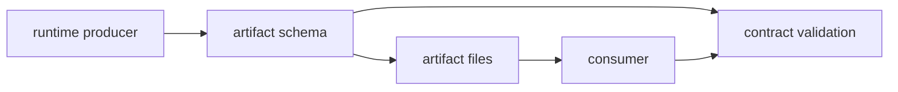

# Artifact Contracts

This page explains the DAG artifact files that carry evidence across runs,
reviews, and replay work.

Their value comes from continuity: the bytes, metadata, and lineage records
have to stay meaningful after the original process is gone.

## Artifact Map

## Contract Surfaces

- run manifest, graph snapshot, and provenance records
- run-level and node-level output indexes
- node trace, input index, and attempt evidence files
- timeline, event-log, and schema index files
- cache-entry manifests, metadata, and reuse proofs
- promotion ledgers and manifest promotion summaries

## Code Anchors

- `crates/bijux-dag-artifacts/src/storage/models.rs`
- `crates/bijux-dag-artifacts/src/integrity/hash.rs`
- `crates/bijux-dag-artifacts/src/integrity/index.rs`
- `crates/bijux-dag-artifacts/src/integrity/proof.rs`
- `crates/bijux-dag-runtime/src/artifacts/`

## Contract Rules

- hash and lineage mismatches must be surfaced explicitly
- missing required evidence must not be treated as equivalent
- schema-bearing artifact files require compatibility review on shape changes

## Reading Rule

Use this page when the change affects persistent run evidence rather than
ephemeral command output.

## Next Reads

- [Reproducibility Model](reproducibility-model.md)
- [Run Evidence Layout](run-evidence-layout.md)
- [Data Contracts](data-contracts.md)
- [State and Persistence](../architecture/state-and-persistence.md)
- [Documentation Standards](../quality/documentation-standards.md)
