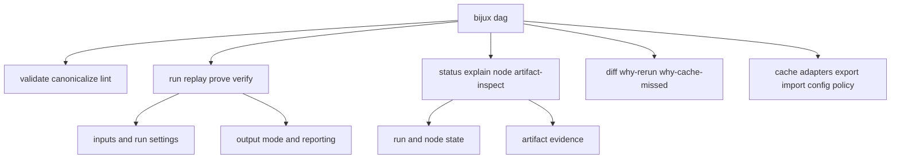

# CLI Surface

The DAG command surface is organized around lifecycle intent: validate
definitions, execute runs, inspect evidence, classify replay/diff, and manage
portability/configuration concerns.

## Visual Summary

## Command Families

- definition: `init`, `validate`, `canonicalize`, `lint`, `graph-lint`, `fingerprint`
- execution and replay: `run`, `replay`, `prove`, `proof-summary`, `verify`, `fsck`
- inspect and history: `status`, `explain`, `node`, `runs ...`, `artifact-inspect`
- comparison: `diff`, `why-rerun`, `why-cache-missed`, `trace-artifact`
- operations: `cache ...`, `adapters ...`, `export`, `import`, `config ...`, `policy ...`

## Global Flags

- `--json`: machine-readable output mode
- `--quiet`: reduced human-oriented output noise

## Code Anchors

- `crates/bijux-dag-cli/src/main.rs`
- `crates/bijux-dag-app/src/commands/mod.rs`
- `crates/bijux-dag-app/tests/cli_contract.rs`
- `crates/bijux-dag-app/tests/command_surface_routing_contracts.rs`

## CLI Surface Rules

- command additions require docs and contract test updates
- classification commands must preserve explicit outcome vocabulary
- hidden or deprecated paths should remain tested until removal is intentional

## Next Reads

- [Operator Workflows](operator-workflows.md)
- [Entrypoints and Examples](entrypoints-and-examples.md)
- [Compatibility Commitments](compatibility-commitments.md)
