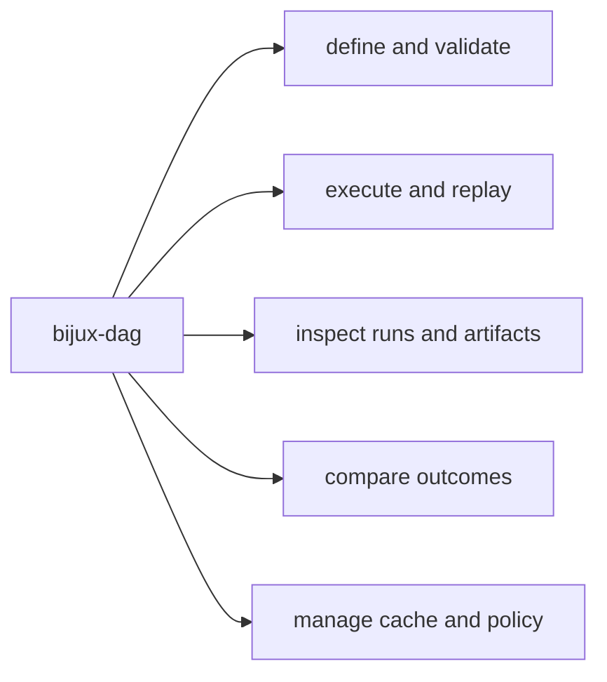

# CLI Surface

This page explains how the DAG command surface groups work by intent rather than
by crate layout.

The useful split is not the full command count. It is whether the operator is
defining work, running it, inspecting evidence, comparing outcomes, or managing
the environment around it.

For `v0.4.0`, the public CLI contract is the visible root help surface from
`bijux-dag --help`. That surface is intentionally smaller than the full routed
command tree. Hidden experimental, simulation, and maintainer routes remain
callable by explicit path, but they are not part of the supported
operator-facing release boundary.

## Route Map

## Visible Root Surface

- author and validate: `validate`, `plan`
- execute and replay: `run`, `replay`, `verify`
- inspect evidence: `runs ...`, `artifact`, `artifact-inspect`, `diff`, `explain`
- operate locally: `cache ...`, `doctor`, `version`, `commands`, `completions`

## Hidden Experimental Routes

The following operator-oriented routes stay callable by explicit path, but they
are hidden from the default root help and default command catalog because they
either widen the contract too far or still need stricter release posture:

- authoring helpers and raw graph internals: `init`, `canonicalize`, `graph`, `graph-lint`, `fingerprint`, `hash`, `canonical-bytes`, `canonical-diff`
- advanced inspection and comparison helpers: `status`, `node`, `trace-artifact`, `why-rerun`, `why-cache-missed`
- bundle, migration, and environment control helpers: `export`, `import`, `migrate`, `adapters`, `config`, `policy`, `fsck`, `prove`, `proof-summary`

## Full Command Families

- definition: `init`, `validate`, `canonicalize`, `lint`, `graph-lint`, `fingerprint`
- execution and replay: `run`, `replay`, `prove`, `proof-summary`, `verify`, `fsck`
- inspect and history: `status`, `explain`, `node`, `runs ...`, `artifact-inspect`
- comparison: `diff`, `why-rerun`, `why-cache-missed`, `trace-artifact`
- operations: `cache ...`, `adapters ...`, `export`, `import`, `config ...`, `policy ...`

## Hidden Simulation And Maintainer Namespaces

The following root namespaces are intentionally hidden from the public help
surface in `v0.4.0`:

- simulation and platform modeling: `control-plane`, `state-store`, `dataset`, `enterprise`, `fleet`, `federation`, `incident`, `lab`
- maintainer quality and release modeling: `security`, `durability`, `performance`, `release`, `runtime`, `schedule`
- internal capability probes: `version-inspect`, `capabilities`, `semantic-portability`, `equivalence-proof`

These routes still exist for explicit maintainer workflows and contract tests.
They can be inventoried with `bijux-dag commands --all`, but they are not
presented as stable operator APIs.

## Global Flags

- `--json`: machine-readable output mode
- `--quiet`: reduced human-oriented output noise

## Code Anchors

- `crates/bijux-dag-cli/src/main.rs`
- `crates/bijux-dag-app/src/commands/mod.rs`
- `crates/bijux-dag-app/tests/cli_contract.rs`
- `crates/bijux-dag-app/tests/command_surface_routing_contracts.rs`

## CLI Surface Rules

- command additions require docs and contract test updates
- classification commands must preserve explicit outcome vocabulary
- hidden experimental routes must stay off the default root help and default command catalog unless they are intentionally promoted
- hidden maintainer namespaces must stay off the default root help and default command catalog
- hidden or deprecated paths should remain tested until removal is intentional

## Reading Rule

Use this page when the question is which command family should own a DAG task
before you inspect one concrete route or crate.

## Next Reads

- [Operator Workflows](operator-workflows.md)
- [Entrypoints and Examples](entrypoints-and-examples.md)
- [Compatibility Commitments](compatibility-commitments.md)
