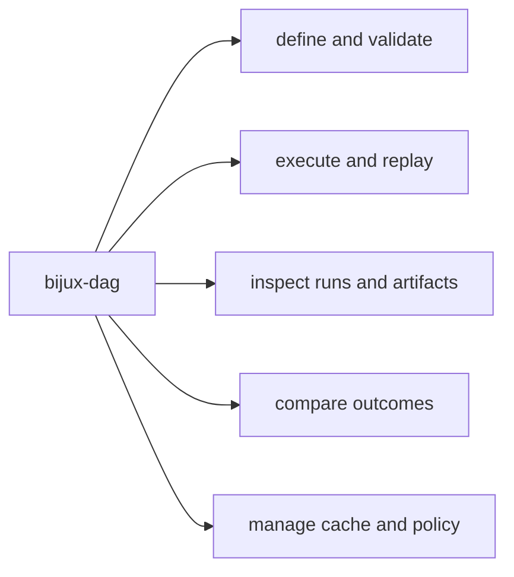

# CLI Surface

This page explains how the DAG command surface groups work by intent rather than
by crate layout.

The useful split is not the full command count. It is whether the operator is
defining work, running it, inspecting evidence, comparing outcomes, or managing
the local execution environment around it.

For `v0.4.0`, the public CLI contract is the visible root help surface from
`bijux-dag --help`. That surface is intentionally smaller than the full routed
command tree. Hidden experimental routes remain callable by explicit path and
are inventoryable through `bijux-dag commands --lane experimental`.
Simulation and maintainer routes require explicit opt-in through
`BIJUX_DAG_ENABLE_SIMULATED=1` or `BIJUX_DAG_ENABLE_INTERNAL=1`, plus
deliberate inventory through `bijux-dag commands --lane simulated` or
`bijux-dag commands --lane internal`. None of those lanes are part of the
supported operator-facing release boundary.

For the command-by-command stable reference generated from the live Clap help
surface, use [Generated CLI Reference](generated-cli-reference.md). For the
separate inventory of deliberate non-stable routes, use
[Non-Stable Command Inventory](reference/nonstable-command-inventory.md).

## v0.4.0 Surface Truth Table

| Class | `v0.4.0` meaning | Representative surfaces |
| --- | --- | --- |
| stable | supported visible `bijux-dag --help` surface for local DAG authoring, execution, replay, and evidence inspection | `validate`, `plan`, `run`, `replay`, `runs ...`, `artifact`, `artifact-inspect`, `diff`, `explain`, `verify`, `doctor`, `cache`, `version`, `commands`, `completions` |
| experimental | callable by explicit path and repository-tested, but outside the stable operator compatibility lane | explicit-path operator helpers such as `init`, `status`, `export`, `migrate`, `prove`, and `trace-artifact`; use `bijux-dag commands --lane experimental` for the current inventory |
| simulated | modeled platform and control-plane namespaces that require `BIJUX_DAG_ENABLE_SIMULATED=1`, not production backends or services | modeled control-plane and organizational route families; use `bijux-dag commands --lane simulated` only when you intentionally need repository-owned modeling surfaces |
| internal | maintainer-only and contract-only routes that require `BIJUX_DAG_ENABLE_INTERNAL=1` and stay outside the public operator boundary | maintainer verification, schedule, runtime, release, and capability lanes; use `bijux-dag commands --lane internal` only for deliberate repository maintenance work |
| future | not a `v0.4.0` product promise | generic hpc execution beyond the shared-filesystem slurm lane, public remote workers, public enterprise or federation APIs, full scheduler service |

The canonical source for this table is
[`../foundation/release-boundary.md`](../foundation/release-boundary.md).

## Route Map

## Visible Root Surface

- author and validate: `validate`, `plan`
- execute and replay: `run`, `replay`, `verify`
- inspect evidence: `runs ...`, `artifact`, `artifact-inspect`, `diff`, `explain`
- operate locally: `cache ...`, `doctor`, `version`, `commands`, `completions`

Within `runs ...`, `runs compare` is the retained-run attribution surface: it
compares fingerprints, graph inputs, selected nodes, node statuses, output
hashes, and the first meaningful divergence without claiming a deeper
directory-wide diff than the retained evidence supports.

If you want the concrete operator path through those groups, read
[Operator Workflows](./operator-workflows.md).

## Hidden Experimental Routes

The following operator-oriented routes stay callable by explicit path, but they
are hidden from the default root help and default command catalog because they
either widen the contract too far or still need stricter release posture:

- authoring helpers and raw graph internals:
  `init`, `canonicalize`, `graph`, `graph-lint`, `fingerprint`, `hash`,
  `canonical-bytes`, `canonical-diff`, `show-effective-graph`
- advanced inspection and comparison helpers:
  `status`, `node`, `trace-artifact`, `why-rerun`, `why-cache-missed`
- bundle, migration, and environment control helpers:
  `export`, `import`, `migrate`, `adapters`, `config`, `policy`, `fsck`,
  `prove`, `proof-summary`

`node` is the explicit-path deep inspection route for one persisted node and
surfaces planned fields, artifact indexes, attempts, log tails, cache state,
failure evidence, and evidence gaps.

`show-effective-graph` is the explicit graph-structure inspection route and
surfaces nodes, edges, roots, leaves, branch paths, joins, resources, output
contracts, and selected versus omitted nodes either from graph input or a
persisted run snapshot.

For one repository-backed example that uses the stable `cache verify` route
plus the explicit-path `why-cache-missed` route to explain changed-input misses
and corruption refusal on the same retained workflow, use
[Cache Behavior Workflow](../operations/guides/cache-behavior-workflow.md).

When the next question is which retained fingerprint, cache-key component, or
replay-bundle mode explains that output, use
[Reproducibility Model](reference/reproducibility-model.md).

For the full generated inventory of experimental, simulated, and internal
routes, use
[Non-Stable Command Inventory](reference/nonstable-command-inventory.md).

## Full Command Families

- definition: `init`, `validate`, `canonicalize`, `lint`, `graph-lint`, `fingerprint`
- execution and replay: `run`, `replay`, `prove`, `proof-summary`, `verify`, `fsck`
- inspect and history: `status`, `explain`, `node`, `runs ...`, `artifact-inspect`, `show-effective-graph`
- comparison: `diff`, `why-rerun`, `why-cache-missed`, `trace-artifact`
- operations: `cache ...`, `adapters ...`, `export`, `import`, `config ...`, `policy ...`

For the explicit node-evidence route, see
[`node-inspection.md`](./reference/node-inspection.md).

## Hidden Simulation And Maintainer Namespaces

The following root namespaces are intentionally hidden from the public help
surface in `v0.4.0`:

- simulation and platform modeling: `control-plane`, `state-store`, `dataset`, `enterprise`, `fleet`, `governance`, `federation`, `incident`, `lab`
- maintainer quality and release modeling: `security`, `durability`, `performance`, `release`, `runtime`, `schedule`
- internal capability probes: `version-inspect`, `capabilities`, `semantic-portability`, `equivalence-proof`

Inside the internal `schedule` namespace, the current maintained control
surfaces cover registry validation, submission evaluation, explicit schedule
pause and resume control, queue state inspection, priority-aware queue
dispatch, queue ledger updates, and durable backfill control.

For one repository-backed proof of the schedule submission and queue lane, use
[Scheduled Catalog Refresh Workflow](../operations/guides/scheduled-catalog-refresh-workflow.md).

For one repository-backed proof of the backfill planning, summary, and
failed-partition retry lane, use
[Historical Catalog Backfill Workflow](../operations/guides/historical-catalog-backfill-workflow.md).

These routes still exist for explicit maintainer workflows and contract tests.
Inventory them by lane: `bijux-dag commands --lane simulated` for modeled
platform namespaces and `bijux-dag commands --lane internal` for maintainer
lanes. Execution still requires `BIJUX_DAG_ENABLE_SIMULATED=1` or
`BIJUX_DAG_ENABLE_INTERNAL=1`. They are not presented as stable operator APIs.
See `LIM-005`, `LIM-006`, `RISK-002`, and `RISK-009` in
[Known Limitations](../quality/known-limitations.md) and
[Risk Register](../quality/risk-register.md).

## Global Flags

- `--json`: machine-readable output mode
- `--quiet`: reduced human-oriented output noise

## Resource Capacity Controls

- `bijux-dag plan explain`, `bijux-dag run`, and `bijux-dag replay` accept
  `--resource-capacity <name=count>` to declare named runtime capacities for
  graph nodes that claim `resources.named_resources`.
- Repeat `--resource-capacity` for multiple capacities such as
  `license.render=2` and `database_slot=1`.
- Execution fails before work starts if a selected node claims a named resource
  with no configured runtime capacity or if the node requests more than the
  configured capacity.

## Selection Controls

- `--select` and `--exclude` remain the stable partial-planning selectors for
  `plan explain` and replay surfaces.
- `show-effective-graph <dag>` accepts the same selector grammar for explicit
  graph inspection before execution.
- `--to-node <node-id>` is available on `bijux-dag plan explain`,
  `bijux-dag run`, `bijux-dag show-effective-graph`, and the compatibility
  alias `bijux-dag explain-plan`.
- `--to-node` selects the named node and its deterministic upstream closure,
  then reports the requested upstream targets in the planning payload.
- `--from-node <node-id>` is available on `bijux-dag plan explain`,
  `bijux-dag replay`, `bijux-dag show-effective-graph`, and the compatibility
  alias `bijux-dag explain-plan`.
- `--from-node` selects the named node and its deterministic downstream
  closure, then reports the requested downstream roots in the planning payload.
- `replay --from-node` treats the selected closure as a rerun boundary, so the
  selected nodes reexecute instead of being satisfied by stale replay reuse.
- `replay --source-run-id <run-id>` lets operators resolve the replay source
  from a run id instead of passing a source run directory path directly.
- `replay --source-run-root <dir>` controls where `--source-run-id` is
  resolved; when omitted, replay uses the requested output root.
- `replay --from-node` verifies the recorded upstream artifacts entering the
  rerun boundary before execution starts.
- `show-effective-graph --run-dir <run-dir>` reuses the persisted selection
  from `run.snapshot.json` and rejects selector overlays so the inspection
  matches what the run actually executed.
- `--to-node` is exclusive with `--select`, `--exclude`, and
  `--dependency-closure`.
- `--from-node` is exclusive with `--select`, `--exclude`, and
  `--dependency-closure`.

## Graph Inspection Controls

- `bijux-dag show-effective-graph --json <dag>` surfaces the canonical graph
  plus explicit inspection summaries for nodes, edges, roots, leaves, branch
  paths, joins, resource claims, output contracts, and selected versus omitted
  nodes.
- `bijux-dag show-effective-graph --json --run-dir <run-dir>` replays the same
  inspection shape from `graph.snapshot.json` and `run.snapshot.json` after
  execution so structural inspection stays comparable before and after a run.

## Path Preview Controls

The stable planning and execution routes expose one explicit path-preview lane
for node-local directories and container workdirs:

- `bijux-dag plan explain <dag> --out <run-root>` computes a preview run layout
  and includes resolved path previews, resolved command argv arrays, and an
  `execution_cost_estimate` summary in JSON output. The estimate includes a
  weighted `critical_path` object plus a `scheduling_simulation` summary; if a
  node declares
  `params.estimated_duration_ms`, that value is used, otherwise the planner
  falls back to unit duration for that node.
- `plan explain` also accepts `--jobs`, `--cpu-budget`, `--memory-budget-mb`,
  `--gpu-device-budget`, and repeated `--resource-capacity` flags so the
  preview can model the same budget surface that `run` and `replay` use.
- `bijux-dag show-effective-plan <dag> --out <run-root>` exposes the same
  payload through the compatibility alias route.
- `--run-id` makes the previewed run layout stable instead of auto-generated.
- `--cache-dir` lets the preview surface show the effective `{cache_dir}`
  binding when the graph references it.
- `--absolute-path-policy {allow-literal,deny-literal}` controls whether a
  literal absolute container `workdir` is accepted or rejected during planning
  and execution.
- `bijux-dag run --preflight-only --json` and
  `bijux-dag run --explain-scheduling --json` include the same `run_layout`
  and `path_previews` contract that `plan explain` uses, including resolved
  argv tokens for command-bearing nodes, the selected
  `execution_cost_estimate`, and the resource-aware `scheduling_simulation`
  report.

## Plan Diff Controls

- `bijux-dag plan diff <before> <after>` compares two graph versions through
  the planner surface instead of a raw text diff.
- JSON output reports `added_nodes`, `removed_nodes`, `changed_params`,
  `changed_outputs`, `changed_resources`, `changed_retry_timeout`,
  `added_dependencies`, and `removed_dependencies`.
- The diff payload distinguishes `metadata_only_changed` from
  `execution_affecting_changed` by comparing graph identity against execution
  identity.
- `bijux-dag plan equivalence <before> <after>` answers the higher-level
  operator question: do these two graph files still execute the same logical
  workflow?
- The equivalence payload reports canonical graph identity equality,
  execution-fingerprint equality, ignored non-execution metadata drift, and the
  exact execution-affecting causes when equivalence fails.
- A matching execution fingerprint is not treated as sufficient proof on its
  own; execution-affecting planner drift still fails equivalence and is exposed
  explicitly in `non_equivalence_causes`.

## Code Anchors

- `crates/bijux-dag-cli/src/main.rs`
- `crates/bijux-dag-app/src/commands/mod.rs`
- `crates/bijux-dag-app/tests/cli_contract.rs`
- `crates/bijux-dag-app/tests/command_surface_routing_contracts.rs`

## CLI Surface Rules

- command additions require docs and contract test updates
- classification commands must preserve explicit outcome vocabulary
- hidden experimental routes must stay off the default root help and default command catalog unless they are intentionally promoted
- hidden maintainer namespaces must stay off the default root help and default command catalog
- hidden or deprecated paths should remain tested until removal is intentional

## Reading Rule

Use this page when the question is which command family should own a DAG task
before you inspect one concrete route or crate.

## Next Reads

- [Operator Workflows](operator-workflows.md)
- [Entrypoints and Examples](entrypoints-and-examples.md)
- [Release Boundary](../foundation/release-boundary.md)
