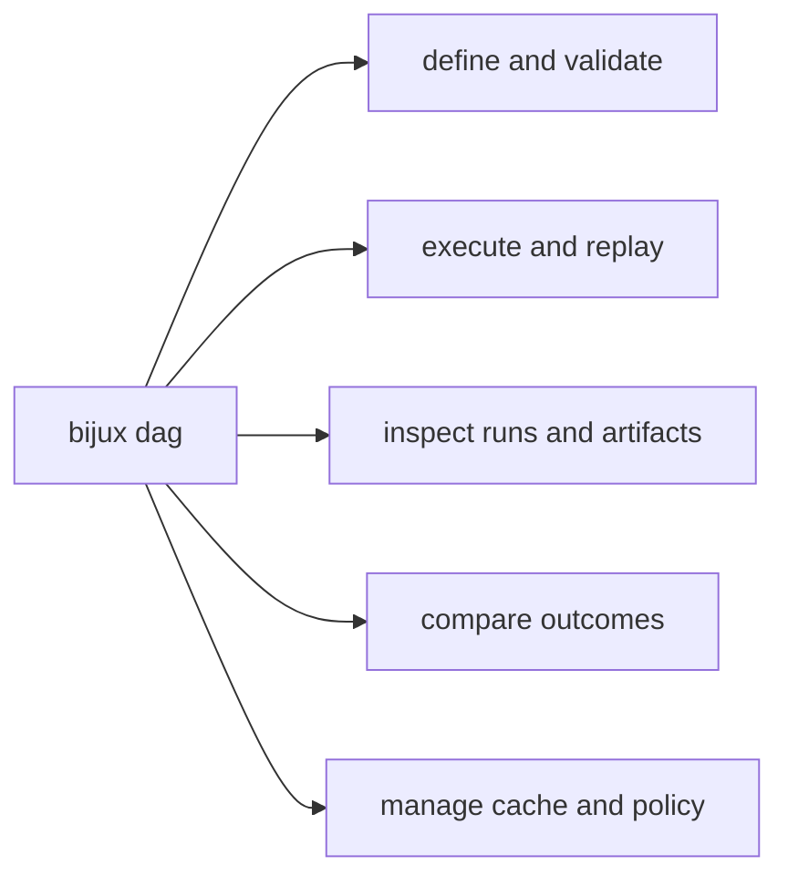

# CLI Surface

This page explains how the DAG command surface groups work by intent rather than
by crate layout.

The useful split is not the full command count. It is whether the operator is
defining work, running it, inspecting evidence, comparing outcomes, or managing
the environment around it.

## Route Map

## Command Families

- definition: `init`, `validate`, `canonicalize`, `lint`, `graph-lint`, `fingerprint`
- execution and replay: `run`, `replay`, `prove`, `proof-summary`, `verify`, `fsck`
- inspect and history: `status`, `explain`, `node`, `runs ...`, `artifact-inspect`
- comparison: `diff`, `why-rerun`, `why-cache-missed`, `trace-artifact`
- operations: `cache ...`, `adapters ...`, `export`, `import`, `config ...`, `policy ...`

## Global Flags

- `--json`: machine-readable output mode
- `--quiet`: reduced human-oriented output noise

## Code Anchors

- `crates/bijux-dag-cli/src/main.rs`
- `crates/bijux-dag-app/src/commands/mod.rs`
- `crates/bijux-dag-app/tests/cli_contract.rs`
- `crates/bijux-dag-app/tests/command_surface_routing_contracts.rs`

## CLI Surface Rules

- command additions require docs and contract test updates
- classification commands must preserve explicit outcome vocabulary
- hidden or deprecated paths should remain tested until removal is intentional

## Reading Rule

Use this page when the question is which command family should own a DAG task
before you inspect one concrete route or crate.

## Next Reads

- [Operator Workflows](operator-workflows.md)
- [Entrypoints and Examples](entrypoints-and-examples.md)
- [Compatibility Commitments](compatibility-commitments.md)
