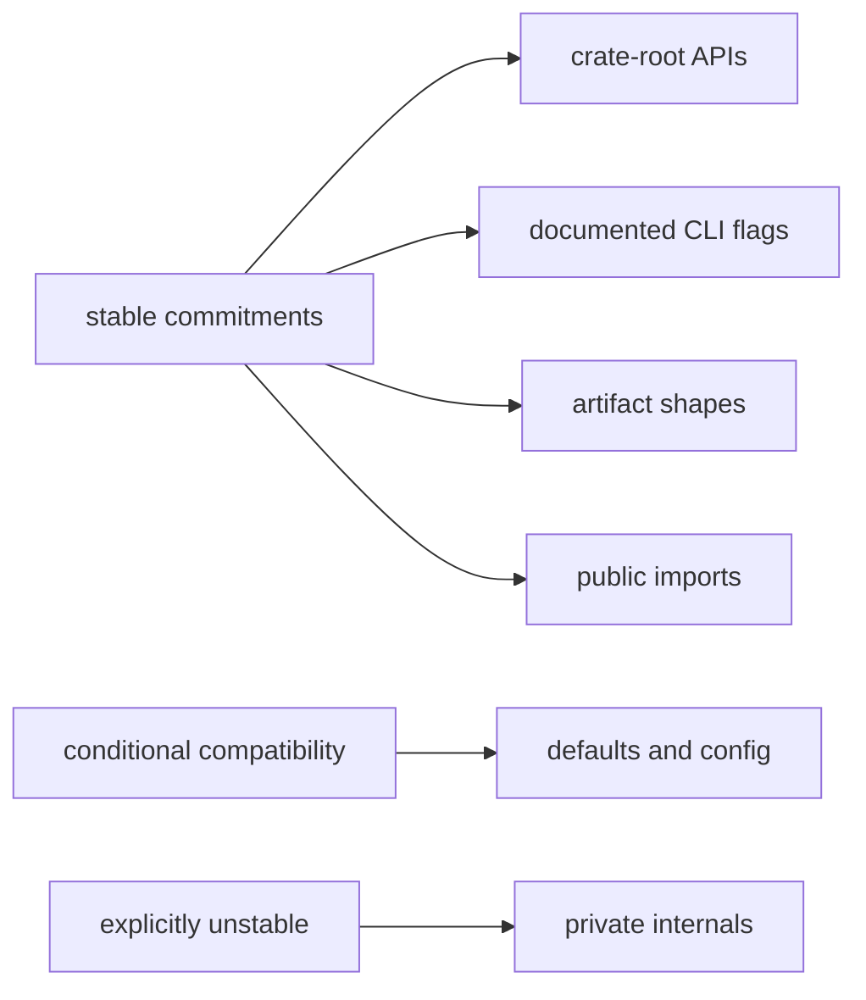

# Compatibility Commitments

This page explains which parts of DAG behavior are expected to stay stable.

That stability matters because runs, artifacts, and replay semantics are often
consumed long after a single command completes.

## Compatibility Map

## Compatibility Scope

- command family behavior for documented DAG surfaces
- graph/run/artifact identity semantics and reason-code meaning
- replay/diff classification vocabulary and failure-state visibility
- crate-root API intent for core/runtime/artifacts integrations
- runtime `tool_version` meaning and the rule that build identity is resolved at
  compile time rather than from the operator's current directory

## Flexibility Boundaries

- additive commands and fields are acceptable with documentation updates
- internal module refactors are acceptable if external behavior stays stable
- capability expansion is acceptable when downgrade semantics remain explicit
- build metadata may include a captured Git short SHA, but ambient runtime Git
  state is not part of the compatibility surface
- clean release-tree builds may inject `BIJUX_DAG_BUILD_GIT_SHA`, but that
  remains a compile-time input rather than a runtime discovery path

## Reading Rule

Use this page when a DAG change may alter what automation, stored runs, or
integrations rely on across versions.

## Code Anchors

- `crates/bijux-dag-app/src/commands/mod.rs`
- `crates/bijux-dag-core/src/analysis/fingerprint.rs`
- `crates/bijux-dag-runtime/src/replay/`
- `crates/bijux-dag-artifacts/src/storage/models.rs`
- `crates/bijux-dag-app/tests/`

## Next Reads

- [Change Principles](../foundation/change-principles.md)
- [Change Validation](../quality/change-validation.md)
- [Release and Versioning](../operations/release-and-versioning.md)
