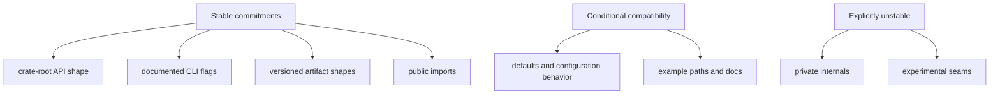

# Compatibility Commitments

Compatibility commitments define what DAG behavior is expected to remain stable
for operators, automation, and integrations.

## Visual Summary

## Compatibility Scope

- command family behavior for documented DAG surfaces
- graph/run/artifact identity semantics and reason-code meaning
- replay/diff classification vocabulary and failure-state visibility
- crate-root API intent for core/runtime/artifacts integrations

## Flexibility Boundaries

- additive commands and fields are acceptable with documentation updates
- internal module refactors are acceptable if external behavior stays stable
- capability expansion is acceptable when downgrade semantics remain explicit

## Code Anchors

- `crates/bijux-dag-app/src/commands/mod.rs`
- `crates/bijux-dag-core/src/analysis/fingerprint.rs`
- `crates/bijux-dag-runtime/src/replay/`
- `crates/bijux-dag-artifacts/src/storage/models.rs`
- `crates/bijux-dag-app/tests/*contract*.rs`

## Next Reads

- [Change Principles](../foundation/change-principles.md)
- [Change Validation](../quality/change-validation.md)
- [Release and Versioning](../operations/release-and-versioning.md)
