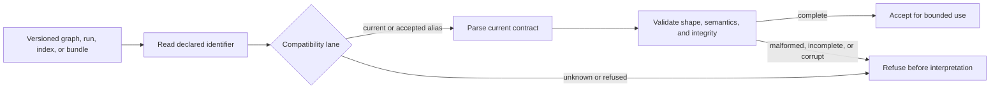

# Compatibility Matrix

`bijux-dag` accepts only declared compatibility lanes and refuses unknown
versions before interpreting payload contents. The machine-readable authority
is `contracts/foundation/version_compatibility_lanes.v1.json`; the DAG-owned
lanes below govern graph, run, index, and bundle readers.

## Lane Semantics

| Classification | Meaning |
| --- | --- |
| current | canonical identifier emitted and consumed by this release |
| accepted previous | explicit alias or older identifier accepted by the current reader |
| refused | known unsupported identifier that must fail closed |

Acceptance means the reader recognizes the declared version. It does not
promise that malformed payloads, missing required evidence, or incompatible
semantics will be repaired automatically.

## Compatibility Decision

Version recognition is the first gate, not the last. Current identifiers still
require full schema, semantic, path, and integrity validation before the
payload can support execution, replay, or comparison.

## DAG Compatibility Lanes

| Surface | Current identifiers | Accepted previous identifiers | Explicitly refused identifiers | Executable evidence |
| --- | --- | --- | --- | --- |
| graph schema and specification | `bijux-dag/v0.1` | `v1`, `v0.1`, `0.1` | `v9`, `bijux-dag/v9` | `evidence/compat/graph_schema/` |
| run manifest | `run-manifest/v0.1` | none | `run-manifest/v0`, `run-manifest/v2` | `evidence/compat/run_dir/` |
| run-dir format and artifact index | `run-dir-schema/v0.1` | none | `run-dir-schema/v0`, `run-dir-schema/v2` | `evidence/compat/run_dir/` |
| export bundle and proof bundle | `export-bundle/v0.1`, `proof-bundle/v0.1` | none | corresponding `v0` and `v2` bundle identifiers | `evidence/compat/export_bundle/` |

The graph spellings in the accepted column are aliases for the same retained
graph contract, not four independent schema generations. Run manifests,
artifact indexes, and replay bundles have no accepted predecessor lane in the
current contract.

## Producer And Consumer Direction

Writers emit only the canonical current identifier. Readers may accept the
explicit previous aliases listed in the machine contract. This asymmetry keeps
new output unambiguous while allowing a bounded read window.

| Operation | Required behavior |
| --- | --- |
| write a new graph, run, index, or bundle | emit the current canonical identifier |
| read an accepted graph alias | normalize it to the current in-memory contract without claiming a separate schema generation |
| read a future or refused identifier | fail before trusting payload fields |
| migrate retained evidence | write a new destination through an explicit governed migration; preserve the source |
| compare differently versioned evidence | classify compatibility before semantic equivalence |

## Refusal And Migration

- Reject an unknown or explicitly refused version before using its fields as
  trusted execution or replay evidence.
- Preserve the declared version in diagnostics so an operator can identify the
  incompatible producer.
- Do not silently rewrite retained runs or bundles in place.
- Use an explicit migration command or governed import path only when the
  relevant evolution rulebook defines one.
- Treat a future version as unsupported even when its JSON happens to resemble
  the current shape.

Refusal is a safety property: interpreting unknown retained evidence as current
would make replay, integrity, and compatibility claims unreliable.

## Cross-Product Boundary

The same machine contract also governs CLI command, output, and error
envelopes, configuration schema registries, and product mount descriptors.
Those are owned by the CLI handbook and are not duplicated here. A change to
the shared contract must keep both product handbooks and their executable
fixtures aligned.

## Change Review

A compatibility change must update:

- `contracts/foundation/version_compatibility_lanes.v1.json`
- the relevant schema or evolution rulebook under `docs/spec/`
- compatibility fixtures under `evidence/compat/`
- the reader or migration implementation
- this matrix and its governing tests

Adding an accepted predecessor is a deliberate compatibility expansion.
Removing one or reinterpreting an existing identifier is incompatible and
requires explicit release treatment.

## Required Change Evidence

| Decision | Required evidence |
| --- | --- |
| add a readable alias | emitting writer, consuming readers, normalization rule, and acceptance fixture |
| add a new canonical identifier | schema or rulebook, current writer, reader behavior, refusal fixture, and release boundary |
| migrate retained evidence | immutable source, governed destination writer, integrity comparison, and recovery path |
| remove an accepted identifier | incompatible release treatment, retained-evidence impact, refusal fixture, and removal notice |
| compare different identifiers | compatibility classification before cache, replay, export, import, or semantic comparison |

Every change must identify the first emitting release and the conditions under
which an older read lane may be removed. Similar JSON shape is not
compatibility evidence.

## Related Contracts

- [Compatibility Commitments](compatibility-commitments.md)
- [Graph Schema Reference](graph-schema.md)
- [Run Evidence Layout](run-evidence-layout.md)
- [Reproducibility Model](reproducibility-model.md)
- [Migration Policy](../../spec/MIGRATION_POLICY.md)
