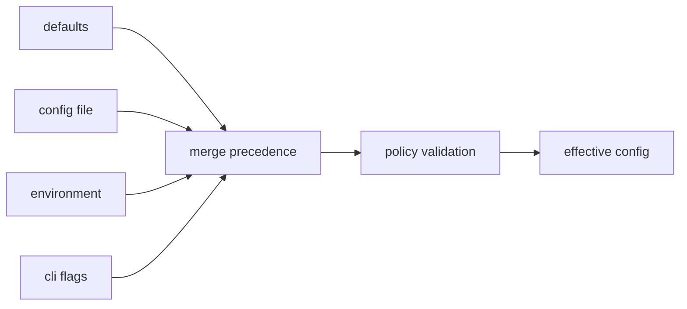

# Configuration Surface

This page explains the settings that shape how DAG work is interpreted and run.

The real contract is not just precedence. It is that effective policy stays
visible enough for replay, diff, and incident review.

## Configuration Flow

## Configuration Inputs

- command flags (`jobs`, `cache`, `cache-dir`, `materialize-inputs`, policy toggles)
- config command surfaces (`config ...`, `policy ...`)
- environment and path resolution inputs where applicable

## Policy-Relevant Controls

- network/env/clock denial flags
- hermetic and clean-env toggles
- select/exclude node targeting
- capability and backend selection where supported

## Code Anchors

- `crates/bijux-dag-app/src/commands/config_surface.rs`
- `crates/bijux-dag-app/src/commands/config_resolution.rs`
- `crates/bijux-dag-app/src/commands/mod.rs`
- `crates/bijux-dag-runtime/src/policy/`

## Configuration Rules

- effective config must be inspectable and explainable
- policy effects must be visible in replay/diff context
- defaults must not silently weaken safety or determinism expectations

## Reading Rule

Use this page when a DAG outcome depends on settings and the hard part is
working out whether the source of truth is defaults, files, environment, flags,
or policy validation.

## Next Reads

- [State and Persistence](../architecture/state-and-persistence.md)
- [Common Workflows](../operations/common-workflows.md)
- [Change Validation](../quality/change-validation.md)
