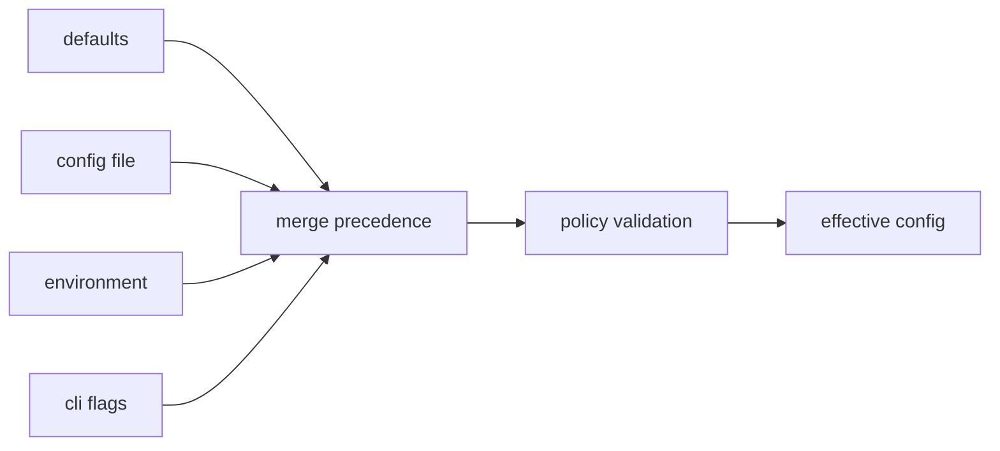
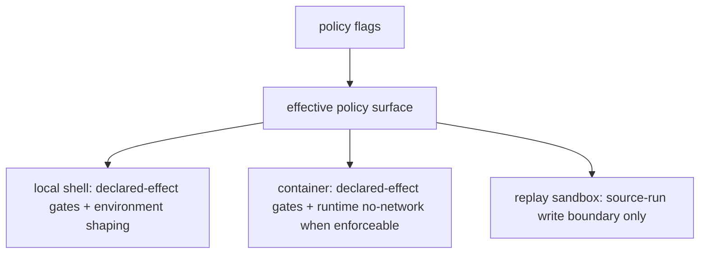

# Configuration Surface

This page explains the settings that shape how DAG work is interpreted and run.
The important contract is not just precedence. The effective policy must stay
visible enough for replay, diff, incident review, and operator trust.

## Configuration Flow

## Configuration Inputs

- command flags (`jobs`, `cache`, `cache-dir`, `materialize-inputs`, policy toggles)
- config command surfaces (`config ...`, `policy ...`)
- environment and path resolution inputs where applicable

## Policy Controls

The release-visible policy flags are precise about what they do and what they
do not do.

| Control | What it does | What it does not do |
| --- | --- | --- |
| `--deny-network` | Rejects nodes that declare the `network` effect. Container execution can also request engine-level no-network mode when the runtime can enforce it. | It does not firewall arbitrary socket calls made by a local shell process. |
| `--deny-env` | Rejects nodes that declare environment reads outside the allowed policy surface. | It does not intercept arbitrary process reads from the host environment. |
| `--deny-clock` | Rejects nodes that declare clock access as an effect. | It does not freeze or virtualize wall-clock access inside a spawned process. |
| `--clean-env` | Runs tasks with the curated bijux environment instead of inheriting the full parent environment. | It does not create a filesystem, process, or syscall sandbox. |
| `--hermetic` | Forces `--deny-network`, `--deny-clock`, and `--clean-env` as the default local policy profile. | It does not claim complete hermetic execution, host filesystem isolation, or clock virtualization. |
| `replay --sandbox` | Forbids replay outputs from being written back into the source run directory. | It does not create a process sandbox or add syscall isolation for replay execution. |

## Execution Boundary Summary

The runtime reports these boundaries through `run --preflight-only`,
`replay --dry-run`, and `runtime isolation` so operators can inspect the
effective policy before execution.

## Code Anchors

- `crates/bijux-dag-app/src/commands/mod.rs`
- `crates/bijux-dag-app/src/routes/policy_surface.rs`
- `crates/bijux-dag-app/src/routes/replay_routes.rs`
- `crates/bijux-dag-runtime/src/internal/control/runtime_controls.rs`
- `crates/bijux-dag-runtime/src/policy/`

## Configuration Rules

- effective config must be inspectable and explainable
- policy effects must be visible in replay/diff context
- defaults must not silently weaken safety or determinism expectations
- help text and dry-run surfaces must not overclaim sandboxing

## Reading Rule

Use this page when a DAG outcome depends on settings and the hard part is
working out whether the source of truth is defaults, files, environment, flags,
or policy validation, especially when a local shell workflow is being described
as "hermetic".

## Next Reads

- [State and Persistence](../architecture/state-and-persistence.md)
- [Common Workflows](../operations/common-workflows.md)
- [Change Validation](../quality/change-validation.md)
