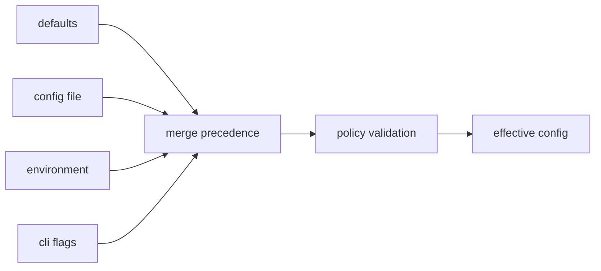
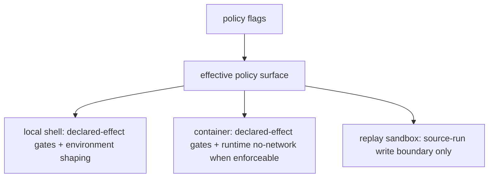

# Configuration Surface

This page explains the settings that shape how DAG work is interpreted and run.
The important contract is not just precedence. The effective policy must stay
visible enough for replay, diff, incident review, and operator trust.

## Configuration Flow

## Configuration Inputs

- command flags (`jobs`, `cache`, `cache-dir`, `materialize-inputs`, policy toggles)
- workflow input flags (`run --input key=value`, `run --inputs-file`)
- explicit-path config command surfaces (`bijux-dag config ...`, `bijux-dag policy ...`)
- environment and path resolution inputs where applicable

## Effective Config Inspection

Use the explicit inspection commands when the operator needs the resolved
configuration without starting execution:

- `bijux-dag config show-effective`
- `bijux-dag policy show-effective`

The canonical merge order is `CLI > explicit config file > environment > defaults`.
Malformed config files and unknown fields are blocking errors, not warnings.

### Input Materialization Modes

`run --materialize-inputs` and `replay --materialize-inputs` currently support:

- `copy`: duplicate the upstream file or directory into the downstream input tree
- `hardlink`: reuse the upstream file inode when the filesystem supports it, with copy fallback
- `symlink`: create a symbolic link when supported, with copy fallback

All three modes still record the same upstream source digest in
`nodes/<node_id>/inputs/index.json`, so downstream cache identity follows the
materialized content rather than relying on ambient filesystem assumptions.

## Workflow Input Binding

Runtime workflow inputs are bound at `run` time so the same DAG file can be
reused with different input values without editing `graph.inputs` in place.

The effective merge order is:

1. `graph.inputs` defaults from the DAG file
2. `run --inputs-file <json-object>`
3. repeated `run --input key=value` flags

Binding rules:

- `--inputs-file` must be a top-level JSON object
- `--input key=value` accepts JSON literals when the right-hand side parses as
  JSON, otherwise it is treated as a plain string
- runtime input keys must already be declared in `graph.inputs`
- if a node references a graph input and the effective value is still `null`,
  the run fails before execution starts

Operator-facing surfaces:

- `run --preflight-only` reports the effective input summary
- `run` human output redacts secret-like keys such as `token`, `password`,
  `secret`, and `api_key`
- `manifest.json` records the effective `run_metadata.graph_inputs` map for the
  run that actually executed

## Policy Controls

The release-visible policy flags are precise about what they do and what they
do not do.

| Control | What it does | What it does not do |
| --- | --- | --- |
| `--deny-network` | Rejects nodes that declare the `network` effect. Container execution can also request engine-level no-network mode when the runtime can enforce it. | It does not firewall arbitrary socket calls made by a local shell process. |
| `--deny-env` | Rejects nodes that declare environment reads outside the allowed policy surface. | It does not intercept arbitrary process reads from the host environment. |
| `--deny-clock` | Rejects nodes that declare clock access as an effect. | It does not freeze or virtualize wall-clock access inside a spawned process. |
| `--clean-env` | Runs tasks with the curated bijux environment instead of inheriting the full parent environment. | It does not create a filesystem, process, or syscall sandbox. |
| `--hermetic` | Forces `--deny-network`, `--deny-clock`, and `--clean-env` as the default local policy profile. | It does not claim complete hermetic execution, host filesystem isolation, or clock virtualization. |
| `replay --sandbox` | Forbids replay outputs from being written back into the source run directory. | It does not create a process sandbox or add syscall isolation for replay execution. |

## Execution Boundary Summary

The runtime reports these boundaries through `run --preflight-only`,
`replay --dry-run`, and `runtime isolation` so operators can inspect the
effective policy before execution.

## Code Anchors

- `crates/bijux-dag-app/src/commands/mod.rs`
- `crates/bijux-dag-app/src/routes/policy_surface.rs`
- `crates/bijux-dag-app/src/routes/replay_routes.rs`
- `crates/bijux-dag-runtime/src/internal/control/runtime_controls.rs`
- `crates/bijux-dag-runtime/src/policy/`

## Configuration Rules

- effective config must be inspectable and explainable
- policy effects must be visible in replay/diff context
- defaults must not silently weaken safety or determinism expectations
- help text and dry-run surfaces must not overclaim sandboxing

## Reading Rule

Use this page when a DAG outcome depends on settings and the hard part is
working out whether the source of truth is defaults, files, environment, flags,
or policy validation, especially when a local shell workflow is being described
as "hermetic".

## Next Reads

- [Config Precedence Contract](../../spec/CONFIG_PRECEDENCE_CONTRACT.md)
- [State and Persistence](../architecture/state-and-persistence.md)
- [Common Workflows](../operations/common-workflows.md)
- [Change Validation](../quality/change-validation.md)
