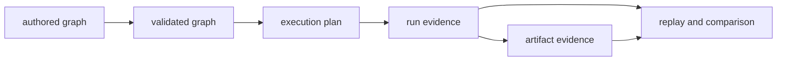

# Data Contracts

Bijux DAG exposes several related data contracts, but no single document or
schema governs all of them. This page identifies the authority for each shape
and explains the identifiers that connect authored intent to retained
evidence.

Use it when a change crosses graph, plan, run, artifact, or comparison
boundaries. For field-level syntax, follow the owning authority instead of
treating this page as another schema.

## Authority Map

| Contract | Describes | Canonical authority | Stable join keys |
| --- | --- | --- | --- |
| authored graph | nodes, edges, inputs, outputs, effects, and execution policy | [Graph Schema](graph-schema.md) and the graph model in `bijux-dag-core` | graph identity, node ID, output name |
| execution plan | validated lowering, dependencies, resolved policies, and scheduler inputs | `configs/dag/schema/execution_plan.schema.json` and `docs/spec/PLANNER_CONTRACT.md` | graph identity, plan identity, node ID |
| run evidence | selected plan, node outcomes, events, attempts, and effective inputs | [Run Evidence Layout](run-evidence-layout.md) and `docs/spec/RUN_DIR_CONTRACT.md` | run ID, graph identity, plan identity, node ID, attempt |
| artifacts | materialized outputs, digests, lineage, verification, and retention | [Artifact Contracts](artifact-contracts.md) and artifact schemas | run ID, node ID, output name, digest |
| replay and comparison | eligibility, refusal, divergence, and cache explanation | [Reproducibility Model](reproducibility-model.md) and `docs/spec/REPLAY_CONTRACT.md` | source run ID, candidate run ID, graph identity, plan identity |

Machine-readable schemas govern serialized shape. The linked prose contracts
govern behavior and interpretation. Public pages explain supported use without
copying every schema field.

## Contract Flow

Each transition adds information; it does not rewrite the identity of the
earlier object:

- validation rejects or normalizes authored input according to the graph
  contract;
- planning records the executable interpretation of the validated graph;
- execution records effective inputs, attempts, outcomes, and timing;
- artifact capture binds declared outputs to observed content digests;
- replay and comparison evaluate retained evidence under explicit
  compatibility rules.

An operator report must not infer an earlier contract from a later summary
when the earlier retained object is available.

## Identity Joins

The useful question at a boundary is not merely whether two JSON objects have
similar fields. It is whether they can be joined without guessing.

| Question | Required evidence |
| --- | --- |
| Which authored node produced this result? | graph identity plus node ID |
| Which declared output does this file satisfy? | node ID plus output name |
| Which execution attempt produced the output? | run ID, node ID, and attempt |
| Has the output content changed? | content digest under the declared digest algorithm |
| Can this prior run be replayed or compared? | retained graph and plan identities plus compatibility decision |
| Why was cached work reused or refused? | cache decision and reason code tied to the effective node identity |

Names are not interchangeable with content identities. A graph name, run
label, or path can help a person find evidence, but it cannot replace the
fingerprint or digest used by a verification decision.

## Boundary Invariants

### Graph To Plan

- Unknown or malformed graph fields are rejected rather than guessed.
- References resolve to declared graph inputs, node outputs, or supported path
  variables.
- Planning preserves enough source identity to explain the lowered result.
- A plan preview is advisory until execution retains the effective plan.

### Plan To Run

- The run records the effective inputs and plan that actually executed.
- Node outcomes remain distinguishable by attempt.
- Runtime policy changes that affect identity or eligibility are visible in
  retained evidence.
- A successful process exit alone is not proof that declared outputs exist or
  satisfy their contracts.

### Run To Artifact

- Every retained artifact maps to a declared output or an explicitly defined
  runtime evidence class.
- Materialized inputs retain upstream node, output, and digest provenance.
- Verification recomputes identity from content; it does not trust a filename
  or manifest assertion by itself.
- Missing optional outputs remain observable and distinct from undeclared
  outputs.

### Evidence To Replay Or Comparison

- Compatibility is decided explicitly before outcomes are compared.
- Refusal is a valid result and carries a machine-readable reason.
- Comparison reports distinguish content divergence, execution divergence,
  incompatible inputs, and missing evidence.
- A summary never claims equivalence beyond the evidence inspected.

## Change Review

Before changing a contract-bearing field:

1. Identify the owning schema or executable specification.
2. Trace every downstream join key and retained representation.
3. Decide whether old evidence remains readable, comparable, replayable, or
   must be refused.
4. Update implementation, fixtures, public explanation, and generated evidence
   together when they describe the same behavior.
5. Verify both successful interpretation and explicit rejection of malformed
   or incompatible data.

Adding a field can still be a compatibility change when the field participates
in identity, validation, replay eligibility, or output interpretation.

## Code Anchors

- graph and validation: `crates/bijux-dag-core/src/graph/`
- planning: `crates/bijux-dag-core/src/planner/`
- execution evidence: `crates/bijux-dag-runtime/src/runtime_core/`
- artifact records: `crates/bijux-dag-artifacts/src/storage/`
- operator responses: `crates/bijux-dag-app/src/routes/response.rs`

## Continue By Question

- To author or validate a graph, read [Graph Schema](graph-schema.md).
- To inspect retained execution state, read
  [Run Evidence Layout](run-evidence-layout.md).
- To interpret output identity and lineage, read
  [Artifact Contracts](artifact-contracts.md).
- To reason about cache, replay, or comparison, read
  [Reproducibility Model](reproducibility-model.md).
- To assess version drift, read
  [Compatibility Commitments](compatibility-commitments.md).
