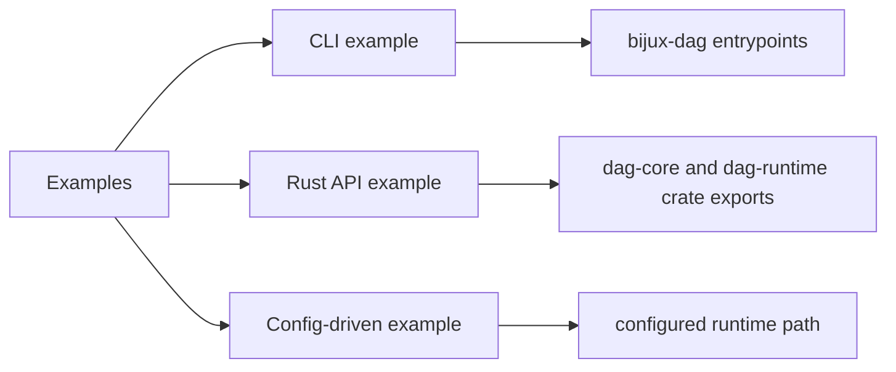

# Entrypoints and Examples

This page records practical DAG entrypoints for CLI users and Rust integrators.

## Visual Summary



## CLI Entrypoints

```bash
bijux-dag validate ./examples/simple.dag.json
bijux-dag run ./examples/simple.dag.json --out ./runs
bijux-dag replay ./runs/run-123 --out ./runs/replay-123
bijux-dag diff ./runs/run-122 ./runs/run-123 --mode semantic --explain
bijux-dag status ./runs/run-123
```

## Rust Entrypoint Example

```rust
use bijux_dag_core::parse_graph_strict;

let graph = parse_graph_strict("{\"spec\":\"bijux-dag/v0.1\",\"nodes\":[],\"edges\":[]}")?;
println!("spec={}", graph.spec);
```

## Code Anchors

- `crates/bijux-dag-cli/src/main.rs`
- `crates/bijux-dag-app/src/lib.rs`
- `crates/bijux-dag-core/src/lib.rs`
- `crates/bijux-dag-runtime/src/lib.rs`

## Next Reads

- [CLI Surface](cli-surface.md)
- [Operator Workflows](operator-workflows.md)
- [Local Development](../operations/local-development.md)
