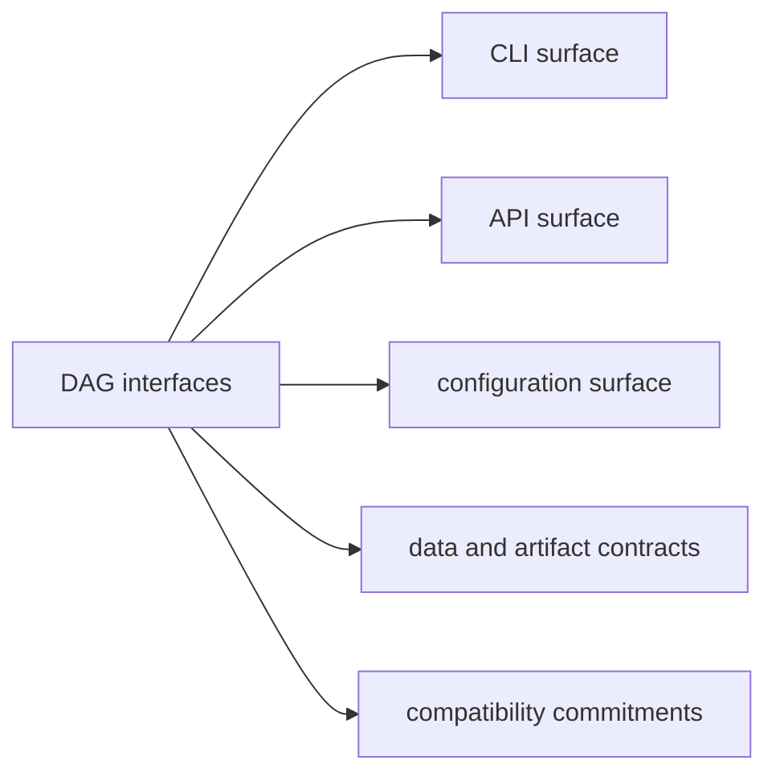

# DAG Interfaces

The interfaces section defines what operators and integrators can rely on:
command surfaces, crate APIs, config and policy surfaces, and identity-bearing
data contracts.

## Section Map

## Interface Scope

- DAG command and subcommand behavior for the public `bijux-dag --help` surface
- stable crate-root API exports by DAG crate
- runtime and policy configuration behavior
- run/artifact/replay/diff contract payloads
- hidden maintainer namespaces only when the question is about internal or simulation coverage

## Code Anchors

- `crates/bijux-dag-cli/src/main.rs`
- `crates/bijux-dag-app/src/commands/mod.rs`
- `crates/bijux-dag-core/src/lib.rs`
- `crates/bijux-dag-runtime/src/lib.rs`
- `crates/bijux-dag-artifacts/src/lib.rs`

## Pages In This Section

- [CLI Surface](cli-surface.md)
- [Generated CLI Reference](generated-cli-reference.md)
- [API Surface](api-surface.md)
- [Configuration Surface](configuration-surface.md)
- [Data Contracts](data-contracts.md)
- [Error Codes](reference/error-codes.md)
- [Non-Stable Command Inventory](reference/nonstable-command-inventory.md)
- [Reusable Subgraphs](guides/reusable-subgraphs.md)
- [Artifact Contracts](artifact-contracts.md)
- [Entrypoints and Examples](entrypoints-and-examples.md)
- [Executable Recipes](executable-recipes.md)
- [Operator Workflows](operator-workflows.md)
- [Public Imports](public-imports.md)
- [Compatibility Commitments](compatibility-commitments.md)

## Reading Rule

Use this section when the question is about what operators, tools, or other
crates can depend on. Move back to Architecture when the next question is about
engine structure instead of public contracts. For deliberate non-stable command
inventory, use `bijux-dag commands --lane experimental`,
`bijux-dag commands --lane simulated`, or `bijux-dag commands --lane internal`
rather than treating hidden routes as public API.
