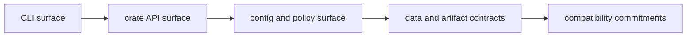

# DAG Interfaces

The interfaces section defines what operators and integrators can rely on:
command surfaces, crate APIs, config/policy surfaces, and identity-bearing data
contracts.

## Visual Summary

## Interface Scope

- DAG command and subcommand behavior
- stable crate-root API exports by DAG crate
- runtime and policy configuration behavior
- run/artifact/replay/diff contract payloads

## Code Anchors

- `crates/bijux-dag-cli/src/main.rs`
- `crates/bijux-dag-app/src/commands/mod.rs`
- `crates/bijux-dag-core/src/lib.rs`
- `crates/bijux-dag-runtime/src/lib.rs`
- `crates/bijux-dag-artifacts/src/lib.rs`

## Pages In This Section

- [CLI Surface](cli-surface.md)
- [API Surface](api-surface.md)
- [Configuration Surface](configuration-surface.md)
- [Data Contracts](data-contracts.md)
- [Artifact Contracts](artifact-contracts.md)
- [Entrypoints and Examples](entrypoints-and-examples.md)
- [Operator Workflows](operator-workflows.md)
- [Public Imports](public-imports.md)
- [Compatibility Commitments](compatibility-commitments.md)
