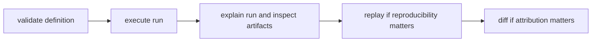

# Operator Workflows

This page explains the normal operator path through a DAG run when the goal is
to move from definition to evidence-backed judgment.

The important habit is simple: validate first, run once, explain evidence, then
use replay or diff instead of guessing.

## Workflow Map



## Baseline Workflow

1. validate graph definition and canonical form
2. execute run and collect run id
3. explain run and inspect artifact evidence
4. replay for reproducibility classification
5. diff against baseline for scoped drift attribution

## Example Sequence

```bash
bijux-dag validate ./pipelines/main.dag.json
bijux-dag run ./pipelines/main.dag.json --out ./runs
bijux-dag explain ./runs/run-20260406-01
bijux-dag runs inspect run-20260406-01 --root ./runs
bijux-dag replay ./runs/run-20260406-01 --out ./runs/replay
bijux-dag diff ./runs/run-20260405-77 ./runs/run-20260406-01 --mode semantic --explain
```

## Preview Resolved Paths Before Execution

When a graph uses `{run_dir}`, `{work_dir}`, `{inputs_dir}`, `{outputs_dir}`, or
`{cache_dir}`, preview the concrete bindings before the first run instead of
guessing where the runtime will materialize them:

```bash
bijux-dag plan explain ./pipelines/main.dag.json \
  --json \
  --out ./runs \
  --run-id rehearsal-main \
  --cache-dir ./.bijux/cache
```

The JSON payload reports:

- `run_layout`: the previewed staging and final run directories
- `path_previews`: the resolved path expressions per node
- `execution_cost_estimate`: the selected node count, root set, critical path
  length, topology-limited parallelism, resource demand, cache exposure, and
  timeout/retry exposure
- `absolute_path_policy`: the policy used for literal absolute container
  workdirs

If you want the same scheduling payload from the execution route without
starting the run, use preflight:

```bash
bijux-dag run ./pipelines/main.dag.json \
  --json \
  --out ./runs \
  --run-id rehearsal-main \
  --preflight-only \
  --explain-scheduling
```

Use the execution-cost estimate before a long run when you need to answer three
operator questions up front:

- how much of the graph is actually going to execute
- where the dependency bottleneck is
- whether resource demand, non-cacheable nodes, or aggressive timeout/retry
  settings make the run more expensive than it first looks

## Rerun Everything Downstream Of A Node

When a parent run already exists and the operator knows which node should be
treated as the restart boundary, use `--from-node` instead of rebuilding the
entire graph mentally.

```bash
bijux-dag plan explain ./pipelines/main.dag.json \
  --json \
  --from-node train

bijux-dag replay ./runs/run-20260406-01 \
  --json \
  --out ./runs/replay-train \
  --from-node train
```

The downstream rerun contract is:

- the named node is included exactly once, by exact node id
- every descendant in the graph is included deterministically
- replay reexecutes the selected closure instead of satisfying it from stale
  replay cache reuse
- nodes outside the closure stay omitted and are reported as outside the
  requested downstream rerun boundary
- `--from-node` is exclusive with `--select`, `--exclude`, and
  `--dependency-closure`

## Run Only The Prerequisites For A Target Node

When the operator wants the minimal execution closure required to reach one
target node, use `--to-node` instead of manually translating dependencies into
selectors.

```bash
bijux-dag plan explain ./pipelines/main.dag.json \
  --json \
  --to-node publish

bijux-dag run ./pipelines/main.dag.json \
  --json \
  --out ./runs \
  --run-id publish-prereqs \
  --to-node publish \
  --preflight-only
```

The upstream target contract is:

- the named node is included exactly once, by exact node id
- every required ancestor is included deterministically
- unrelated nodes stay omitted and are reported as outside the requested
  target boundary
- plan output distinguishes `selected_by_to_node` from
  `selected_by_upstream_closure`
- `--to-node` is exclusive with `--select`, `--exclude`, and
  `--dependency-closure`

## Code Anchors

- `crates/bijux-dag-app/src/routes/run_routes.rs`
- `crates/bijux-dag-app/src/routes/inspect_routes.rs`
- `crates/bijux-dag-app/src/routes/replay_routes.rs`
- `crates/bijux-dag-app/src/routes/diff_routes.rs`

## Reading Rule

Use this page when the question is not which DAG command exists, but which
sequence turns a run into something you can defend with evidence.

## Next Reads

- [Common Workflows](../operations/common-workflows.md)
- [Failure Recovery](../operations/failure-recovery.md)
- [Review Checklist](../quality/review-checklist.md)
