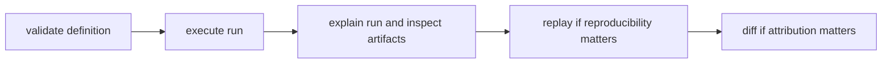

# Operator Workflows

This page explains the normal operator path through a DAG run when the goal is
to move from definition to evidence-backed judgment.

The important habit is simple: validate first, run once, explain evidence, then
use replay or diff instead of guessing.

## Workflow Map



## Baseline Workflow

1. validate graph definition and canonical form
2. execute run and collect run id
3. explain run and inspect artifact evidence
4. replay for reproducibility classification
5. diff against baseline for scoped drift attribution

## Example Sequence

```bash
bijux-dag validate ./pipelines/main.dag.json
bijux-dag run ./pipelines/main.dag.json --out ./runs
bijux-dag explain ./runs/run-20260406-01
bijux-dag runs inspect run-20260406-01 --root ./runs
bijux-dag replay ./runs/run-20260406-01 --out ./runs/replay
bijux-dag diff ./runs/run-20260405-77 ./runs/run-20260406-01 --mode semantic --explain
```

## Preview Resolved Paths Before Execution

When a graph uses `{run_dir}`, `{work_dir}`, `{inputs_dir}`, `{outputs_dir}`, or
`{cache_dir}`, preview the concrete bindings before the first run instead of
guessing where the runtime will materialize them:

```bash
bijux-dag plan explain ./pipelines/main.dag.json \
  --json \
  --out ./runs \
  --run-id rehearsal-main \
  --cache-dir ./.bijux/cache
```

The JSON payload reports:

- `run_layout`: the previewed staging and final run directories
- `path_previews`: the resolved path expressions per node
- `absolute_path_policy`: the policy used for literal absolute container
  workdirs

If you want the same scheduling payload from the execution route without
starting the run, use preflight:

```bash
bijux-dag run ./pipelines/main.dag.json \
  --json \
  --out ./runs \
  --run-id rehearsal-main \
  --preflight-only \
  --explain-scheduling
```

## Code Anchors

- `crates/bijux-dag-app/src/routes/run_routes.rs`
- `crates/bijux-dag-app/src/routes/inspect_routes.rs`
- `crates/bijux-dag-app/src/routes/replay_routes.rs`
- `crates/bijux-dag-app/src/routes/diff_routes.rs`

## Reading Rule

Use this page when the question is not which DAG command exists, but which
sequence turns a run into something you can defend with evidence.

## Next Reads

- [Common Workflows](../operations/common-workflows.md)
- [Failure Recovery](../operations/failure-recovery.md)
- [Review Checklist](../quality/review-checklist.md)
