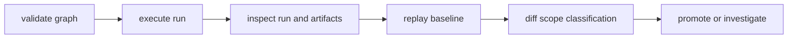

# Operator Workflows

DAG operators should follow evidence-first workflows instead of retry loops
without attribution.

## Visual Summary



## Baseline Workflow

1. validate graph definition and canonical form
2. execute run and collect run id
3. inspect run and artifact evidence
4. replay for reproducibility classification
5. diff against baseline for scoped drift attribution

## Example Sequence

```bash
bijux dag validate ./pipelines/main.dag.json
bijux dag run ./pipelines/main.dag.json --out ./runs
bijux dag inspect ./runs/run-20260406-01
bijux dag replay ./runs/run-20260406-01 --out ./runs/replay
bijux dag diff ./runs/run-20260405-77 ./runs/run-20260406-01 --mode semantic --explain
```

## Code Anchors

- `crates/bijux-dag-app/src/routes/run_routes.rs`
- `crates/bijux-dag-app/src/routes/inspect_routes.rs`
- `crates/bijux-dag-app/src/routes/replay_routes.rs`
- `crates/bijux-dag-app/src/routes/diff_routes.rs`

## Next Reads

- [Common Workflows](../operations/common-workflows.md)
- [Failure Recovery](../operations/failure-recovery.md)
- [Review Checklist](../quality/review-checklist.md)
