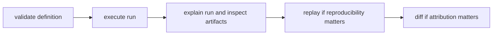

# Operator Workflows

This page explains the normal operator path through a DAG run when the goal is
to move from definition to evidence-backed judgment.

The important habit is simple: validate first, run once, explain evidence, then
use replay or diff instead of guessing.

## Workflow Map



## Baseline Workflow

1. validate graph definition and canonical form
2. preview or execute the run and collect the run id
3. explain the run and inspect artifact evidence
4. replay when reproducibility or targeted rerun matters
5. compare or diff against a baseline for attribution

## Example Sequence

```bash
bijux-dag validate ./pipelines/main.dag.json
bijux-dag run ./pipelines/main.dag.json --out ./runs
bijux-dag explain ./runs/run-20260406-01
bijux-dag runs inspect run-20260406-01 --root ./runs
bijux-dag replay ./runs/run-20260406-01 --out ./runs/replay
bijux-dag diff ./runs/run-20260405-77 ./runs/run-20260406-01 --mode semantic --explain
```

If you need the same run-directory layout and scheduling estimate before any
work starts, use `plan explain` or `run --preflight-only --explain-scheduling`
before step 2.

After `bijux-dag run`, the command now prints a compact post-run summary in
human mode and exposes the same structure under `data.summary` in JSON mode.

That completion summary answers the immediate operator questions without forcing
an extra inspect call:

- final status
- elapsed `duration_ms`
- `node_counts`
- failed node reasons when the run did not succeed
- `cache_hits`
- `artifact_count`
- `promoted_artifact_count`
- one suggested next action with a concrete follow-up command

## Query Recent Run Status

When you need the current status lane instead of a single-run deep dive, use
`runs history` as the status surface for both active and historical runs.

```bash
bijux-dag runs history --root ./runs --status success --limit 5
bijux-dag runs history --json --root ./runs --graph training-pipeline --limit 10
```

The history rows now report:

- `status` and `lifecycle_state` so active runs are distinguishable from
  finalized historical ones
- `graph_name` and `graph_fingerprint` for first-class graph filtering
- `parent_run_id`, `source_run_id`, and `lineage.child_run_ids` for run
  ancestry
- `run_dir` and `output_location` so the evidence location is visible without
  an extra lookup

Use the JSON form when another tool needs stable fields, and use the default
human form when an operator needs a compact recent-run status list.

## Run A Container-Backed Node Deliberately

When the graph includes a container node, treat the container engine as an
explicit runtime dependency instead of assuming the graph will silently fall
back to a host shell.

- validate the graph first so input and path contracts fail before runtime work
- run the graph with the intended engine available on `PATH`
- inspect the retained node trace to confirm engine version and image digest
- treat `CONTAINER_ENGINE_UNAVAILABLE` as an environment failure, not a graph
  authoring failure

For the repository-backed workflow that proves mounted inputs, retained
outputs, stdout/stderr capture, and recorded image identity on a real container
step, use
[Container Packaging Workflow](../operations/guides/container-packaging-workflow.md).

## Run A Branched Workflow Deliberately

When a graph uses `semantic_kind = "branch"`, the branch node is not only
authoring metadata. The retained run should tell you which decision was taken,
which lane ran, and why the other lane did not.

- inspect the branch node trace for `branch_decision`
- inspect the skipped lane for `skip_reason.reason = "branch_decision_not_selected"`
- inspect the join node trace to confirm the intended trigger rule admitted the
  selected branch outcome
- use replay proof when you need to confirm the same branch decision remains
  equivalent across a replay boundary

For the repository-backed workflow that demonstrates branch routing, retained
skip evidence, join-trigger behavior, and replay stability, use
[Branching Bulletin Workflow](../operations/guides/branching-bulletin-workflow.md).

## Interpret Failure Fallout

When a run fails, inspect the fallout before deciding whether downstream nodes
were correctly blocked, intentionally skipped, or actually broken on their own.

```bash
bijux-dag runs explain-failure run-20260406-01 --root ./runs
bijux-dag explain ./runs/run-20260406-01 --node publish
```

The runtime exposes three stable failure propagation behaviors:

- `fail_fast`: stop new dispatch after the first failure and treat the
  undispatched remainder as aborted fallout
- `continue_independent`: allow downstream nodes to run when their trigger
  rules still evaluate true from completed upstream states
- `isolate_branch`: keep unrelated subgraphs running but mark descendants of
  the failed node as skipped with `reason = "isolated_branch_failure"`

Use the failure summary first to find the causal node, then use node-level
explain output to confirm whether a downstream skip came from branch isolation,
trigger-rule blocking, or another boundary such as selector or policy
exclusion.

For a repository-backed recovery sequence that shows a transient retry, a
separate retry exhaustion run, and a repaired approval boundary replay, use
[Compliance-Gated Bulletin Workflow](../operations/guides/compliance-gated-bulletin-workflow.md).

## Inspect Retry Decisions

When the question is "why did this node retry?" or "why did it stop retrying?",
read the attempt evidence before changing the graph or the runtime policy.

- `nodes/<node_id>/attempts.json` records the retry decision reason per attempt
- `run.log.jsonl` and `observability.timeline.json` record `node_retry_scheduled`
  and `node_retry_exhausted` with the same durable retry reason
- `bijux-dag runtime retry --dag <graph> --node-id <node> --attempt <n> --failure-class <class>`
  reports the configured retry decision surface, and `--exit-code <code>` lets
  operators ask about exit-code-specific retry rules explicitly

Use this surface when a timeout, a policy denial, or one exit code should be
treated differently from the broad failure class that contained it.

## Compare Two Retained Runs

When two completed runs need a quick evidence-backed comparison before a deeper
artifact diff, use `runs compare` against the retained run ids:

```bash
bijux-dag runs compare run-20260405-77 run-20260406-01 --root ./runs --json
```

The comparison report keeps the retained-run surface explicit:

- top-level status, retry, cache-hit, artifact-count, and timing summaries for
  both runs
- graph fingerprint and execution fingerprint equality
- graph input values
- selected nodes from `run.snapshot.json`
- per-node terminal statuses
- per-node output hashes from retained node output indexes
- the first meaningful divergence that can be proven from retained evidence

Use `runs compare` when the question is "where did these two retained runs first
drift?" Use `diff` when the question is "how do these run directories differ in
detail across artifacts, policy, provenance, or one specific node?"

## Stop an Active Run

When a live run should stop launching new work, record a durable stop request
against its run id:

```bash
bijux-dag runs stop run-20260406-01 --root ./runs
bijux-dag runs stop run-20260406-01 --root ./runs --json
```

The stop request is written into the active run staging directory, the runtime
observes it during execution, and the finalized manifest records
`run_cancellation_cause = "operator_request"` when the stop succeeds.

## Preview Resolved Paths Before Execution

When a graph uses `{run_dir}`, `{work_dir}`, `{inputs_dir}`, `{outputs_dir}`, or
`{cache_dir}`, preview the concrete bindings before the first run instead of
guessing where the runtime will materialize them:

```bash
bijux-dag plan explain ./pipelines/main.dag.json \
  --json \
  --out ./runs \
  --run-id rehearsal-main \
  --cache-dir ./.bijux/cache
```

The JSON payload reports:

- `run_layout`: the previewed staging and final run directories
- `path_previews`: the resolved path expressions per node
- `execution_cost_estimate`: the selected node count, root set, critical path
  length, weighted `critical_path` details, topology-limited parallelism,
  resource demand, `scheduling_simulation` bottlenecks, cache exposure, and
  timeout/retry exposure
- `absolute_path_policy`: the policy used for literal absolute container
  workdirs

If you want the same scheduling payload from the execution route without
starting the run, use preflight:

```bash
bijux-dag run ./pipelines/main.dag.json \
  --json \
  --out ./runs \
  --run-id rehearsal-main \
  --preflight-only \
  --explain-scheduling
```

Use the execution-cost estimate before a long run when you need to answer three
operator questions up front:

- how much of the graph is actually going to execute
- where the dependency bottleneck is
- whether resource demand, non-cacheable nodes, or aggressive timeout/retry
  settings make the run more expensive than it first looks

When you also care about runtime budgets, add the same flags the execution
surface uses to the preview itself:

```bash
bijux-dag plan explain ./pipelines/main.dag.json \
  --json \
  --jobs 4 \
  --cpu-budget 4 \
  --memory-budget-mb 8192 \
  --resource-capacity database_slot=1
```

The resulting `execution_cost_estimate.scheduling_simulation` section answers a
different question from the pure dependency `critical_path`:

- `run_bound`: whether the previewed run remains dependency-bound or becomes
  resource-bound under the selected budgets
- `resource_delay_ms`: how much longer the simulated run takes than the
  dependency-only critical path
- `bottlenecks`: which resource caps forced ready nodes to wait
- `blocked_nodes`: which nodes waited, for how long, and why

When a node carries `params.estimated_duration_ms`, the planner uses that value
to weight the reported `critical_path`. Nodes without an estimate fall back to
`1`, and the payload reports both the chosen path and how many nodes on that
path relied on the unit fallback.

## Rerun Everything Downstream Of A Node

When a parent run already exists and the operator knows which node should be
treated as the restart boundary, use `--from-node` instead of rebuilding the
entire graph mentally.

```bash
bijux-dag plan explain ./pipelines/main.dag.json \
  --json \
  --from-node train

bijux-dag replay ./runs/run-20260406-01 \
  --json \
  --out ./runs/replay-train \
  --from-node train

bijux-dag replay \
  --json \
  --source-run-id 20260406-01 \
  --source-run-root ./runs \
  --out ./runs/replay-train \
  --from-node train
```

The downstream rerun contract is:

- the named node is included exactly once, by exact node id
- every descendant in the graph is included deterministically
- replay verifies the persisted upstream artifacts that cross into the rerun
  boundary before execution begins
- replay reexecutes the selected closure instead of satisfying it from stale
  replay cache reuse
- nodes outside the closure stay omitted and are reported as outside the
  requested downstream rerun boundary
- when exactly one rerun root is selected, the replay response includes a
  focused node diff so the operator can see what changed without running a
  second compare command
- `--from-node` is exclusive with `--select`, `--exclude`, and
  `--dependency-closure`

When the source run is easier to identify by id than by path, prefer
`--source-run-id` with `--source-run-root` over manually reconstructing the run
directory path.

## Compare Two Graph Versions Before Running

When an operator needs to understand whether a DAG edit is cosmetic or changes
execution, use `plan diff` against the two graph files instead of inferring the
impact from source control alone.

```bash
bijux-dag plan diff \
  ./pipelines/main-before.dag.json \
  ./pipelines/main-after.dag.json \
  --json
```

The diff contract reports:

- added and removed nodes
- node ids with changed params
- node ids with changed outputs
- node ids with changed resources
- node ids with changed retry or timeout policy
- added and removed dependencies
- whether drift is metadata-only or execution-affecting

Metadata-only drift means the graph fingerprint changed while the execution
fingerprint stayed stable. Execution-affecting drift means the planned runtime
surface changed and should be reviewed as a real workflow mutation.

When the operator needs a yes-or-no answer instead of a raw diff, use
`plan equivalence` against the same pair of graph files.

```bash
bijux-dag plan equivalence \
  ./pipelines/main-before.dag.json \
  ./pipelines/main-after.dag.json \
  --json
```

The equivalence contract reports:

- whether the graphs are execution-equivalent
- whether canonical graph identity stayed equal
- whether the execution fingerprint stayed equal
- which metadata drift was ignored to preserve equivalence
- the exact execution-affecting causes when equivalence fails

This keeps cosmetic metadata edits separate from real workflow mutations, and
it does not over-claim safety when planner-visible execution drift exists even
if the current execution fingerprint remains unchanged.

## Drive Scheduled Runs From Typed Trigger Context

When scheduled work needs graph inputs from trigger metadata, declare the input
contract in the schedule registry and submit explicit trigger payloads instead
of encoding that context indirectly in DAG defaults or ad hoc environment
state.

A submit input file can carry manual arguments, event payloads, dependency
completions, and signal payloads:

```json
{
  "now_unix_ms": 1762387200000,
  "manual_requests": [
    {
      "request_id": "manual-001",
      "schedule_id": "manual-ops",
      "requested_unix_ms": 1762387200000,
      "arguments": {
        "region": "eu-west-1"
      }
    }
  ],
  "events": [
    {
      "event_id": "evt-001",
      "event_type": "dataset.ready",
      "source": "catalog",
      "occurred_unix_ms": 1762387260000,
      "payload": {
        "tenant": "atlas",
        "batch": 7
      }
    }
  ],
  "dependencies": [
    {
      "upstream_run_id": "atlas-run-7",
      "dag_name": "atlas.ingest",
      "status": "succeeded",
      "finished_unix_ms": 1762387290000
    }
  ],
  "signals": [
    {
      "signal_id": "sig-001",
      "signal_name": "refresh-cache",
      "occurred_unix_ms": 1762387320000,
      "payload": {
        "tenant": "atlas"
      }
    }
  ]
}
```

Submit the registry and trigger inputs together:

```bash
bijux-dag schedule submit ./ops/schedule-registry.json \
  ./ops/schedule-inputs.json \
  --out ./artifacts/schedule-ledger.json
```

The schedule-input binding contract is:

- trigger-derived values are normalized against the declared graph input types
- manual submissions can supply `manual_requests[].arguments` for bound inputs
- event and signal schedules can bind either the full payload or a JSON Pointer
  inside the payload
- dependency-triggered schedules can bind upstream run ids and completion
  status
- invalid or missing bindings suppress submission instead of creating a run
  request with partial graph input state
- event-triggered submissions record event-to-run lineage in the durable
  submission ledger through `event_lineage`

## Trigger One DAG When Another DAG Completes

When one workflow should launch only after another reaches a terminal outcome,
declare an explicit dependency trigger in the schedule registry instead of
polling run history out of band.

```json
{
  "id": "publish-after-ingest",
  "dag_name": "atlas.publish",
  "dag_version_policy": "run-latest",
  "input_contract": {
    "dependency_run_id": { "type": "string", "required": true },
    "dependency_status": { "type": "string", "required": true }
  },
  "input_bindings": {
    "dependency_run_id": { "source": "dependency_upstream_run_id" },
    "dependency_status": { "source": "dependency_status" }
  },
  "trigger": {
    "Dependency": {
      "dag_name": "atlas.ingest",
      "on_status": "any_terminal"
    }
  }
}
```

The dependency-trigger contract is:

- `on_status` is explicit and supports `success`, `failure`, or `any_terminal`
- `success` matches successful upstream completions
- `failure` matches terminal non-success completions such as failed, cancelled,
  or timed-out runs
- `any_terminal` matches either successful or failure terminal outcomes
- `dependency_upstream_run_id` binds the completed upstream run id into the
  downstream graph input contract
- dedupe is keyed by schedule id, upstream run id, and trigger condition so
  alias status spellings do not create duplicate downstream submissions

## Preserve Event-To-Run Lineage For External Triggers

When scheduled work comes from an external event, the durable submission ledger
retains the triggering event identity alongside the generated run id instead of
relying on the dedupe key alone.

The event lineage contract is:

- event-triggered schedules deduplicate by schedule id plus `event_id`
- the emitted submission request and durable ledger entry retain
  `event_id`, `event_type`, `source`, and `occurred_unix_ms`
- payload binding into graph inputs does not erase the original event identity
- repeated delivery of the same event id does not create a second run or a
  second lineage record

## Pause Scheduled Submission Creation Without Deleting The Schedule

When the schedule definition should stay in the registry but new submissions
must stop, record an explicit schedule control override instead of removing the
definition or editing the submission ledger by hand.

Pause one schedule by appending a durable override record:

```bash
bijux-dag schedule control pause ./artifacts/schedule-overrides.json \
  --schedule-id manual-ops \
  --operator atlas-ops \
  --at-unix-ms 1762387440000 \
  --reason "hold while downstream validation is degraded" \
  --out ./artifacts/schedule-overrides.json
```

Inspect the current pause status for every schedule in the registry:

```bash
bijux-dag schedule control status ./ops/schedule-registry.json \
  --overrides ./artifacts/schedule-overrides.json \
  --out ./artifacts/schedule-control-status.json
```

Then evaluate submissions against the same override log:

```bash
bijux-dag schedule submit ./ops/schedule-registry.json \
  ./ops/schedule-inputs.json \
  --overrides ./artifacts/schedule-overrides.json \
  --out ./artifacts/schedule-ledger.json
```

Resume the schedule only when new submissions should become eligible again:

```bash
bijux-dag schedule control resume ./artifacts/schedule-overrides.json \
  --schedule-id manual-ops \
  --operator atlas-ops \
  --at-unix-ms 1762388400000 \
  --reason "validation recovered" \
  --out ./artifacts/schedule-overrides.json
```

The schedule-control contract is:

- the override file is a durable append-only operator log, not derived output
- the latest record for one `schedule_id` determines whether that schedule is
  paused or active
- a paused schedule creates no new submissions during `schedule submit`
- pause does not delete the schedule definition and does not rewrite existing
  ledger entries
- operator identity and control timestamp are recorded on every pause or resume
- resume is explicit; the schedule stays paused until a resume record is
  written

The submission ledger is also the durable queue-state source for scheduled
work. Each recorded submission preserves its queue identity, priority, dedupe
key, and status so queue occupancy can be reconstructed after a restart.

Inspect queue occupancy from the registry plus the current submission ledger:

```bash
bijux-dag schedule queue status ./ops/schedule-registry.json \
  --ledger ./artifacts/schedule-ledger.json \
  --out ./artifacts/queue-state.json
```

When external execution state proves a scheduled run finished, advance the same
ledger explicitly instead of editing queue occupancy by hand:

```bash
bijux-dag schedule queue update \
  ./artifacts/schedule-ledger.json \
  ./ops/submission-status-updates.json \
  --out ./artifacts/schedule-ledger.json
```

The queue-state control contract is:

- queue occupancy is reconstructed from `pending` and `running` ledger entries
- queue caps are enforced per queue name and, when configured, per queue plus
  tenant
- queue status only reflects capacities declared in the validated registry
- status updates are transition-checked before the ledger is rewritten
- the queue-state file is derived output, while the submission ledger remains
  the durable source of truth

When the ledger contains more than one pending scheduled run, dispatch from the
same durable ledger instead of relying on arrival order:

```bash
bijux-dag schedule queue dispatch \
  ./artifacts/schedule-ledger.json \
  --max-dispatches 2 \
  --out ./artifacts/schedule-ledger.json
```

The priority-dispatch contract is:

- `critical`, `high`, `standard`, and `low` priorities are ordered by explicit
  weights
- equal effective priority is broken deterministically by creation time, then
  schedule id, then run id
- deferred pending runs accumulate durable starvation ticks in the ledger
- once a run crosses the starvation threshold, the dispatcher boosts it above
  the normal priority lane so low-priority work cannot starve forever
- dispatched runs move from `pending` to `running` and reset their starvation
  counter

## Control A Historical Backfill

When an operator needs to replay a bounded historical window, treat the
backfill as a durable operation instead of a loose list of manual reruns.

Plan the operation from the schedule registry first:

```bash
bijux-dag schedule backfill plan ./ops/schedule-registry.json \
  --schedule-id historical-catalog \
  --planned-unix-ms 1762387200000 \
  --out ./artifacts/backfill-state.json
```

Advance the operation with explicit throttling inputs:

```bash
bijux-dag schedule backfill advance \
  ./artifacts/backfill-state.json \
  ./ops/backfill-advance-request.json \
  --out ./artifacts/backfill-state.json
```

Pause, resume, or cancel the same durable state file when operator control is
needed:

```bash
bijux-dag schedule backfill pause ./artifacts/backfill-state.json \
  --at-unix-ms 1762387500000 \
  --reason "hold while downstream catalog is degraded" \
  --out ./artifacts/backfill-state.json

bijux-dag schedule backfill resume ./artifacts/backfill-state.json \
  --at-unix-ms 1762388400000 \
  --out ./artifacts/backfill-state.json

bijux-dag schedule backfill cancel ./artifacts/backfill-state.json \
  --at-unix-ms 1762389000000 \
  --reason "superseded by corrected source snapshot" \
  --out ./artifacts/backfill-state.json
```

The backfill control contract is:

- time-window expansion is deterministic and advances in one-minute request
  slots across the declared window
- partition-list backfills expand deterministically within each time slot
- `max_parallelism` limits concurrent submitted or running backfill work
- the advance request applies live-load throttling before dispatching new runs
- failure policy controls whether a failed backfill run continues, pauses, or
  cancels remaining queued work
- pause and cancel stop new dispatches without pretending that already
  submitted runs were never issued

## Run Only The Prerequisites For A Target Node

When the operator wants the minimal execution closure required to reach one
target node, use `--to-node` instead of manually translating dependencies into
selectors.

```bash
bijux-dag plan explain ./pipelines/main.dag.json \
  --json \
  --to-node publish

bijux-dag run ./pipelines/main.dag.json \
  --json \
  --out ./runs \
  --run-id publish-prereqs \
  --to-node publish \
  --preflight-only
```

The upstream target contract is:

- the named node is included exactly once, by exact node id
- every required ancestor is included deterministically
- unrelated nodes stay omitted and are reported as outside the requested
  target boundary
- plan output distinguishes `selected_by_to_node` from
  `selected_by_upstream_closure`
- `--to-node` is exclusive with `--select`, `--exclude`, and
  `--dependency-closure`

## Code Anchors

- `crates/bijux-dag-app/src/routes/run_routes.rs`
- `crates/bijux-dag-app/src/routes/inspect_routes.rs`
- `crates/bijux-dag-app/src/routes/replay_routes.rs`
- `crates/bijux-dag-app/src/routes/diff_routes.rs`
- `crates/bijux-dag-app/src/routes/schedule_routes.rs`

## Reading Rule

Use this page when the question is not which DAG command exists, but which
sequence turns a run into something you can defend with evidence.

## Next Reads

- [Common Workflows](../operations/common-workflows.md)
- [Branching Bulletin Workflow](../operations/guides/branching-bulletin-workflow.md)
- [Compliance-Gated Bulletin Workflow](../operations/guides/compliance-gated-bulletin-workflow.md)
- [Container Packaging Workflow](../operations/guides/container-packaging-workflow.md)
- [Failure Recovery](../operations/failure-recovery.md)
- [Review Checklist](../quality/review-checklist.md)
