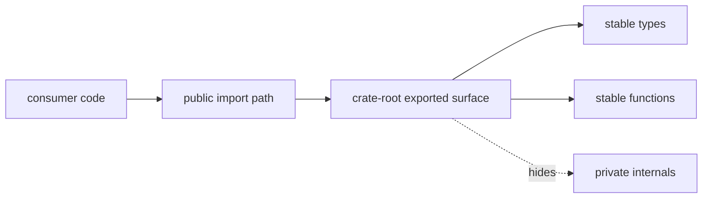

# Public Imports

This page records the import paths DAG integrations should prefer.

Using the crate-root exports keeps downstream code aligned with the public
surface instead of tying it to internal module layout.

## Import Map

## Preferred Imports

- `bijux_dag_core::{Graph, GraphError, parse_graph_strict, lower_graph_to_execution_plan}`
- `bijux_dag_runtime::{Runtime, RuntimeConfig, build_plan}`
- `bijux_dag_artifacts::{RunDir, verify_run_dir, write_outputs_index}`
- `bijux_dag_app::{dag_command, dag_run}` for CLI wiring integrations

## Reading Rule

Use this page when an integration needs DAG types or functions but the correct
crate-root boundary is still unclear.

## Code Anchors

- `crates/bijux-dag-core/src/lib.rs`
- `crates/bijux-dag-runtime/src/lib.rs`
- `crates/bijux-dag-artifacts/src/lib.rs`
- `crates/bijux-dag-app/src/lib.rs`

## Next Reads

- [API Surface](api-surface.md)
- [Dependency Governance](../quality/dependency-governance.md)
- [Compatibility Commitments](compatibility-commitments.md)
