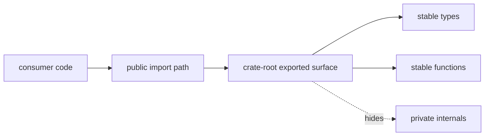

# Public Imports

This page records the import paths DAG integrations should prefer.

Using crate-root exports, `stable`, or `prelude` keeps downstream code aligned
with the intentional public surface instead of tying it to internal module
layout.

For `bijux-dag-runtime`, the only module-level public lanes are `stable`,
`prelude`, `experimental`, and `simulated_platform`. Compatibility-heavy
backend, governance, and evidence helpers remain repository-owned and are
hidden from the default docs surface.

## Import Map

## Preferred Imports

- `bijux_dag_core::prelude::{Graph, GraphError, parse_graph_strict, lower_graph_to_execution_plan}`
- `bijux_dag_runtime::prelude::{Runtime, RuntimeConfig, build_plan}`
- `bijux_dag_artifacts::prelude::{RunDir, verify_run_dir, write_outputs_index}`
- `bijux_dag_app::prelude::{dag_command, dag_run}` for CLI wiring integrations
- `bijux_dag_runtime::simulated_platform::{...}` only when a maintainer workflow
  intentionally needs modeled platform or control-plane contracts

## Experimental Imports

- enable the crate-local `experimental-public-api` feature before using any
  `experimental` module
- prefer durable feature-lane paths such as
  `bijux_dag_core::experimental::resource_capabilities`
  instead of transitional internal module names

## Reading Rule

Use this page when an integration needs DAG types or functions but the correct
crate-root boundary is still unclear.

## Code Anchors

- `crates/bijux-dag-core/src/lib.rs`
- `crates/bijux-dag-runtime/src/lib.rs`
- `crates/bijux-dag-artifacts/src/lib.rs`
- `crates/bijux-dag-app/src/lib.rs`

## Next Reads

- [API Surface](api-surface.md)
- [Dependency Governance](../quality/dependency-governance.md)
- [Compatibility Commitments](compatibility-commitments.md)
