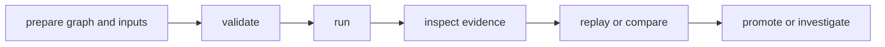

# Common Workflows

Every operator workflow must connect a declared graph to retained evidence and
a bounded decision. Choose the workflow by the proof required, not merely by
the command that initiates it.

## Normal Operator Loop



The minimum responsible sequence is:

1. validate the graph and resolve required inputs
2. execute into a deliberate artifact root
3. inspect run state and required artifacts
4. replay when reproducibility matters, or compare when attribution matters
5. promote only after the required evidence verifies

The [First-Run Tutorial](first-run-tutorial.md) executes this loop against a
checked-in graph. The [Operator Workflows](../interfaces/operator-workflows.md)
documents individual inspection, replay, comparison, scheduling, and backfill
operations.

## Choose A Workflow

| Question | Workflow | Proof produced |
| --- | --- | --- |
| which checked-in example demonstrates a capability? | [Executable Examples](../interfaces/runnable-examples.md) | tested commands and declared expected outputs |
| can a local file workflow run, cache, replay, and promote? | [File Processing Workflow](file-processing-workflow.md) | rendered report, warm reuse, focused replay, promotion evidence |
| which nodes changed after an input changed? | [Data Pipeline Workflow](data-pipeline-workflow.md) | structured comparison and affected-stage attribution |
| why was cached work reused or refused? | [Cache Behavior Workflow](cache-behavior-workflow.md) | hit evidence, selective invalidation, corruption refusal, miss reason |
| which conditional lane ran? | [Branching Bulletin Workflow](branching-bulletin-workflow.md) | selected branch, retained skip, join trigger, replay stability |
| can a failed tail be repaired without hiding the root failure? | [Compliance-Gated Bulletin Workflow](compliance-gated-bulletin-workflow.md) | retry attempts, approval failure, propagated fallout, repaired verification |
| can a node execute in a real container boundary? | [Container Packaging Workflow](container-packaging-workflow.md) | mounted inputs, retained outputs, image and engine identity |
| how are scheduled submissions linked to runs? | [Scheduled Catalog Refresh Workflow](scheduled-catalog-refresh-workflow.md) | cron preview, slot suppression, queue dispatch, ledger-to-run identity |
| how are failed historical partitions retried? | [Historical Catalog Backfill Workflow](historical-catalog-backfill-workflow.md) | partition fanout, retry selection, aggregate state |

The schedule and backfill guides describe proof-backed internal surfaces in
v0.4.x, not stable scheduler APIs. Read
[Known Limitations](../quality/known-limitations.md) before depending on them.

## Stop A Live Run

Request a cooperative stop when an active run should stop dispatching more
nodes:

```bash
bijux-dag runs stop run-20260406-01 --root ./runs/proposed
```

Use `--json` when automation needs the recorded request path and current stop
state. A stop request is evidence of intent, not proof that already-dispatched
work was terminated; inspect the retained run state before deciding what to do
next.

## Promotion Criteria

Promote an output only when:

- the run reached the expected final state
- required artifacts exist and pass the applicable verification
- replay or comparison evidence exists when reproducibility or attribution is
  part of the claim
- drift and exceptions are absent or explicitly approved

## Code Anchors

- `crates/bijux-dag-app/src/routes/run_routes.rs`
- `crates/bijux-dag-app/src/routes/inspect_routes.rs`
- `crates/bijux-dag-app/src/routes/replay_routes.rs`

## Recovery And Evidence

- [Failure Recovery](failure-recovery.md)
- [Run Evidence Layout](../interfaces/run-evidence-layout.md)
- [Security And Isolation](security-isolation-truth.md)
- [Review Checklist](../quality/review-checklist.md)
