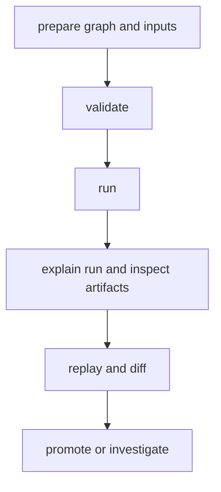

# Common Workflows

This page captures the DAG workflow path people follow most often.

The sequence matters because DAG work is less about one command and more about
moving safely from validation to evidence-backed decisions.

## Workflow Map



## Workflow Catalog

- preflight validation for graph and config correctness
- execution workflow for run creation and status tracking
- reproducibility workflow for replay confirmation
- change-attribution workflow for semantic diff explanations
- container-packaging workflow for mounted inputs, retained outputs, and engine identity
- file-processing workflow for cache, lineage, rerun, and promotion proof
- data-pipeline workflow for cache reuse, changed-input attribution, and retained-run comparison

## Canonical Command Path

```bash
bijux-dag validate ./pipelines/main.dag.json
bijux-dag run ./pipelines/main.dag.json --out ./runs/proposed
bijux-dag explain ./runs/proposed/run-20260406-01
bijux-dag runs inspect run-20260406-01 --root ./runs/proposed
bijux-dag replay ./runs/proposed/run-20260406-01 --out ./runs/replay
bijux-dag diff ./runs/reference/run-20260405-77 ./runs/proposed/run-20260406-01 --mode semantic --explain
```

## Stop a Live Run

When a proposed run is active and should stop dispatching additional nodes:

```bash
bijux-dag runs stop run-20260406-01 --root ./runs/proposed
```

Use `--json` when another tool needs the recorded stop request path or current
stop state.

## Code Anchors

- `crates/bijux-dag-app/src/routes/run_routes.rs`
- `crates/bijux-dag-app/src/routes/inspect_routes.rs`
- `crates/bijux-dag-app/src/routes/replay_routes.rs`

## Promotion Criteria

- run completed with expected fidelity level
- required artifact evidence present and verifiable
- drift either absent or explicitly approved

## Concrete Repository Example

For one end-to-end local workflow that validates real input files, renders a
promotable report, proves warm-cache reuse, and exercises focused replay, use
[File Processing Workflow](guides/file-processing-workflow.md).

For a structured analytics-style workflow that changes one explicit graph input
and then compares retained runs to identify the affected stages, use
[Data Pipeline Workflow](guides/data-pipeline-workflow.md).

For a real local container execution path that mounts upstream inputs, writes
retained outputs, records image identity, and fails clearly when Docker is not
available, use
[Container Packaging Workflow](guides/container-packaging-workflow.md).

## Reading Rule

Use this page when the DAG commands are already familiar but the correct
operator sequence is still unclear.

## Next Reads

- [Failure Recovery](failure-recovery.md)
- [Container Packaging Workflow](guides/container-packaging-workflow.md)
- [Data Pipeline Workflow](guides/data-pipeline-workflow.md)
- [Operator Workflows](../interfaces/operator-workflows.md)
- [Review Checklist](../quality/review-checklist.md)
