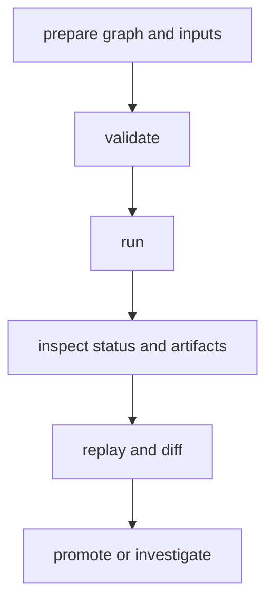

# Common Workflows

Common workflows define the standard operator path from graph readiness to
promotion decisions.

## Visual Summary



## Workflow Catalog

- preflight validation for graph and config correctness
- execution workflow for run creation and status tracking
- reproducibility workflow for replay confirmation
- change-attribution workflow for semantic diff explanations

## Canonical Command Path

```bash
bijux dag validate ./pipelines/main.dag.json
bijux dag run ./pipelines/main.dag.json --out ./runs/proposed
bijux dag status ./runs/proposed/latest
bijux dag replay ./runs/proposed/latest --out ./runs/replay
bijux dag diff ./runs/reference/latest ./runs/proposed/latest --mode semantic --explain
```

## Code Anchors

- `crates/bijux-dag-app/src/routes/run_routes.rs`
- `crates/bijux-dag-app/src/routes/status_routes.rs`
- `crates/bijux-dag-app/src/routes/inspect_routes.rs`

## Promotion Criteria

- run completed with expected fidelity level
- required artifact evidence present and verifiable
- drift either absent or explicitly approved

## Next Reads

- [Failure Recovery](failure-recovery.md)
- [Operator Workflows](../interfaces/operator-workflows.md)
- [Review Checklist](../quality/review-checklist.md)
