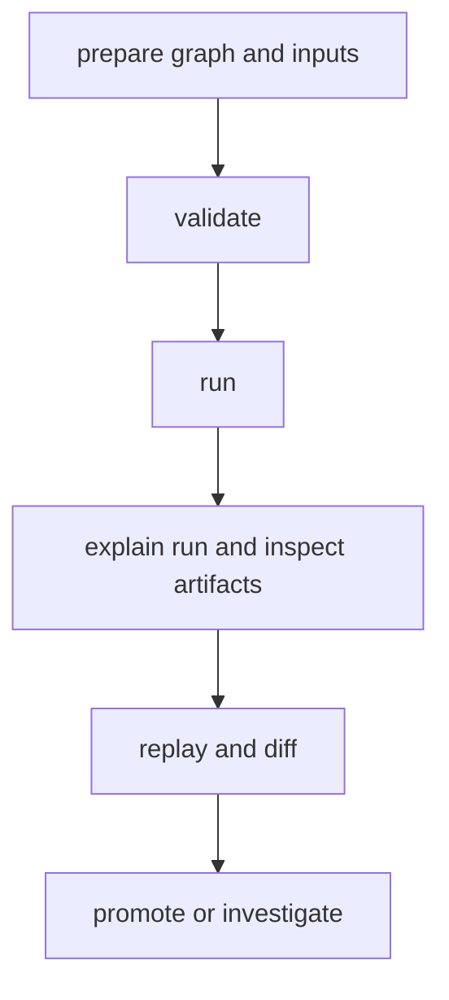

# Common Workflows

This page captures the DAG workflow path people follow most often.

The sequence matters because DAG work is less about one command and more about
moving safely from validation to evidence-backed decisions.

## Workflow Map



## Workflow Catalog

- preflight validation for graph and config correctness
- execution workflow for run creation and status tracking
- reproducibility workflow for replay confirmation
- change-attribution workflow for semantic diff explanations
- branch-routing workflow for retained skip reasons and join-trigger evidence
- container-packaging workflow for mounted inputs, retained outputs, and engine identity
- failure-recovery workflow for retry evidence, focused replay repair, and strict verification
- file-processing workflow for cache, lineage, rerun, and promotion proof
- data-pipeline workflow for cache reuse, changed-input attribution, and retained-run comparison
- cache-behavior workflow for selective invalidation, corruption refusal, and cache-miss explanation
- internal schedule workflow for cron preview, deterministic submission, queue dispatch, and explicit run linkage
- internal backfill workflow for historical partition fanout, retryable failed partitions, and aggregate summary reporting

## Canonical Command Path

```bash
bijux-dag validate ./pipelines/main.dag.json
bijux-dag run ./pipelines/main.dag.json --out ./runs/proposed
bijux-dag explain ./runs/proposed/run-20260406-01
bijux-dag runs inspect run-20260406-01 --root ./runs/proposed
bijux-dag replay ./runs/proposed/run-20260406-01 --out ./runs/replay
bijux-dag diff ./runs/reference/run-20260405-77 ./runs/proposed/run-20260406-01 --mode semantic --explain
```

## Stop a Live Run

When a proposed run is active and should stop dispatching additional nodes:

```bash
bijux-dag runs stop run-20260406-01 --root ./runs/proposed
```

Use `--json` when another tool needs the recorded stop request path or current
stop state.

## Code Anchors

- `crates/bijux-dag-app/src/routes/run_routes.rs`
- `crates/bijux-dag-app/src/routes/inspect_routes.rs`
- `crates/bijux-dag-app/src/routes/replay_routes.rs`

## Promotion Criteria

- run completed with expected fidelity level
- required artifact evidence present and verifiable
- drift either absent or explicitly approved

## Concrete Repository Example

For one index of the repository-backed hello, file-processing, cache, replay,
failure, branch, and container proofs, use
[Runnable Examples](../interfaces/runnable-examples.md).

For one end-to-end local workflow that validates real input files, renders a
promotable report, proves warm-cache reuse, and exercises focused replay, use
[File Processing Workflow](file-processing-workflow.md).

For a structured analytics-style workflow that changes one explicit graph input
and then compares retained runs to identify the affected stages, use
[Data Pipeline Workflow](data-pipeline-workflow.md).

For one repository-backed cache integrity workflow that proves warm reuse,
changed-input invalidation, corruption refusal, and explicit
`why-cache-missed` evidence on the same retained run family, use
[Cache Behavior Workflow](cache-behavior-workflow.md).

For a real local container execution path that mounts upstream inputs, writes
retained outputs, records image identity, and fails clearly when Docker is not
available, use
[Container Packaging Workflow](container-packaging-workflow.md).

For one real conditional workflow that records the selected branch, retains the
unselected lane as a skip, and proves join behavior plus replay stability, use
[Branching Bulletin Workflow](branching-bulletin-workflow.md).

For one real recovery workflow that retries a transient node, separates the
root approval failure from propagated fallout, and repairs the failed tail with
`replay --from-node`, use
[Compliance-Gated Bulletin Workflow](compliance-gated-bulletin-workflow.md).

For one repository-backed schedule workflow that stays explicit about the
internal boundary while still proving cron preview, same-slot suppression,
queue dispatch, and ledger-to-run identity continuity, use
[Scheduled Catalog Refresh Workflow](scheduled-catalog-refresh-workflow.md).

For one repository-backed backfill workflow that stays explicit about the
internal boundary while proving partition fanout, failed-partition retry, and
aggregate state summaries, use
[Historical Catalog Backfill Workflow](historical-catalog-backfill-workflow.md).

Those two workflow families remain proof-backed internal surfaces in `v0.4.x`,
not stable scheduler APIs. Use [Known Limitations](../quality/known-limitations.md)
before turning them into operator automation.

## Reading Rule

Use this page when the DAG commands are already familiar but the correct
operator sequence is still unclear.

## Next Reads

- [Runnable Examples](../interfaces/runnable-examples.md)
- [Failure Recovery](failure-recovery.md)
- [Branching Bulletin Workflow](branching-bulletin-workflow.md)
- [Compliance-Gated Bulletin Workflow](compliance-gated-bulletin-workflow.md)
- [Container Packaging Workflow](container-packaging-workflow.md)
- [Cache Behavior Workflow](cache-behavior-workflow.md)
- [Data Pipeline Workflow](data-pipeline-workflow.md)
- [Historical Catalog Backfill Workflow](historical-catalog-backfill-workflow.md)
- [Scheduled Catalog Refresh Workflow](scheduled-catalog-refresh-workflow.md)
- [Operator Workflows](../interfaces/operator-workflows.md)
- [Known Limitations](../quality/known-limitations.md)
- [Review Checklist](../quality/review-checklist.md)
