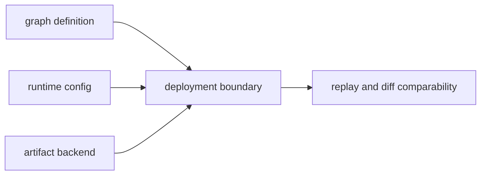

# Deployment Boundaries

Deployment boundaries define what must be consistent across environments to keep
DAG run meaning stable.

## Visual Summary

## Boundary Layers

- graph/schema/version compatibility
- runtime feature set and execution mode
- artifact storage backend semantics
- environment variables and secrets exposure model
- declared-effect policy surface versus runtime-enforced isolation

## Enforcement Rules

- deployment metadata must be discoverable from run artifacts
- capability downgrades must be surfaced as explicit fidelity changes
- cross-boundary comparisons must include environment context
- shell and container execution must not be documented as equivalent boundaries
- replay sandboxing must be described as source-run write protection only

## Code Anchors

- `crates/bijux-dag-runtime/src/internal/control/runtime_controls.rs`
- `crates/bijux-dag-runtime/src/backend/runtime/container_execution.rs`
- `crates/bijux-dag-artifacts/src/storage/services.rs`
- `crates/bijux-dag-app/src/routes/replay_routes.rs`

## Next Reads

- [Compatibility Commitments](../interfaces/compatibility-commitments.md)
- [Release and Versioning](release-and-versioning.md)
- [Execution Security And Isolation](security-isolation-truth.md)
