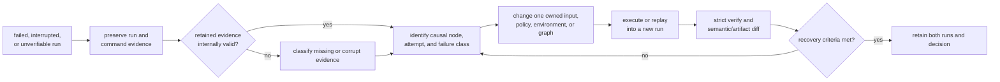

# Failure Recovery

Recovery begins with the failed run as evidence. Never edit or overwrite that
run to make it appear healthy. Diagnose the first causal failure, create a new
run for remediation or replay, and compare the two results under the same
identity and policy rules.



## Preserve The Failure

Record before any mutation:

- exact binary version, graph source, invocation, inputs, backend, and policy;
- stdout, stderr, command exit status, run root, and run ID;
- manifest, output index, node traces, attempt records, scheduler checkpoint,
  failure propagation, and backend evidence;
- strict verification result, including missing or corrupt paths;
- environment facts needed to reproduce the selected backend.

An incomplete run remains useful incident evidence. A valid failed run can
pass structural verification because verification checks retained truth, not
whether every node succeeded.

## Diagnostic Commands

```bash
RUNS_ROOT="./artifacts/runs"
FAILED_RUN_ID="<failed-run-id>"
FAILED_RUN_DIR="${RUNS_ROOT}/run-${FAILED_RUN_ID}"
RECOVERY_ROOT="./artifacts/recovery"

bijux-dag verify "${FAILED_RUN_DIR}" --strict
bijux-dag explain "${FAILED_RUN_DIR}"
bijux-dag explain "${FAILED_RUN_DIR}" --node publish
bijux-dag runs explain-failure "${FAILED_RUN_ID}" --root "${RUNS_ROOT}"
bijux-dag runs inspect "${FAILED_RUN_ID}" --root "${RUNS_ROOT}"

bijux-dag replay \
  --source-run-id "${FAILED_RUN_ID}" \
  --source-run-root "${RUNS_ROOT}" \
  --out "${RECOVERY_ROOT}" \
  --from-node publish

bijux-dag diff "${FAILED_RUN_DIR}" "<recovered-run-dir>" \
  --mode semantic \
  --explain
```

`bijux-dag runs explain-failure` is the fastest way to separate the primary fault
from the blast radius it created. The report identifies the first causal
failure, surfaces its class/code/message/reason, lists propagated failures
separately from propagated skips or cancellations, and groups downstream
affected nodes by terminal status.

When the run uses branch isolation, descendants skipped because of an upstream
failure are reported with `reason = "isolated_branch_failure"` instead of being
collapsed into a generic dependency failure. The same classification is written
to `failure-propagation.json` together with the blocking ancestor set and the
active propagation mode.

When recovery starts from one suspicious node instead of a whole-run replay,
prefer `replay --source-run-id ... --from-node <node-id>`. That path verifies
the persisted upstream artifacts feeding the rerun boundary before execution
starts and returns a focused node diff for the selected rerun root after the
child run finishes.

Use `bijux-dag explain <run_dir> --node <node_id>` when the recovery question
is why one node never ran. The node explanation classifies dependency
blocking, trigger-rule blocking, branch skips, selector exclusions, resource
blocking, cache reuse, and policy denial from persisted run evidence. That
path remains useful even when the blocked node never produced
`nodes/<node_id>/trace.json`.

When a node did retry or the runtime vetoed a retry, inspect
`nodes/<node_id>/attempts.json` and the retry events in `run.log.jsonl`. Each
attempt now records a durable retry decision reason, so operators can separate
budget exhaustion, timeout-policy vetoes, exit-code matches, class matches, and
non-retriable policy failures without reconstructing the control path by hand.

## Classify Before Remediation

| Failure class | Evidence | Appropriate remediation |
| --- | --- | --- |
| graph or schema | validation envelope and exact source | correct the graph; a retry of unchanged input has no value |
| missing or invalid input | declared input contract and materialization result | supply or repair the owned input |
| policy denial | effective policy and denied declaration | change the request or policy through its owner |
| execution | attempt records, exit code, timeout, stdout, stderr | correct node code, dependency, or bounded retry policy |
| dependency propagation | first causal failure, trigger rule, propagation mode | repair the ancestor or deliberately change graph semantics |
| backend | submission identity, polling evidence, worker/pod result | repair scheduler, cluster, adapter configuration, or shared storage |
| artifact integrity | output index, hashes, proofs, and filesystem evidence | preserve the run; restore from an authoritative source or re-execute |
| cache | lookup identity and miss/rejection reason | repair identity or invalid entry; never force reuse |
| compatibility | schema/tool versions and migration support | use a supported reader or governed migration |
| unknown or internal | complete structured payload and diagnostic bundle | retain uncertainty and escalate to the owning implementation |

Do not add retries to graph, policy, compatibility, or deterministic integrity
failures. Retry is valid only when the recorded class and policy identify a
transient attempt boundary.

## Concrete Repository Workflow

For a repository-backed recovery path that shows one transient retry, one retry
budget exhaustion run, one approval-gate repair, and a strict verification step
after targeted replay, use
[Compliance-Gated Bulletin Workflow](compliance-gated-bulletin-workflow.md).

## Propagation Modes During Recovery

Operators should interpret downstream fallout through the configured failure
propagation mode before deciding whether the workflow design or the failing
node is at fault.

- `fail_fast` stops new dispatch after the first failure, so remaining work is
  expected to end as aborted fallout rather than evidence of independent faults
- `continue_independent` lets joins and other downstream nodes keep running
  when their trigger rules still evaluate true from terminal upstream states
- `isolate_branch` keeps unrelated subgraphs running but skips every
  descendant of the failed node, even when a permissive trigger rule such as
  `all_done` could otherwise release a downstream join

Replay preserves the recorded propagation decision. If a descendant was skipped
because of branch isolation in the parent run, the replayed evidence should
show the same skip classification unless the operator intentionally changed the
graph or policy.

## Retry Classification During Recovery

Retry evidence should be read with the same precedence the runtime used during
execution.

- policy-denied nodes do not retry, even when a node declares policy failures
  as retryable
- timeout failures follow `timeout_retry_policy`, so `never` is a durable veto
  and `always` can schedule a retry even when timeout is absent from the class
  allowlist
- execution failures can become retryable through explicit
  `retryable_exit_codes` when a broad failure-class allowlist would be too
  coarse

## Code Anchors

- `crates/bijux-dag-app/src/routes/inspect_routes.rs`
- `crates/bijux-dag-app/src/routes/replay_routes.rs`
- `crates/bijux-dag-runtime/src/replay/`

## Recovery Boundaries

- never replace failing evidence in-place
- never classify unknown mismatch as success
- never skip replay or diff after high-impact remediation

## Recovery Acceptance

A recovered run is acceptable only when:

1. the original failure remains preserved and attributable;
2. the remediation names one owning boundary;
3. the new run uses a distinct identity and records the changed input;
4. strict verification passes for the new retained evidence;
5. the original workload's domain assertions pass;
6. semantic, artifact, provenance, timing, policy, or cache comparison is
   interpreted only for its selected mode;
7. any remaining difference or unsupported environment is explicit.

If broad deletion or an unrecorded environment change is required to make the
workflow pass, the cause remains unresolved.

## Next Reads

- [Compliance-Gated Bulletin Workflow](compliance-gated-bulletin-workflow.md)
- [Observability and Diagnostics](observability-and-diagnostics.md)
- [Risk Register](../quality/risk-register.md)
- [Known Limitations](../quality/known-limitations.md)
