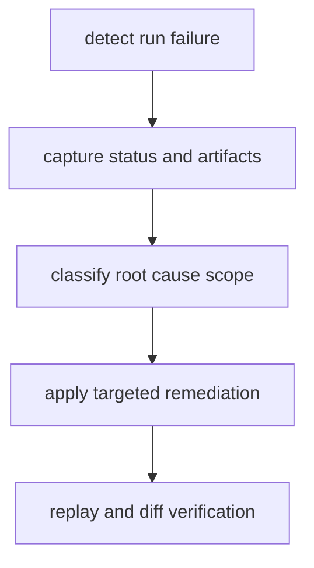

# Failure Recovery

Failure recovery in DAG should preserve evidence first, then restore a runnable
state with clear attribution.

## Visual Summary



## Recovery Sequence

1. record run status and retain failing artifact directory
2. classify failure as graph, input, runtime, environment, or backend issue
3. remediate one scope at a time and rerun
4. replay the recovered run to verify determinism behavior
5. diff against last known good run before promotion

## Diagnostic Commands

```bash
bijux-dag status ./runs/failed-20260406-01
bijux-dag inspect ./runs/failed-20260406-01
bijux-dag replay ./runs/failed-20260406-01 --out ./runs/replay-failed
bijux-dag diff ./runs/good-20260405-77 ./runs/recovered-20260406-02 --mode semantic --explain
```

## Code Anchors

- `crates/bijux-dag-app/src/routes/status_routes.rs`
- `crates/bijux-dag-app/src/routes/inspect_routes.rs`
- `crates/bijux-dag-runtime/src/replay/`

## Recovery Boundaries

- never replace failing evidence in-place
- never classify unknown mismatch as success
- never skip replay or diff after high-impact remediation

## Next Reads

- [Observability and Diagnostics](observability-and-diagnostics.md)
- [Risk Register](../quality/risk-register.md)
- [Known Limitations](../quality/known-limitations.md)
