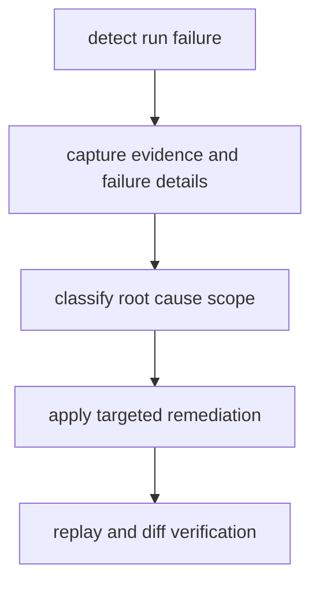

# Failure Recovery

Failure recovery in DAG should preserve evidence first, then restore a runnable
state with clear attribution.

## Visual Summary



## Recovery Sequence

1. record run status and retain failing artifact directory
2. classify failure as graph, input, runtime, environment, or backend issue
3. remediate one scope at a time and rerun
4. replay the recovered run to verify determinism behavior
5. diff against last known good run before promotion

## Diagnostic Commands

```bash
bijux-dag explain ./runs/failed-20260406-01
bijux-dag explain ./runs/failed-20260406-01 --node publish
bijux-dag runs explain-failure failed-20260406-01 --root ./runs
bijux-dag runs inspect failed-20260406-01 --root ./runs
bijux-dag replay ./runs/failed-20260406-01 --out ./runs/replay-failed
bijux-dag diff ./runs/good-20260405-77 ./runs/recovered-20260406-02 --mode semantic --explain
```

`bijux-dag runs explain-failure` is the fastest way to separate the primary fault
from the blast radius it created. The report identifies the first causal
failure, surfaces its class/code/message/reason, lists propagated failures
separately from propagated skips or cancellations, and groups downstream
affected nodes by terminal status.

When the run uses branch isolation, descendants skipped because of an upstream
failure are reported with `reason = "isolated_branch_failure"` instead of being
collapsed into a generic dependency failure. The same classification is written
to `failure-propagation.json` together with the blocking ancestor set and the
active propagation mode.

Use `bijux-dag explain <run_dir> --node <node_id>` when the recovery question
is why one node never ran. The node explanation classifies dependency
blocking, trigger-rule blocking, branch skips, selector exclusions, resource
blocking, cache reuse, and policy denial from persisted run evidence. That
path remains useful even when the blocked node never produced
`nodes/<node_id>/trace.json`.

## Propagation Modes During Recovery

Operators should interpret downstream fallout through the configured failure
propagation mode before deciding whether the workflow design or the failing
node is at fault.

- `fail_fast` stops new dispatch after the first failure, so remaining work is
  expected to end as aborted fallout rather than evidence of independent faults
- `continue_independent` lets joins and other downstream nodes keep running
  when their trigger rules still evaluate true from terminal upstream states
- `isolate_branch` keeps unrelated subgraphs running but skips every
  descendant of the failed node, even when a permissive trigger rule such as
  `all_done` could otherwise release a downstream join

Replay preserves the recorded propagation decision. If a descendant was skipped
because of branch isolation in the parent run, the replayed evidence should
show the same skip classification unless the operator intentionally changed the
graph or policy.

## Code Anchors

- `crates/bijux-dag-app/src/routes/inspect_routes.rs`
- `crates/bijux-dag-app/src/routes/replay_routes.rs`
- `crates/bijux-dag-runtime/src/replay/`

## Recovery Boundaries

- never replace failing evidence in-place
- never classify unknown mismatch as success
- never skip replay or diff after high-impact remediation

## Next Reads

- [Observability and Diagnostics](observability-and-diagnostics.md)
- [Risk Register](../quality/risk-register.md)
- [Known Limitations](../quality/known-limitations.md)
