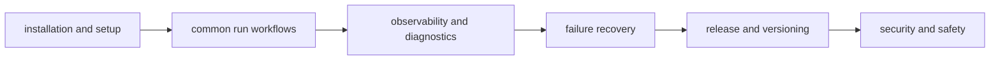

# DAG Operations

DAG operations focus on repeatable execution, artifact evidence, and predictable
recovery under change.

## Visual Summary

## Operating Priorities

- prefer deterministic runs over convenience shortcuts
- preserve evidence before remediation actions
- diagnose with command output and artifacts, not assumptions
- keep release policy and runtime behavior synchronized

## Core Runbook Pages

- [Installation and Setup](installation-and-setup.md)
- [Local Development](local-development.md)
- [Common Workflows](common-workflows.md)
- [Observability and Diagnostics](observability-and-diagnostics.md)
- [Failure Recovery](failure-recovery.md)

## Boundary and Governance Pages

- [Deployment Boundaries](deployment-boundaries.md)
- [Performance and Scaling](performance-and-scaling.md)
- [Release and Versioning](release-and-versioning.md)
- [Security and Safety](security-and-safety.md)

## Cross References

- [Operator Workflows](../interfaces/operator-workflows.md)
- [Change Validation](../quality/change-validation.md)
