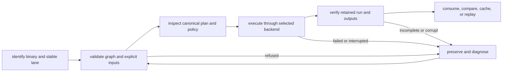

# DAG Operations

`bijux-dag` v0.4.1 is a local-first DAG runtime for reproducible workflows
with explicit graph contracts, deterministic execution records, verified
artifacts, cache explanation, and replayable run bundles.
The [Replay Contract](../../spec/REPLAY_CONTRACT.md) defines the replay authority.

Use this section when you need to run real DAG workflows, inspect retained
evidence, recover from failures, or understand the operational boundary of the
released local-first product.

DAG operations focus on repeatable execution, retained artifacts, and
predictable recovery under change.

## Operating Loop

Every boundary answers a different question. Validation does not prove
execution, a terminal run does not prove retained integrity, and strict
verification does not prove the domain correctness of a generated report or
dataset.

## Start With The Situation You Have

| If you need to... | Open this page |
| --- | --- |
| get from checkout to a real run quickly | [First-Run Tutorial](first-run-tutorial.md) |
| install the tool and verify the environment | [Installation and Setup](installation-and-setup.md) |
| iterate on a local run, replay, and diff loop before merge | [Local Development](local-development.md) |
| run the normal local workflow loop | [Common Workflows](common-workflows.md) |
| inspect failures, traces, and retained evidence | [Observability and Diagnostics](observability-and-diagnostics.md) |
| recover from runtime or workflow failures | [Failure Recovery](failure-recovery.md) |
| understand release boundaries and what the shipped product claims today | [v0.4.0 Release Notes](v0-4-0-release-notes.md) |
| understand runtime limits before deployment or isolation work | [Deployment Boundaries](deployment-boundaries.md) |

## Choose A Workflow By Proof

| Workflow | Demonstrates | Retained proof |
| --- | --- | --- |
| [File Processing](file-processing-workflow.md) | explicit inputs, file transformation, and declared output | graph, run manifest, trace, report artifact, strict verification |
| [Data Pipeline](data-pipeline-workflow.md) | staged processing and dependency flow | node outcomes, intermediate lineage, final outputs |
| [Branching Bulletin](branching-bulletin-workflow.md) | conditions, skips, and join behavior | branch decisions and terminal node classifications |
| [Compliance-Gated Bulletin](compliance-gated-bulletin-workflow.md) | retry exhaustion, approval repair, and targeted replay | attempt records, failure propagation, child run, focused diff |
| [Evidence-Backed Bulletin](evidence-backed-bulletin-workflow.md) | artifact-backed reporting and verification | source lineage, report output, verification result |
| [Container Packaging](container-packaging-workflow.md) | container-node execution and mount contract | adapter identity, mounted inputs/outputs, container trace |
| [Historical Backfill](historical-catalog-backfill-workflow.md) | bounded historical processing | run family and per-item evidence |
| [Scheduled Refresh](scheduled-catalog-refresh-workflow.md) | repeated catalog refresh behavior | comparable retained runs and refresh results |

Select the workflow that exercises the disputed property. A larger example is
not automatically stronger evidence when it obscures the boundary under
review.

## Preserve These Facts

For every operational decision, retain:

- exact binary version and stable/non-stable command lane;
- graph source and canonical identity;
- explicit inputs, policy, backend, and execution options;
- run root, run ID, terminal command status, and structured envelope;
- manifest, node attempts, traces, output index, and declared artifacts;
- verification mode and result;
- environment or backend facts required to interpret comparison and replay.

## Cross References

- [Executable Examples](../interfaces/runnable-examples.md)
- [Operator Workflows](../interfaces/operator-workflows.md)
- [Change Validation](../quality/change-validation.md)

Read [Execution Security And Isolation](security-isolation-truth.md) before
running untrusted work, [Performance And Scaling](performance-and-scaling.md)
before making capacity claims, and [Release And Versioning](release-and-versioning.md)
before depending on a non-stable command lane. Open
[Local Development](local-development.md) when the question is how to keep a
checkout's validate, run, replay, and diff loop honest before CI.
