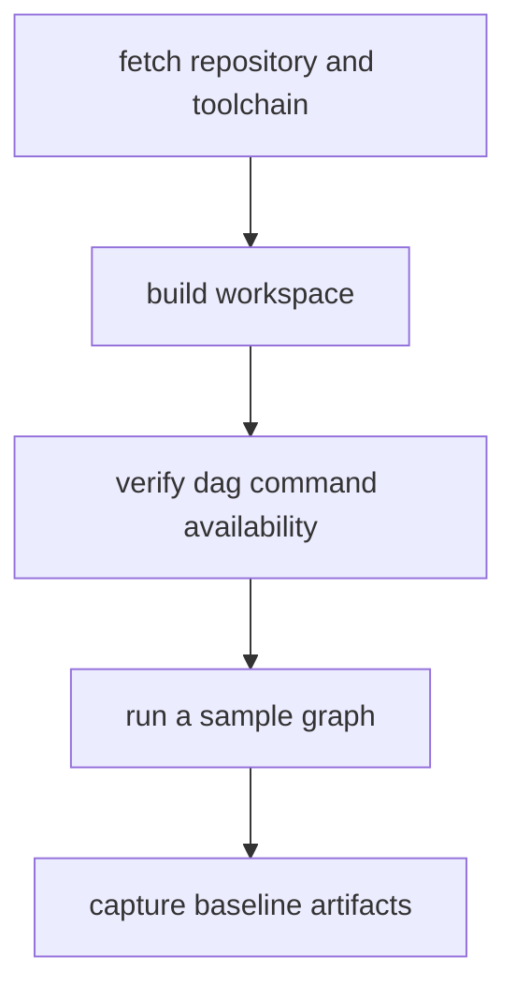

# Installation And Setup

Installation and setup should create a predictable DAG execution environment for
both local and automation use.

## Visual Summary



## Required Setup Contract

- Rust `1.86.0`, pinned by repository `rust-toolchain.toml`
- workspace build succeeds with `cargo build --workspace`
- DAG command surface reachable via `bijux-dag --help`
- sample graph validates and runs without undocumented flags

## Recommended Validation Sequence

```bash
cargo build --workspace
cargo test -p bijux-dag-core
bijux-dag validate ./examples/simple.dag.json
bijux-dag run ./examples/simple.dag.json --out ./runs/bootstrap
bijux-dag explain ./runs/bootstrap/latest
```

## Code Anchors

- `crates/bijux-dag-cli/src/main.rs`
- `crates/bijux-dag-app/src/commands/mod.rs`
- `crates/bijux-dag-app/src/routes/run_routes.rs`

## Setup Failure Signals

- command not found for `bijux-dag`
- schema rejection on known-good example graphs
- run directories missing outputs index or manifest evidence

## Next Reads

- [Local Development](local-development.md)
- [Common Workflows](common-workflows.md)
- [Failure Recovery](failure-recovery.md)
