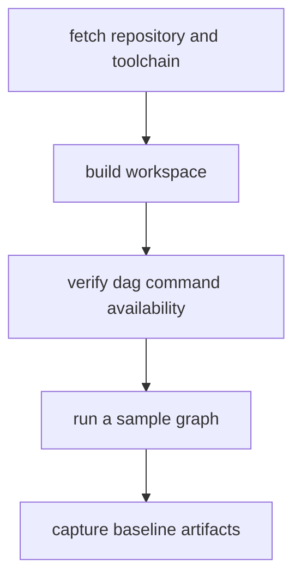

# Installation And Setup

Installation and setup should create a predictable DAG execution environment for
both local and automation use.

## Visual Summary



## Required Setup Contract

- Rust `1.86.0`, pinned by repository `rust-toolchain.toml`
- workspace build succeeds with `cargo build --workspace`
- DAG command surface reachable via `bijux-dag --help`
- sample graph validates and runs without undocumented flags

## Fastest Honest Validation

If you want one repository command that proves the local DAG surface before you
start exploring individual subcommands, run:

```bash
make dag-demo
```

`dag-demo` builds or reuses `bijux-dag`, runs the retained file-processing
workflow, inspects the resulting graph and artifacts, checks warm cache reuse,
replays the final reporting boundary, and finishes with `verify --strict`.
Its retained evidence lands under `artifacts/dag-demo/`.

## Recommended Validation Sequence

```bash
SOURCE_DIR="$(pwd)/evidence/dag/authoring/examples/file-processing-source"

cargo build -p bijux-dag-cli --release
cargo run -p bijux-dag-cli --bin bijux-dag -- version
cargo test -p bijux-dag-core
bijux-dag validate evidence/dag/authoring/examples/file-processing-report.dag.json
bijux-dag run evidence/dag/authoring/examples/file-processing-report.dag.json \
  --out ./artifacts/bootstrap-runs \
  --run-id bootstrap-file-processing \
  --input "source_dir=${SOURCE_DIR}"
bijux-dag artifact-inspect \
  ./artifacts/bootstrap-runs/run-bootstrap-file-processing \
  render_report:report.md
```

## Code Anchors

- `crates/bijux-dag-cli/src/main.rs`
- `crates/bijux-dag-app/src/commands/mod.rs`
- `crates/bijux-dag-app/src/routes/run_routes.rs`

## Setup Failure Signals

- command not found for `bijux-dag`
- schema rejection on known-good example graphs
- run directories missing outputs index or manifest evidence
- required runtime inputs not provided for the repository workflow examples

## Next Reads

- [First-Run Tutorial](guides/first-run-tutorial.md)
- [Local Development](local-development.md)
- [Common Workflows](common-workflows.md)
- [File Processing Workflow](guides/file-processing-workflow.md)
- [Failure Recovery](failure-recovery.md)
