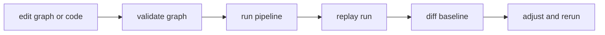

# Local Development

Local development should mirror integration behavior closely enough that replay
and diff outcomes are meaningful before merge.

## Visual Summary



## Daily Development Loop

1. validate changed graph definitions
2. run local execution with dedicated output directory
3. replay baseline runs when behavior should remain stable
4. run semantic diff against expected baseline
5. only promote changes with explicit drift attribution

## Example Loop

```bash
bijux-dag validate ./pipelines/main.dag.json
bijux-dag run ./pipelines/main.dag.json --out ./runs/dev
bijux-dag replay ./runs/dev/latest --out ./runs/dev-replay
bijux-dag diff ./runs/baseline/latest ./runs/dev/latest --mode semantic --explain
```

## Code Anchors

- `crates/bijux-dag-app/src/routes/validate_routes.rs`
- `crates/bijux-dag-app/src/routes/replay_routes.rs`
- `crates/bijux-dag-app/src/routes/diff_routes.rs`

## Hygiene Rules

- keep run outputs isolated per change branch
- avoid reusing stale evidence directories
- avoid manual mutation of run artifact files

## Next Reads

- [Observability and Diagnostics](observability-and-diagnostics.md)
- [Performance and Scaling](performance-and-scaling.md)
- [Change Validation](../quality/change-validation.md)
