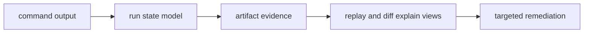

# Observability And Diagnostics

Observability for DAG focuses on making run outcomes explainable from command
output and persisted evidence.

## Visual Summary

## Primary Diagnostic Surfaces

- `status` and `inspect` command outputs
- run manifests, outputs index, and node traces
- replay proof and replay explain artifacts
- diff explain summaries grouped by mismatch class

## Diagnostic Workflow

1. confirm run state and completion flags
2. inspect missing or degraded artifact groups
3. run replay explain for fidelity and environment gaps
4. run semantic diff explain for drift clusters
5. map findings to runtime/input/environment boundaries

## Code Anchors

- `crates/bijux-dag-app/src/routes/status_routes.rs`
- `crates/bijux-dag-app/src/routes/inspect_routes.rs`
- `crates/bijux-dag-runtime/src/replay/`
- `crates/bijux-dag-artifacts/src/integrity/`

## Anti-Patterns

- treating all failures as transient retries
- mutating artifacts before capturing diagnostics
- promoting runs without explain evidence when drift exists

## Next Reads

- [Failure Recovery](failure-recovery.md)
- [Risk Register](../quality/risk-register.md)
- [State and Persistence](../architecture/state-and-persistence.md)
