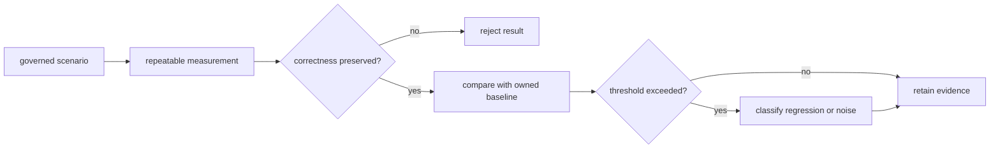

# Performance And Scaling

Performance evidence in this repository detects regressions in named,
controlled scenarios. It does not establish universal throughput, cluster
capacity, or production sizing. A performance claim is credible only when its
workload, measurement method, baseline, threshold, hardware context, and noise
class are all recoverable.

## Evidence Decision



Correctness is evaluated before speed. A faster run with changed graph identity,
missing artifacts, weakened verification, or different replay meaning is a
behavioral regression, not an optimization.

## Runtime Cost Topology

```mermaid
flowchart TB
    graph["parse and validate graph"]
    plan["canonicalize and plan"]
    ready["evaluate readiness and triggers"]
    attempt["dispatch node attempt"]
    backend["local process or backend adapter"]
    evidence["finalize traces, outputs, and artifacts"]
    verify["verify, replay, diff, or inspect"]

    graph --> plan --> ready --> attempt --> backend --> evidence --> verify
    evidence -->|"newly ready nodes"| ready
```

Different graph shapes stress different boundaries. A deep graph amplifies
readiness progression, a wide graph pressures scheduling, many small nodes
emphasize orchestration overhead, large artifacts emphasize IO and hashing,
and replay-heavy use emphasizes retained-evidence reads and verification.

## Scaling Variables

| Variable | Primary pressure | Correctness signal that must stay stable |
| --- | --- | --- |
| node and edge count | parse, canonicalization, dependency bookkeeping | graph identity and validation result |
| ready-set width | scheduler and concurrency controls | deterministic dependency and trigger semantics |
| attempt count | process/backend startup and trace volume | attempt numbering, retry policy, terminal state |
| artifact count and bytes | hashing, storage, finalization, output index | declared identity, integrity, and atomic acceptance |
| cache entries and metadata | lookup and verification | hit/miss reason and content validity |
| run-history depth | inspect, diff, replay, and retention scans | selected run identity and comparison meaning |
| backend latency | adapter submission, polling, and collection | backend state translation and accepted evidence |

## Governed Scenario Classes

`evidence/perf/metadata.json` is the scenario registry. Its release-relevant set
currently covers:

- canonical tiny and medium graph execution;
- wide scheduler pressure;
- cache-heavy execution;
- replay verification cost;
- manifest and trace write amplification;
- memory use across many-node execution.

Advisory and experimental scenarios can guide investigation but do not become
release blockers without an owned threshold. The benchmark-signal policy in
`configs/dag/policy/benchmark_signal_governance.json` separately maps benchmark
families to supported claims, gate class, and expected noise.

## What May Be Claimed

| Evidence | Supported statement | Unsupported leap |
| --- | --- | --- |
| release scenario remains within its owned threshold | no governed regression was observed for that scenario | the runtime is faster on every workload |
| scheduler-pressure scenario improves with equivalent outputs | scheduler overhead improved under the recorded graph and environment | arbitrary graph scale is supported |
| memory scenario stays within budget | recorded peak/resource behavior met that scenario's budget | production memory is bounded independently of workload |
| cache-heavy scenario improves with integrity checks unchanged | cache path improved under the governed fixture | all storage backends have equal cache performance |
| advisory result changes | investigation signal changed | release performance regressed |

## Optimization Boundaries

The usual levers are scheduler parallelism, readiness evaluation, artifact IO,
cache lookup, replay verification, and graph processing. Each belongs to a
different correctness boundary. Do not trade away:

- deterministic graph and execution identity;
- dependency and trigger-rule semantics;
- artifact integrity or atomic finalization;
- attempt, cancellation, and retry evidence;
- cache validation and miss explanation;
- replay and diff classification precision.

Parallelism is not a monotonic speed control. Increasing it may move the
bottleneck from scheduler readiness to process startup, memory, storage, or
the selected backend. Tune one governed workload at a time and retain the
effective concurrency and backend configuration with the measurement.

## Evidence Route

Run `bijux-dev-dag performance-evidence-report` to validate the registry,
release-relevant scenarios, baseline ownership, threshold references, and
contract links. Then inspect the generated measurement output for the exact
source commit and environment. The report command validates governance; it does
not manufacture a benchmark pass when measurements are absent.

When comparing results:

1. use the same scenario and measurement method;
2. retain source commit, toolchain, operating system, architecture, and relevant
   backend identity;
3. compare correctness and evidence shape before timing;
4. apply the scenario's owned threshold and noise classification;
5. classify a failure as regression, environment drift, or insufficient
   evidence without silently moving the threshold.

## Regression Triage

| Symptom | Compare first | Do not conclude yet |
| --- | --- | --- |
| validate and plan both regress | identical canonical graph and toolchain | runtime scheduling is at fault |
| run regresses but plan does not | attempt traces, backend timings, artifact volume | graph processing regressed |
| cache-heavy scenario regresses | hit/miss classification and integrity checks | disabling verification is acceptable |
| replay or diff regresses | run-history size, manifest shape, storage context | live execution is slower |
| wide graph regresses | ready-set width, effective parallelism, process count | deeper graphs have the same behavior |
| memory scenario regresses | peak context, node/edge/attempt counts, evidence volume | a timing improvement compensates for it |
| only one machine changes | toolchain, OS, architecture, load, and storage | the owned baseline should move |

If correctness or comparability cannot be established, classify the result as
insufficient evidence. Moving a threshold, dropping a scenario, or changing a
fixture is a governance change and requires its own justification.

## Code Anchors

- `crates/bijux-dag-runtime/src/runtime_core/execution/engine.rs`
- `crates/bijux-dag-runtime/src/replay/`
- `crates/bijux-dag-app/tests/replay_diff_hardening_contract.rs`
- `crates/bijux-dev/src/commands/perf_evidence.rs`
- `evidence/perf/CONTRACT.md`

## Next Reads

- [Invariants](../quality/invariants.md)
- [Change Validation](../quality/change-validation.md)
- [Common Workflows](common-workflows.md)
- [Known Limitations](../quality/known-limitations.md)
