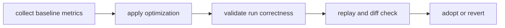

# Performance And Scaling

Performance and scaling changes must preserve DAG correctness guarantees and
not blur replay or diff attribution.

## Visual Summary

## Performance Levers

- execution parallelism and scheduling strategy
- artifact write/read batching and backend tuning
- graph partitioning and incremental execution hints

## Required Guardrails

- track latency and throughput with fixed benchmark graphs
- verify output equivalence and replay fidelity after tuning
- reject optimization changes that hide classification precision

## Evidence Route

Before changing performance language here, run
`bijux-dev-dag performance-evidence-report` and review
`evidence/perf/metadata.json` so the page stays tied to maintained benchmark
scenarios.

## Code Anchors

- `crates/bijux-dag-runtime/src/runtime_core/execution/engine.rs`
- `crates/bijux-dag-runtime/src/replay/`
- `crates/bijux-dag-app/tests/replay_diff_hardening_contract.rs`

## Next Reads

- [Invariants](../quality/invariants.md)
- [Change Validation](../quality/change-validation.md)
- [Common Workflows](common-workflows.md)
- [Known Limitations](../quality/known-limitations.md)
