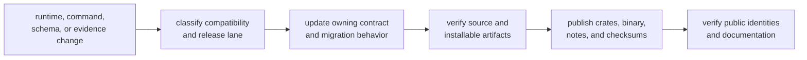

# Release And Versioning

The `bijux-dag` version binds more than a binary. It identifies a command
surface, graph and output contracts, retained run readers, replay and diff
meaning, backend behavior, and a classified release lane. Operators need that
complete boundary when upgrading or moving evidence between environments.

For the current operator-facing release framing, use
[v0.4.0 Release Notes](v0-4-0-release-notes.md). That page is where stable
features, non-stable lanes, limitations, migration notes, examples, and
validation commands are kept together for this release line.

## Versioned Surfaces

| Surface | Compatibility concern |
| --- | --- |
| visible commands and options | scripts, completion, stream placement, exit classification |
| graph schema and canonicalization | whether existing graph sources retain meaning |
| run directory and manifests | whether newer and older tools can inspect retained evidence |
| traces, attempts, outputs, and proofs | whether verification, replay, and lineage remain valid |
| replay and diff classification | whether the same comparison vocabulary preserves meaning |
| cache identity and entry validation | whether reuse remains safe across versions and adapters |
| backend contracts | whether submission, state translation, storage, and evidence semantics remain supported |
| command lanes | whether a surface is stable, experimental, simulated, internal, or unreleased |

Syntax compatibility is insufficient when meaning changes. A field can retain
its name while its identity, lifecycle, or comparison semantics become
incompatible.

## Versioning Rules

- behavior-changing command semantics require explicit compatibility note
- schema and artifact shape changes require migration guidance
- replay/diff classification vocabulary changes require contract review
- runtime build identity must be captured at compile time; release flows must
  not depend on ambient runtime Git discovery
- clean release-tree builds must carry the source revision through
  `BIJUX_DAG_BUILD_GIT_SHA` when the original checkout SHA should remain visible
  in `tool_version`

The stable command lane carries the strongest compatibility expectation.
Experimental routes require deliberate adoption and may change more quickly.
Simulated and internal routes do not become public support commitments merely
because the repository tests them.

## Release Validation Matrix

| Proof | Required result |
| --- | --- |
| toolchain alignment | workspace, CI, release tree, and package policy agree on supported Rust requirements |
| DAG crate tests | graph, artifacts, runtime, app, and CLI contracts pass together |
| replay and diff | schema and classification lockstep remain executable |
| runtime identity | working-directory changes do not rewrite provenance or cache fingerprints |
| release-tree identity | `tool_version` retains the source build stamp without a live `.git` directory |
| package boundary | public crates package and dry-run publish in governed dependency order without private dependencies |
| installed smoke | the release-tree binary validates, runs, and verifies the supported workflow boundary |
| documentation | generated command reference, release notes, links, and navigation match the release |

The release gate risks behind this matrix are tracked directly in `RISK-003`,
`RISK-007`, `RISK-008`, `RISK-009`, and `RISK-010` in
[Risk Register](../quality/risk-register.md).

## Operator Upgrade Procedure

Before upgrading a workflow environment:

1. retain the current binary identity and a strictly verified representative
   run;
2. read release notes and migration guidance for commands, graphs, evidence,
   cache, replay, and backends in use;
3. install the candidate without overwriting the known-good executable;
4. validate and plan the same graph under both versions;
5. execute into a new run and cache root;
6. verify both runs, then compare semantic, artifact, provenance, policy,
   cache, and timing evidence as required;
7. promote only after workload-specific assertions pass;
8. keep the previous reader available while retained evidence still requires
   it.

Do not test an upgrade by opening a source run with a mutating migration or
repair command. Preserve the original and write migrated or replayed evidence
to a new location.

## Release Evidence

A published release should let consumers connect:

- the version and immutable source revision;
- public crate and binary checksums;
- package dependency order and private-package exclusions;
- stable command inventory and classified non-stable lanes;
- graph, run, replay, cache, and compatibility contracts;
- known limitations and migration instructions;
- completed release validation and installed-boundary proof.

A tag or uploaded crate alone does not establish that chain. Partial
publication is a repository incident, not a successfully completed DAG
release.

## Code Anchors

- `crates/bijux-dag-app/tests/`
- `crates/bijux-dag-core/tests/`
- `crates/bijux-dag-runtime/tests/`

## Next Reads

- [v0.4.0 Release Notes](v0-4-0-release-notes.md)
- [Compatibility Commitments](../interfaces/compatibility-commitments.md)
- [Definition of Done](../quality/definition-of-done.md)
- [Review Checklist](../quality/review-checklist.md)
