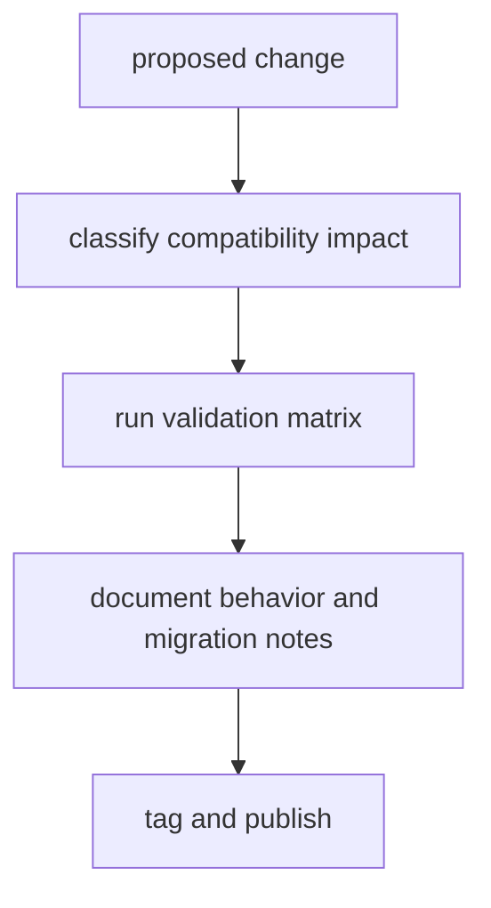

# Release And Versioning

Release and versioning policy for DAG protects compatibility expectations for
operators, integrations, and artifact consumers.

For the current operator-facing release framing, use
[v0.4.0 Release Notes](v0-4-0-release-notes.md). That page is where stable
features, non-stable lanes, limitations, migration notes, examples, and
validation commands are kept together for this release line.

## Visual Summary

## Versioning Rules

- behavior-changing command semantics require explicit compatibility note
- schema and artifact shape changes require migration guidance
- replay/diff classification vocabulary changes require contract review
- runtime build identity must be captured at compile time; release flows must
  not depend on ambient runtime Git discovery
- clean release-tree builds must carry the source revision through
  `BIJUX_DAG_BUILD_GIT_SHA` when the original checkout SHA should remain visible
  in `tool_version`

## Release Validation Matrix

- Rust `1.86.0` toolchain alignment across local runs, CI, and release automation
- cargo test suites for dag core/runtime/app crates
- replay and diff contract tests for schema lockstep
- runtime identity checks confirming working-directory changes do not rewrite
  provenance or cache fingerprints
- release-tree validation proving `tool_version` keeps the source build stamp
  without depending on a live `.git` directory
- docs checks ensuring references align with released behavior

The release gate risks behind this matrix are tracked directly in `RISK-003`,
`RISK-007`, `RISK-008`, `RISK-009`, and `RISK-010` in
[Risk Register](../quality/risk-register.md).

## Code Anchors

- `crates/bijux-dag-app/tests/`
- `crates/bijux-dag-core/tests/`
- `crates/bijux-dag-runtime/tests/`

## Next Reads

- [v0.4.0 Release Notes](v0-4-0-release-notes.md)
- [Compatibility Commitments](../interfaces/compatibility-commitments.md)
- [Definition of Done](../quality/definition-of-done.md)
- [Review Checklist](../quality/review-checklist.md)
