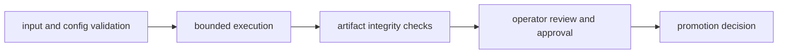

# Security And Safety

Security and safety for DAG focus on controlled execution, artifact integrity,
and predictable failure handling.

## Visual Summary

## Safety Principles

- validate graphs and inputs before execution
- restrict runtime privileges to minimum required scope
- verify artifact integrity before downstream consumption
- favor fail-closed behavior for unknown mismatch categories

## Security Control Areas

- configuration and secret boundary discipline
- filesystem and storage write scope constraints
- tamper detection via hash and proof validation

## Code Anchors

- `crates/bijux-dag-app/src/routes/validate_routes.rs`
- `crates/bijux-dag-artifacts/src/integrity/proof.rs`
- `crates/bijux-dag-runtime/src/env/`

## Next Reads

- [Deployment Boundaries](deployment-boundaries.md)
- [Risk Register](../quality/risk-register.md)
- [Artifact Contracts](../interfaces/artifact-contracts.md)
