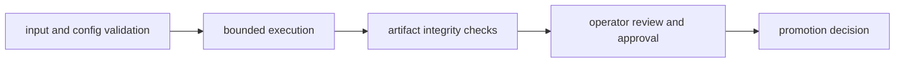

# Security And Safety

Security and safety for DAG focus on controlled execution, artifact integrity,
and predictable failure handling. The release contract is intentionally honest:
local shell execution is best-effort isolation, while stronger isolation claims
are only made where the runtime can actually enforce them.

For the precise enforcement matrix, open
[Security And Isolation Truth](reference/security-isolation-truth.md).

## Visual Summary

## Safety Principles

- validate graphs and inputs before execution
- restrict runtime privileges to minimum required scope
- verify artifact integrity before downstream consumption
- favor fail-closed behavior for unknown mismatch categories

## Execution Isolation Surfaces

| Execution surface | What DAG enforces | What operators must still assume |
| --- | --- | --- |
| Local shell subprocess | Declared-effect policy gates, curated environment shaping, and Unix subprocess-group termination on timeout or cancellation. `--hermetic` forces `--deny-network`, `--deny-clock`, and `--clean-env`. | The process still runs on the host. There is no socket firewall, no clock virtualization, and no arbitrary filesystem-read sandbox. Non-Unix hosts still rely on best-effort process termination. |
| Container engine | Declared-effect policy gates plus engine-level no-network mode when the container runtime can honor it. | Isolation depends on the selected engine and runtime host. This is not a VM boundary and does not imply complete filesystem or clock isolation. |
| Replay `--sandbox` | Source-run write protection: replay outputs cannot be written into the original run directory. | Replay still executes as a normal process. `--sandbox` does not create a process sandbox or network jail. |

The table above is the short operational summary. The truth page is the
authoritative breakdown for:

- shell backend versus container backend
- what `clean-env` really does
- how `deny-network` differs between shell and container execution
- why `deny-clock` is a declaration gate rather than time virtualization
- what filesystem boundaries are rooted and validated versus what remains a
  host-process trust boundary

## Policy Denial Behavior

When a graph declares an effect that the requested policy forbids, the runtime
fails closed before it executes the conflicting node. This is the core safety
contract for `--deny-network`, `--deny-env`, and `--deny-clock`.

`runtime isolation`, `run --preflight-only`, and `replay --dry-run` expose the
enforcement surface so operators can see whether a requested control is:

- a declared-effect gate
- environment shaping
- a runtime-enforced container flag

The release posture for these execution-boundary risks is tracked directly in
`RISK-001` and `RISK-006` in
[Risk Register](../quality/risk-register.md).

## Timeout And Cancellation Cleanup

When a local shell node times out or an operator cancels a run, DAG now treats
process cleanup as part of the execution contract instead of a background
best-effort detail.

- On Unix hosts, the runtime places each controlled subprocess in its own
  process group and terminates that group on timeout or cancellation.
- This closes the common orphan-helper failure mode where a parent shell exits
  but a background child or grandchild keeps running on the host.
- If the runtime cannot complete subprocess-group signaling cleanly, it records
  the degradation in node `stderr` so operators can see that cleanup fell back
  to a weaker path.
- This is a cleanup guarantee, not a sandbox claim. It does not create network,
  filesystem-read, or clock isolation.

## Security Control Areas

- configuration and secret boundary discipline
- filesystem and storage write scope constraints
- tamper detection via hash and proof validation

## Code Anchors

- `crates/bijux-dag-app/src/routes/validate_routes.rs`
- `crates/bijux-dag-app/src/routes/policy_surface.rs`
- `crates/bijux-dag-app/src/routes/runtime_routes.rs`
- `crates/bijux-dag-artifacts/src/integrity/proof.rs`
- `crates/bijux-dag-runtime/src/internal/control/runtime_controls.rs`
- `crates/bijux-dag-runtime/src/backend/runtime/container_execution.rs`

## Next Reads

- [Security And Isolation Truth](reference/security-isolation-truth.md)
- [Deployment Boundaries](deployment-boundaries.md)
- [Trust Boundaries](reference/trust-boundaries.md)
- [Risk Register](../quality/risk-register.md)
- [Artifact Contracts](../interfaces/artifact-contracts.md)
