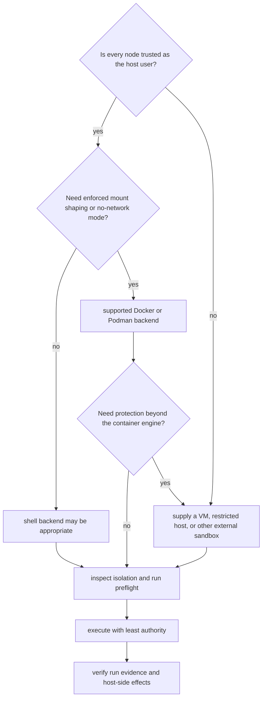

# Execution Security And Isolation

`bijux-dag v0.4.x` is a local DAG runtime with policy gates, rooted evidence
storage, and backend-specific execution controls. It is not a general-purpose
host sandbox.

The practical rule is:

- use the shell backend only for code inside the host's trust boundary
- use the container backend when engine-enforced mount shaping or no-network
  mode is required
- use replay `--sandbox` to protect source evidence from writes, not to isolate
  the replayed process

`runtime isolation`, `run --preflight-only`, and `replay --dry-run` expose the
controls selected for a run. A control is enforced only when both that evidence
and this page identify an enforcement boundary.

## Choose The Execution Boundary

Backend choice changes enforcement mechanics; it does not change whether the
workflow author must declare effects honestly.

## Enforcement Matrix

| Surface | What is enforced | What is best-effort | What is not protected |
| --- | --- | --- | --- |
| shell backend | declared-effect refusal; clean environment shaping; command validation; declared output target preflight; rooted evidence paths | Unix subprocess-group cleanup; command discipline inside the node work tree | sockets, time syscalls, arbitrary host reads, or host side effects after launch |
| container backend | declared-effect refusal; supported-engine no-network flags; validated mounts; optional image-digest policy; declared output target preflight | isolation and reported image identity supplied by Docker or Podman | VM-grade isolation, clock virtualization, registry signature trust, or controls beyond the engine boundary |
| replay `--sandbox` | writes to the source run directory are forbidden | inspection and replay from complete retained evidence | process, network, clock, or general filesystem isolation |
| clean environment | allowlist and denylist environment shaping; required-binding preflight | accuracy of graph declarations | filesystem, process, network, or clock isolation |

These guarantees assume that graph effect declarations are honest. Policy gates
fail closed on declared effects; they do not inspect arbitrary process
behavior.

## Shell Backend

The shell backend launches a host process after validating its declared
contract.

### What is enforced

- `deny-network`, `deny-env`, and `deny-clock` reject nodes that declare the
  corresponding effect.
- Shell `argv` must contain a non-blank executable token.
- `clean-env` constructs the launched environment from permitted bindings;
  missing exact required bindings fail before launch.
- Declared outputs are authorized before launch. Traversal such as
  `../escape.txt` and symlinked existing parent components are rejected.
- Finalization rejects undeclared or missing outputs.
- Governed run, output, and cache paths remain beneath owned storage roots.

### What is best-effort

- The subprocess boundary keeps command execution out of the controller
  process.
- On Unix, timeout and cancellation terminate the subprocess group so known
  descendants do not continue silently.

### What is not protected

- there is no socket firewall for shell subprocesses
- no wall-clock or time-syscall virtualization is provided
- arbitrary host filesystem reads are not sandboxed
- syscalls and side effects are not interposed after process launch

## Container Backend

The container backend delegates process isolation to Docker or Podman while
`bijux-dag` validates the execution contract and mount plan.

### What is enforced

- Built-in execution accepts supported Docker and Podman contracts.
- `deny-network` passes the engine's no-network flag and fails closed when the
  adapter cannot honor it.
- Input mounts are read-only; output and work mounts are writable only at
  validated paths beneath the node root.
- Declared output target preflight rejects absolute paths, traversal, and
  symlink escapes before the engine starts.
- Policy can require a digest-pinned image reference.

### What is best-effort

- Isolation strength and image identity evidence are limited to guarantees
  provided and reported by the selected engine.

### What is not protected

- this is not a VM boundary
- registry signatures and publisher identity are not verified
- clock denial remains declaration-based rather than syscall-based
- host isolation beyond the container engine is not claimed

## Network policy

`deny-network` has two distinct enforcement boundaries:

- every backend refuses a node that declares the `network` effect
- supported container engines additionally receive an explicit no-network flag

For shell execution, declaration refusal is the complete guarantee. A dishonest
or incomplete graph declaration can still permit socket use because there is
no host-process network firewall.

## Clock policy

`deny-clock` refuses nodes that declare the `clock` effect. It does not freeze
time, inject a deterministic clock, or intercept time syscalls. Workflows that
depend on this policy must declare clock use honestly.

## Filesystem boundaries

Filesystem enforcement protects governed paths and retained evidence; it does
not sandbox all host access.

- Storage-relative paths reject absolute paths, traversal, and backslash
  escapes.
- Declared input and output paths must remain within their authorized roots.
- Container mounts must remain beneath the validated node root.
- Replay sandbox mode forbids writes to the source run directory.
- Output hashes and proofs are verified before downstream use.

Shell code can still read arbitrary files available to its host identity and
can attempt writes outside repository-owned storage helpers. Use host-level
containment when untrusted code requires a stronger boundary.

## Failure And Evidence Integrity

The runtime preserves attribution when execution fails:

- graph, policy, input, and declared-output validation complete before launch
- unknown policy mismatches fail closed rather than silently degrading
- output indexes, hashes, and proofs are checked before downstream use
- Unix timeout and cancellation target the subprocess group
- degraded cleanup is recorded in node stderr

These controls protect run evidence. They do not erase side effects already
made by a host process.

Configuration and secrets remain operator-owned inputs. Keep secrets out of
graph definitions, command arguments, retained stdout, and telemetry. Grant
each node the smallest environment allowlist it requires.

Execution-isolation and cleanup risks are tracked as `RISK-001` and `RISK-006`
in the [Risk Register](../quality/risk-register.md).

## Post-Run Security Review

| Check | Evidence of acceptance | Escalation signal |
| --- | --- | --- |
| policy selection | effective isolation and preflight output match the intended lane | requested control is absent, advisory, or unsupported |
| process cleanup | terminal trace records normal completion or successful cancellation cleanup | degraded cleanup or a surviving descendant |
| filesystem scope | output index contains only declared, rooted, verified paths | traversal, symlink escape, undeclared output, or host-side mutation |
| network posture | container engine received the enforced no-network control where required | shell execution was used for code that required socket isolation |
| environment scope | required bindings are present and unnecessary values are absent | secret value appears in argv, stdout, stderr, graph, or trace |
| image identity | accepted engine evidence and required digest policy agree | mutable tag, missing digest, or identity mismatch under required policy |

If a run violates its trust assumption, stop downstream consumption, preserve
the run directory and command evidence, verify whether host credentials or
external systems were reachable, and rotate or remediate outside the DAG
runtime. Deleting the run directory does not reverse process side effects.

## Review Anchors

Implementation:

- `crates/bijux-dag-runtime/src/internal/control/runtime_controls.rs`
- `crates/bijux-dag-runtime/src/internal/identity/security_env.rs`
- `crates/bijux-dag-runtime/src/artifacts/storage/path_authorization.rs`
- `crates/bijux-dag-runtime/src/artifacts/storage/store.rs`
- `crates/bijux-dag-runtime/src/backend/runtime/container_execution.rs`
- `crates/bijux-dag-app/src/routes/policy_surface.rs`
- `crates/bijux-dag-artifacts/src/integrity/proof.rs`

Executable contracts:

- `crates/bijux-dag-runtime/tests/policy_cache_contract.rs`
- `crates/bijux-dag-runtime/tests/security_model_contracts.rs`
- `crates/bijux-dag-runtime/tests/subprocess_cleanup_contracts.rs`
- `crates/bijux-dag-app/tests/policy_enforcement_surface_contract.rs`

## Related References

- [Deployment Boundaries](deployment-boundaries.md)
- [Known Limitations](../quality/known-limitations.md)
- [Artifact Contracts](../interfaces/artifact-contracts.md)
