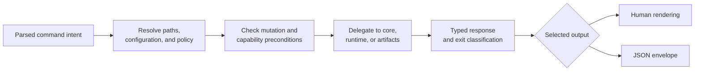

# bijux-dag-app

<!-- bijux-core-badges:generated:start -->
[](https://crates.io/crates/bijux-dag-app)
[](https://docs.rs/bijux-dag-app)
[](https://github.com/bijux/bijux-core/blob/main/LICENSE)
[](https://github.com/bijux/bijux-core/actions/workflows/ci.yml?query=branch%3Amain)
[](https://github.com/bijux/bijux-core)

[](https://bijux.io/bijux-core/bijux-core/) [](https://bijux.io/bijux-core/bijux-dag/packages/bijux-dag-app/)
<!-- bijux-core-badges:generated:end -->

`bijux-dag-app` is the application boundary behind the `bijux-dag` command.
It turns operator intent into calls across graph, runtime, and evidence
packages, then returns a typed outcome for human or machine consumption.

Use this crate when a command composes the wrong workflow, resolves the wrong
inputs, exposes the wrong route, or describes a domain result incorrectly.

## Command Workflow



Human and JSON output describe the same operation. Human text can add guidance;
it cannot weaken a refusal, omit the causal class, or turn an unsuccessful
domain outcome into success.

## Authority

| Domain | This crate decides |
| --- | --- |
| command model | command tree below process startup, arguments, route selection, and surface-lane guardrails |
| input resolution | source files, run roots, run identities, output destinations, configuration precedence, and deprecation behavior |
| orchestration | validate, plan, run, inspect, replay, diff, cache, import, export, migration, repair, and diagnostic workflows |
| preconditions | unsafe path relationships, mutation intent, capability requirements, and route availability |
| response contract | typed command outcomes, diagnostics views, JSON envelopes, human rendering, and recovery guidance |
| generated reference | checked-in command reference derived from the owned command model |

The app does not redefine graph semantics, schedule nodes, implement backends,
or invent serialized artifact formats. Those decisions remain in core,
runtime, and artifacts.

## Read-Only And Mutating Routes

Inspection and preview commands must not mutate retained state. Mutating
commands identify their destination, validate unsafe source/destination
relationships before domain execution, and report what changed.

Repair, replay, migration, import, and export preserve the distinction between
source evidence and new output. A failed source run is never rewritten into
successful history.

Explicit invalid configuration is an error. The application must not silently
replace it with a profile, environment value, or default merely to continue.

## Surface Lanes

The crate contains more routes than the stable release exposes:

| Lane | App responsibility |
| --- | --- |
| stable | construct and maintain the supported operator surface |
| experimental | keep repository-tested helpers callable only by deliberate lane |
| simulated | guard modeled platform namespaces behind `BIJUX_DAG_ENABLE_SIMULATED=1` |
| internal | guard maintainer and contract routes behind `BIJUX_DAG_ENABLE_INTERNAL=1` |

Source presence is not promotion. Route guards, `bijux-dag commands`, generated
reference material, and the release truth table must agree.

## Failure Contract

Operator-controlled input must not panic the application. Failures preserve
their domain:

- malformed arguments or input;
- graph rejection;
- policy refusal;
- unsupported backend or adapter capability;
- runtime execution failure;
- missing or corrupt evidence;
- unsafe paths;
- incompatible replay, cache, import, or migration material; and
- internal rendering or orchestration defects.

When JSON output is selected and the command promises an envelope, failure
remains parseable JSON. Diagnostics belong on their documented stream, and the
selected exit classification must survive the CLI handoff.

## Cross-Package Delegation

| Operator question | Owning package | App role |
| --- | --- | --- |
| Is the graph valid and what is its plan? | [`bijux-dag-core`](bijux-dag-core.md) | load input, call the kernel, and shape diagnostics |
| What should execute, retry, replay, or reuse? | [`bijux-dag-runtime`](bijux-dag-runtime.md) | establish explicit runtime inputs and report the outcome |
| Is retained evidence safe and intact? | [`bijux-dag-artifacts`](bijux-dag-artifacts.md) | locate evidence, call verification, and present findings |
| How does the process start and terminate? | [`bijux-dag-cli`](bijux-dag-cli.md) | supply the command model and selected process result |

If a route begins to implement a domain algorithm, move that behavior to its
owner and keep the app responsible for preconditions and composition.

## Public Rust Surface

`stable` is the curated long-lived integration lane; `prelude` provides common
application imports. Crate-root compatibility exports remain available for
focused use, while experimental helpers require explicit feature opt-in.

Command names, arguments, configuration precedence, JSON envelopes, human
output semantics, exits, and retained destination behavior are
compatibility-bearing even when the Rust API is unchanged.

## Verification Evidence

| Claim | Evidence |
| --- | --- |
| package and dependency boundary | `crates/bijux-dag-app/tests/crate_boundary_contract.rs` |
| command tree and route policy | CLI surface and command-routing contracts |
| machine output | output, error-output, schema lockstep, and snapshot contracts |
| operator-input safety | route-entrypoint and no-panic contracts |
| run, replay, import, and export | owning workflow and retained-evidence contracts |
| public Rust lane | `crates/bijux-dag-app/tests/public_api_contract.rs` |

For broad orchestration changes, run:

```bash
cargo test --locked -p bijux-dag-app
```

## Source Authorities

- package contract: `crates/bijux-dag-app/docs/CONTRACTS.md`
- command model and surface policy: `crates/bijux-dag-app/src/commands/`
- route preconditions and dispatch: `crates/bijux-dag-app/src/routes/`
- graph loading and orchestration: `crates/bijux-dag-app/src/graph/` and
  `crates/bijux-dag-app/src/read/`
- evidence inspection: `crates/bijux-dag-app/src/inspect/`
- replay and comparison: `crates/bijux-dag-app/src/replay/`
- cache and repair orchestration: `crates/bijux-dag-app/src/cache/` and
  `crates/bijux-dag-app/src/repair/`

See the [CLI Surface](../interfaces/cli-surface.md) for the installed command
contract and the [Release Boundary](../foundation/release-boundary.md) for
lane status.
