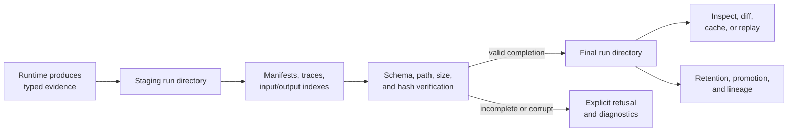

# bijux-dag-artifacts

<!-- bijux-core-badges:generated:start -->
[](https://crates.io/crates/bijux-dag-artifacts)
[](https://docs.rs/bijux-dag-artifacts)
[](https://github.com/bijux/bijux-core/blob/main/LICENSE)
[](https://github.com/bijux/bijux-core/actions/workflows/ci.yml?query=branch%3Amain)
[](https://github.com/bijux/bijux-core)

[](https://bijux.io/bijux-core/) [](https://bijux.io/bijux-core/bijux-dag/packages/bijux-dag-artifacts/)
<!-- bijux-core-badges:generated:end -->

bijux-dag v0.4.1 is a local-first DAG runtime for reproducible workflows with
explicit graph contracts, deterministic execution records, verified artifacts,
cache explanation, and replayable run bundles.
Replay claims on this page are governed by the
[Replay Contract](../../spec/REPLAY_CONTRACT.md).

`bijux-dag-artifacts` owns the retained evidence boundary: models, normalized
paths, filesystem publication, hashes, integrity proofs, lineage, promotion,
and retention primitives.

Use it when the question is what a run leaves behind, how those bytes acquire
an identity, or whether retained material can still support an inspection,
cache, replay, or audit decision.

## Evidence Lifecycle



A retained run is published as evidence only through an explicit finalization
path. Verification can describe damage; it does not silently repair evidence
while claiming to inspect it.

## Authority

| Domain | This crate decides |
| --- | --- |
| retained models | run manifests, node traces, input and output indexes, provenance, and artifact pack metadata |
| layout | run-directory structure, normalized relative paths, and platform-safe path representation |
| persistence | filesystem-backed stores, durable JSON writes, incomplete markers, and finalization |
| identity | content hashes, sizes, artifact identifiers, and deduplication inputs |
| integrity | schema checks, proof models, corruption classification, and run-directory audit results |
| lifecycle | lineage edges, retention policy data, promotion records, and safe-garbage-collection explanations |

The runtime decides **when** evidence is produced and what an execution outcome
means. This crate decides **how** that evidence is represented, persisted, and
verified. It does not validate graphs, schedule nodes, route commands, or infer
an operator's policy from ambient state.

## A Valid Path Is Part Of Integrity

Artifact paths are normalized relative paths beneath an explicitly supplied
root. The crate rejects:

- absolute paths where a retained relative path is required;
- traversal outside the owned root;
- platform-dependent ambiguity;
- missing required output; and
- layouts that cannot be interpreted under the supported contract.

Path safety is not separate from evidence validity. Bytes with a valid digest
at an unsafe or ambiguous location are not a valid retained artifact.

## Integrity Is Not Success

Verification distinguishes failure classes instead of collapsing them:

| Finding | Meaning |
| --- | --- |
| missing | required evidence is absent |
| unreadable | storage could not be inspected |
| hash or size mismatch | retained bytes no longer match their recorded identity |
| malformed | an index, manifest, trace, or schema-bearing record cannot be decoded |
| unsupported schema | evidence belongs to a shape this reader cannot safely interpret |
| unsafe path | a retained reference violates the owned-root boundary |
| incomplete lineage | provenance is insufficient for the requested lifecycle decision |

A clean integrity result proves consistency with the retained contract. It does
not prove that the workload was scientifically correct, that the execution
environment was trusted, or that two runs are equivalent.

## Publication And Crash Safety

Run material is assembled in a staging directory. Completion writes and
finalization must avoid exposing a partially valid final directory as complete.
An interrupted run retains an explicit incomplete state rather than borrowing
the appearance of a successful run.

Durability depends on the filesystem and storage environment supplied by the
caller. Atomic rename and durable-write helpers protect the publication
protocol; they cannot manufacture storage guarantees that the underlying
platform does not provide.

## Compatibility-Bearing Evidence

The following schemas govern serialized run evidence:

- `configs/dag/schema/inputs_index.schema.json`
- `configs/dag/schema/node_trace.schema.json`
- `configs/dag/schema/outputs_index.schema.json`
- `configs/dag/schema/run_manifest.schema.json`

Readers refuse incompatible required fields rather than defaulting malformed
evidence into validity. Additive optional fields still require round-trip and
consumer evidence. Breaking shape changes require schema-evolution, migration,
and downstream replay/import review.

Run layout, path normalization, digest interpretation, verification outcomes,
and finalization behavior are compatibility-sensitive even when Rust source
compatibility is unchanged.

## Public Rust Surface

| Import lane | Intended use | Compatibility |
| --- | --- | --- |
| `bijux_dag_artifacts::stable` | long-lived storage, identity, integrity, and lifecycle integration | curated public contract |
| `bijux_dag_artifacts::prelude` | common read, write, hash, and validate workflow | curated convenience surface |
| crate root | focused access when the exact item is known | public, with broad compatibility modules hidden from default docs |
| `experimental` feature surface | advisory run-layout and lifecycle contracts | opt-in and outside the stable lane |

## Route A Change

| Change | First owner | Required consumer review |
| --- | --- | --- |
| manifest, trace, or index shape | storage and schema modules | runtime writers, app readers, import/export, and replay |
| path or run-directory layout | layout and IO modules | every persisted-evidence consumer |
| hash, proof, or verification outcome | integrity modules | cache, replay, verify, and operator diagnostics |
| retention, promotion, or lineage model | lifecycle modules | maintainer and policy consumers |
| retry, scheduling, replay eligibility, or execution outcome | [`bijux-dag-runtime`](bijux-dag-runtime.md) | artifacts persists the decision but does not own it |

## Verification Evidence

| Claim | Evidence |
| --- | --- |
| artifact identity and lineage | `artifact_identity_and_lineage_contracts.rs` |
| manifest identity and round trip | run-manifest identity, round-trip, and retention contracts |
| path and store safety | IO/store and storage-resilience contracts |
| corruption refusal and hardening | artifact hardening contracts |
| public import boundary | `public_api_contract.rs` |

For a broad retained-evidence change, run:

```bash
cargo test --locked -p bijux-dag-artifacts
```

## Source Authorities

- package contract: `crates/bijux-dag-artifacts/docs/CONTRACTS.md`
- curated exports and run-directory entrypoints:
  `crates/bijux-dag-artifacts/src/lib.rs`
- retained models and services: `crates/bijux-dag-artifacts/src/storage/`
- path and platform rules: `crates/bijux-dag-artifacts/src/layout/`
- hashes, proofs, schemas, and audits:
  `crates/bijux-dag-artifacts/src/integrity/`
- filesystem operations: `crates/bijux-dag-artifacts/src/io/`
- lineage, promotion, and retention:
  `crates/bijux-dag-artifacts/src/lifecycle/`

See [Run Evidence Layout](../interfaces/run-evidence-layout.md) for the exact
filesystem map and [Artifact Contracts](../interfaces/artifact-contracts.md)
for compatibility-bearing evidence surfaces. Use the
[Reproducibility Model](../interfaces/reproducibility-model.md) to distinguish
artifact identity from graph, plan, execution, environment, output, cache, and
replay identity.
