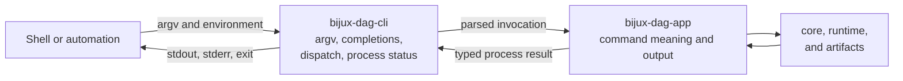

# bijux-dag-cli

<!-- bijux-core-badges:generated:start -->
[](https://crates.io/crates/bijux-dag-cli)
[](https://docs.rs/bijux-dag-cli)
[](https://github.com/bijux/bijux-core/blob/main/LICENSE)
[](https://github.com/bijux/bijux-core/actions/workflows/ci.yml?query=branch%3Amain)
[](https://github.com/bijux/bijux-core)

[](https://bijux.io/bijux-core/bijux-core/) [](https://bijux.io/bijux-core/bijux-dag/packages/bijux-dag-cli/)
<!-- bijux-core-badges:generated:end -->

bijux-dag v0.4.0 is a local-first DAG runtime for reproducible workflows with
explicit graph contracts, deterministic execution records, verified artifacts,
cache explanation, and replayable run bundles.
Replay claims on this page are governed by the
[Replay Contract](../../spec/REPLAY_CONTRACT.md).

`bijux-dag-cli` is the installable process boundary for `bijux-dag`. It owns
startup, shell completion generation, application dispatch, panic containment,
and final process status. Command meaning belongs to `bijux-dag-app`.

## The Thin Boundary



The executable must remain thin enough that library consumers and the installed
binary share one command implementation.

## Owned And Delegated Behavior

| Concern | Owner |
| --- | --- |
| binary target and startup | `bijux-dag-cli` |
| process arguments and top-level parser invocation | `bijux-dag-cli`, using the app-owned command tree |
| shell completion emission for Bash, Zsh, Fish, Elvish, and PowerShell | `bijux-dag-cli` |
| application dispatch and selected exit handoff | `bijux-dag-cli` |
| command routes, preconditions, responses, and rendering | [`bijux-dag-app`](bijux-dag-app.md) |
| graph, execution, and evidence semantics | core, runtime, and artifacts |

The wrapper must not inspect individual domain commands to create alternate
behavior, rewrite JSON envelopes, translate a failed dispatch into success, or
depend directly on graph, runtime, or artifact internals.

## Process Contract

- Parser errors remain nonzero and use parser-owned diagnostics.
- Application failures preserve the status selected by the app.
- Completion output goes to standard output and does not execute a domain
  command.
- An unexpected panic is contained at the process boundary, reported as an
  internal error, and exits unsuccessfully.
- Partial output followed by successful status is a process-boundary defect.

Panic containment is a final safety net, not a substitute for no-panic
operator-input contracts in the application and domain packages.

## Public Surface

The visible `bijux-dag --help` tree is the stable operator surface. Other lanes
remain deliberate:

- `bijux-dag commands --lane experimental` inventories callable but non-stable
  helpers;
- simulated routes require `BIJUX_DAG_ENABLE_SIMULATED=1`; and
- internal routes require `BIJUX_DAG_ENABLE_INTERNAL=1`.

The binary does not advertise those routes as stable merely because the app can
dispatch them. See the [Release Boundary](../foundation/release-boundary.md)
before building automation around a command.

## Integration Risk

The installed binary name, command tree, global arguments, completion output,
stream discipline, and process status are public interfaces. A startup smoke
test proves that delegation works; it does not prove every command workflow.

Changes to a command belong in the app and require the app's CLI, output, and
workflow contracts. Changes to this crate should be rare and limited to genuine
process concerns.

## Verification Evidence

| Claim | Evidence |
| --- | --- |
| binary startup and basic delegation | `crates/bijux-dag-cli/tests/smoke_pipeline.rs` |
| shell completion behavior | package completion contracts and maintainer completion checks |
| command tree and exit semantics | owning `bijux-dag-app` CLI and error contracts |
| dependency thinness | `crates/bijux-dag-app/tests/crate_boundary_contract.rs` |

For wrapper changes, run:

```bash
cargo test --locked -p bijux-dag-cli
```

## Source Authorities

- process contract: `crates/bijux-dag-cli/docs/CONTRACTS.md`
- executable implementation: `crates/bijux-dag-cli/src/main.rs`
- command semantics: `crates/bijux-dag-app/docs/CONTRACTS.md`
- installed command contract: [CLI Surface](../interfaces/cli-surface.md)

Use the [Reproducibility Model](../interfaces/reproducibility-model.md) when a
CLI result raises a graph, plan, execution, environment, output, cache, or
replay identity question.
