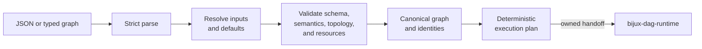

# bijux-dag-core

<!-- bijux-core-badges:generated:start -->
[](https://crates.io/crates/bijux-dag-core)
[](https://docs.rs/bijux-dag-core)
[](https://github.com/bijux/bijux-core/blob/main/LICENSE)
[](https://github.com/bijux/bijux-core/actions/workflows/ci.yml?query=branch%3Amain)
[](https://github.com/bijux/bijux-core)

[](https://bijux.io/bijux-core/bijux-core/) [](https://bijux.io/bijux-core/bijux-dag/packages/bijux-dag-core/)
<!-- bijux-core-badges:generated:end -->

bijux-dag v0.4.0 is a local-first DAG runtime for reproducible workflows with
explicit graph contracts, deterministic execution records, verified artifacts,
cache explanation, and replayable run bundles.

`bijux-dag-core` is the deterministic graph kernel. It decides what a workflow
means before clocks, filesystems, schedulers, processes, or retained run state
can influence the answer.

Use this crate when you need to author, parse, validate, canonicalize, inspect,
or plan a graph without taking execution dependencies.

## From Definition To Execution Plan



Every box before the handoff is a pure data transformation. A caller supplies
all inputs; the crate does not consult ambient machine state to decide whether
a graph is valid.

## Authority

| Domain | This crate decides |
| --- | --- |
| graph model | node, edge, input, output, resource, metadata, branch, subgraph, and trigger-rule meaning |
| parsing | whether serialized input is structurally acceptable |
| resolution | how declared references, inputs, and graph defaults become explicit |
| validation | schema, semantic, topology, resource, selector, and reference violations |
| canonicalization | which representational differences can be removed without erasing meaning |
| identity | graph, node, fingerprint, and planner identity inputs |
| topology | deterministic ordering and rejection of cycles or missing dependencies |
| planning | lowering a valid graph into runtime-facing planned nodes and edges |
| diagnostics | stable graph-contract findings with severity, location, and context |

The crate does **not** execute processes, inspect an environment, schedule
nodes, persist artifacts, route commands, or format operator responses.

## Purity Is A Product Property

Kernel purity makes four downstream guarantees possible:

- the same supplied graph data produces the same validation result;
- canonical identity is independent of the machine performing validation;
- planning can be inspected before any workload side effect;
- cache and replay logic can rely on declared graph identity rather than
  accidental runtime state.

Core product code must not read the filesystem, inspect environment variables,
source wall-clock time, spawn processes, or persist state. Serialization,
hashing, Unicode normalization, allocation, and deterministic collection
operations are allowed.

If graph validity needs a fact from a cluster, filesystem, or tool probe, that
fact belongs in an explicit input or a later runtime capability check—not in
the graph kernel.

## Identity And Canonicalization

Canonicalization removes representation noise while preserving
execution-relevant differences. The governing invariants are:

1. Equal canonical graphs produce equal graph identities.
2. An execution-relevant change affects the identity that protects its
   downstream decision.
3. Presentation-only changes do not affect execution identity unless a
   documented contract explicitly includes them.
4. Identity never repairs an invalid graph; validation precedes trusted
   planning.

Changes to canonicalization are high-impact even when the Rust API remains
source-compatible. They can alter cache keys, replay decisions, diffs, and the
meaning of retained evidence.

## Validation Refuses Ambiguity

The kernel rejects rather than heuristically repairs:

- cycles and missing dependencies;
- duplicate identifiers;
- unresolved or ambiguous references;
- invalid selectors and path-variable bindings;
- incompatible branch or trigger rules;
- unsupported node or resource combinations; and
- malformed schema or semantic state.

Diagnostics remain deterministically ordered. New operator-facing findings
require stable identifiers, focused tests, registry alignment, and handbook
coverage.

## Public Rust Surface

| Import lane | Intended use | Compatibility |
| --- | --- | --- |
| `bijux_dag_core::stable` | deliberate long-lived graph integration | curated public contract |
| `bijux_dag_core::prelude` | common parse, validate, canonicalize, and plan workflows | curated convenience surface |
| crate root | focused imports when the exact item is already known | public, but broad compatibility re-exports are hidden from default docs |
| `experimental` feature surface | contract research and opt-in evaluation | excluded from the stable lane |

Serialized graph shape, diagnostics, canonicalization, identities, and planner
lowering are compatibility-bearing regardless of import path.

## Route A Change

| Change | First owner | Required downstream review |
| --- | --- | --- |
| node, edge, input, resource, branch, or trigger semantics | graph and analysis modules | runtime interpretation and serialized fixtures |
| parse, resolution, or validation behavior | pipeline modules | app diagnostics and compatibility fixtures |
| canonical form or fingerprint inputs | graph and analysis modules | cache, replay, diff, and retained identity consumers |
| planned node or edge shape | planner module | runtime and app consumers |
| scheduler, retry, backend, or replay policy | [`bijux-dag-runtime`](bijux-dag-runtime.md) | not a core change unless the graph contract also changes |
| persisted evidence model | [`bijux-dag-artifacts`](bijux-dag-artifacts.md) | core records identity inputs but does not own storage |

## Verification Evidence

| Claim | Evidence |
| --- | --- |
| canonical representation | `crates/bijux-dag-core/tests/canonical_contract.rs` |
| graph and node identity | identity and property contracts under `crates/bijux-dag-core/tests/` |
| deterministic topology | `graph_kernel_determinism.rs` and topology fuzz contracts |
| planner lowering | planner contracts and planner fixtures |
| validation behavior | entrypoint, adversarial, diagnostics, and fixture contracts |
| serialized compatibility | schema and serde round trips plus snapshot-shape contracts |

For a broad kernel change, run:

```bash
cargo test --locked -p bijux-dag-core
```

## Source Authorities

- package contract: `crates/bijux-dag-core/docs/CONTRACTS.md`
- curated exports: `crates/bijux-dag-core/src/lib.rs`
- graph domain: `crates/bijux-dag-core/src/graph/`
- parse, resolve, and validate: `crates/bijux-dag-core/src/pipeline/`
- identities and semantics: `crates/bijux-dag-core/src/analysis/`
- runtime handoff: `crates/bijux-dag-core/src/planner/`

Continue with the [Reproducibility Model](../interfaces/reproducibility-model.md)
to follow these identities into execution, cache, and replay.
