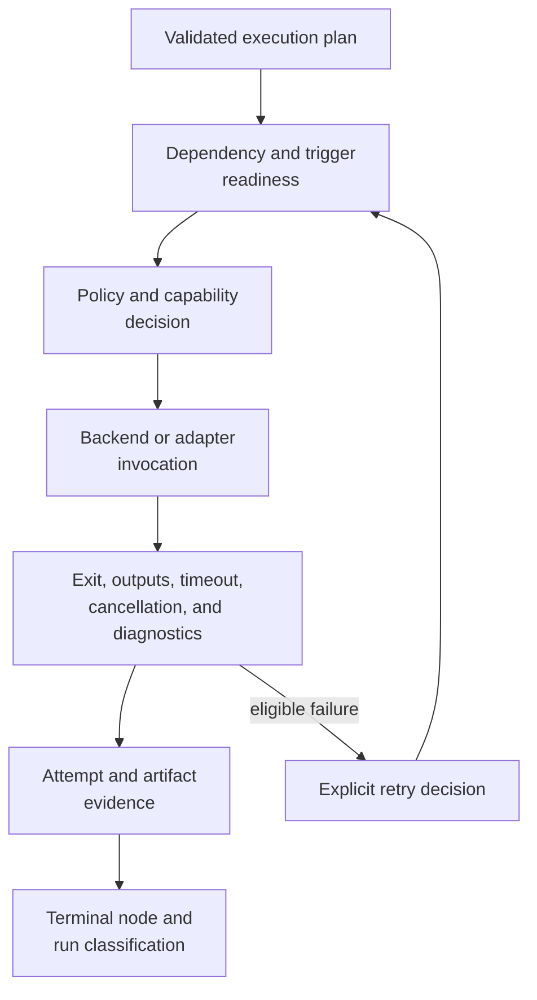

# bijux-dag-runtime

<!-- bijux-core-badges:generated:start -->
[](https://crates.io/crates/bijux-dag-runtime)
[](https://docs.rs/bijux-dag-runtime)
[](https://github.com/bijux/bijux-core/blob/main/LICENSE)
[](https://github.com/bijux/bijux-core/actions/workflows/ci.yml?query=branch%3Amain)
[](https://github.com/bijux/bijux-core)

[](https://bijux.io/bijux-core/) [](https://bijux.io/bijux-core/bijux-dag/packages/bijux-dag-runtime/)
<!-- bijux-core-badges:generated:end -->

bijux-dag v0.4.0 is a local-first DAG runtime for reproducible workflows with
explicit graph contracts, deterministic execution records, verified artifacts,
cache explanation, and replayable run bundles.
Replay claims on this page are governed by the
[Replay Contract](../../spec/REPLAY_CONTRACT.md).

`bijux-dag-runtime` is the effectful execution kernel. It turns a validated
plan into governed node attempts, backend operations, retained traces, cache
decisions, and replay outcomes.

Use this crate when a graph is already valid but execution readiness, policy,
state, backend behavior, reuse, or recovery is wrong.

## Execution Control Loop



Each accepted transition has preconditions, produces one governed
classification, and retains the context needed to explain the decision.

## Authority

| Domain | This crate decides |
| --- | --- |
| engine and scheduler | node readiness, dependency release, concurrency, attempts, retry, timeout, cancellation, and terminal state |
| policy | runtime configuration, policy evaluation, refusal, and decision traces |
| backends | capability negotiation, local process execution, container execution, Kubernetes Job submission, and shared-filesystem SLURM submission |
| adapters | registration, invocation, conformance, result normalization, and external adapter boundaries |
| branch execution | selected-lane pruning, skipped-node evidence, trigger evaluation, and replay checks |
| cache | eligibility, identity, lookup, verification, write, lineage, and miss explanation |
| replay | source-evidence eligibility, semantic comparison, reuse, refusal, and diagnostics |
| evidence orchestration | when manifests, attempts, traces, and output records are written through `bijux-dag-artifacts` |
| failures | stable runtime classes and causal diagnostics |

Graph meaning remains owned by
[`bijux-dag-core`](bijux-dag-core.md). Serialized evidence shape remains owned
by [`bijux-dag-artifacts`](bijux-dag-artifacts.md). Command intent and response
shape remain owned by [`bijux-dag-app`](bijux-dag-app.md).

## A Process Exit Is Not A Node Result

Terminal classification combines several facts:

- whether launch was accepted;
- whether policy and backend capability permitted execution;
- whether timeout or cancellation occurred;
- the process or adapter outcome;
- whether required outputs exist;
- whether output evidence could be persisted and verified; and
- whether retry or trigger rules change the next scheduler decision.

An exit code of zero cannot override a missing required output, failed
evidence publication, policy refusal, or cancellation.

## Effects Must Be Explicit

Subprocesses, network clients, clocks, environment access, filesystems, and
backend tools are effect boundaries. Planning and policy decisions must not
depend on unrecorded ambient values.

Secrets may enter an execution environment through an approved boundary, but
must not be written into cache identity, command evidence, traces, or
diagnostics in clear text. The runtime records the effective non-secret
configuration and identities needed to explain a decision.

The runtime does not provide universal process isolation. Local commands
inherit the invoking environment's security boundary; container and cluster
isolation depend on their configured runtime and external policy.

## Backend Capability Is Negotiated

| Backend | Runtime responsibility | External responsibility |
| --- | --- | --- |
| local | launch, capture, timeout/cancellation handling, outputs, and evidence | host permissions, tools, isolation, and resource enforcement |
| container | engine detection, mounts, command execution, captured streams, and recorded image identity | image trust, engine security, registry access, and host policy |
| Kubernetes | Job construction/submission, status mapping, shared-workspace contract, and evidence | cluster admission, identity, quota, networking, secrets, storage, and scheduling |
| SLURM | `sbatch` submission, `sacct` polling, shared-run-directory contract, and evidence | account policy, partitions, modules, shared storage, and scheduler availability |

Unsupported requirements are refused or explicitly classified. A backend must
not approximate unsupported behavior and report it as equivalent.

## Cache And Replay Are Proof Decisions

Cache reuse requires compatible identities and valid retained evidence across
the graph, node, inputs, execution mode, backend or adapter, environment, and
policy dimensions required by the governing contract.

Replay requires a source run with sufficient compatible evidence. Missing,
corrupt, or incompatible evidence produces an explained refusal. Replay must
not silently become a fresh run while still being reported as replay.

`--sandbox` prevents replay writes from modifying the source run. It does not
create operating-system process isolation.

## Failure And Recovery

Runtime failures preserve their causal class: policy refusal, unsupported
capability, launch failure, timeout, cancellation, node exit, missing output,
artifact persistence, cache corruption, and replay incompatibility are not
interchangeable.

Retries append attempts and retain the original cause. Repair and resume are
explicit operations; they do not rewrite a failed attempt into successful
history.

## Public Rust Surface

| Lane | Intended use |
| --- | --- |
| `stable` | curated long-lived runtime integration |
| `prelude` | common execution integration |
| crate root | focused imports when the exact item is known |
| `experimental` | feature-gated contracts outside the stable lane |
| `simulated_platform` | modeled non-production platform behavior |

Internal module reachability is not a support promise. Simulated platform
types cannot substantiate a production backend or service claim.

## Verification Evidence

| Claim | Evidence |
| --- | --- |
| engine and scheduler correctness | engine, scheduler, state-machine, and invariant contracts |
| node execution modes | node execution mode and runtime node execution contracts |
| backend and adapter behavior | adapter backend, conformance, and reference contracts |
| cache semantics | cache evolution, policy-cache, proof, and runtime-cache contracts |
| replay semantics | replay, runtime replay, and replay determinism contracts |
| policy behavior | runtime policy and decision-trace contracts |

For broad execution-semantic changes, run:

```bash
cargo test --locked -p bijux-dag-runtime
```

## Source Authorities

- package contract: `crates/bijux-dag-runtime/docs/CONTRACTS.md`
- engine and scheduler: `crates/bijux-dag-runtime/src/runtime_core/`
- backend capability and execution: `crates/bijux-dag-runtime/src/backend/`
- adapter contracts: `crates/bijux-dag-runtime/src/adapters/`
- cache and replay: `crates/bijux-dag-runtime/src/cache/` and
  `crates/bijux-dag-runtime/src/replay/`
- runtime evidence writers: `crates/bijux-dag-runtime/src/artifacts/`
- diagnostics and failure classes:
  `crates/bijux-dag-runtime/src/diagnostics/` and
  `crates/bijux-dag-runtime/src/error/`

Continue with the
[Reproducibility Model](../interfaces/reproducibility-model.md) for identity,
cache, and replay boundaries; [Run Evidence Layout](../interfaces/run-evidence-layout.md)
for retained state; or
[Execution Security And Isolation](../operations/security-isolation-truth.md)
for effect-boundary limits.
