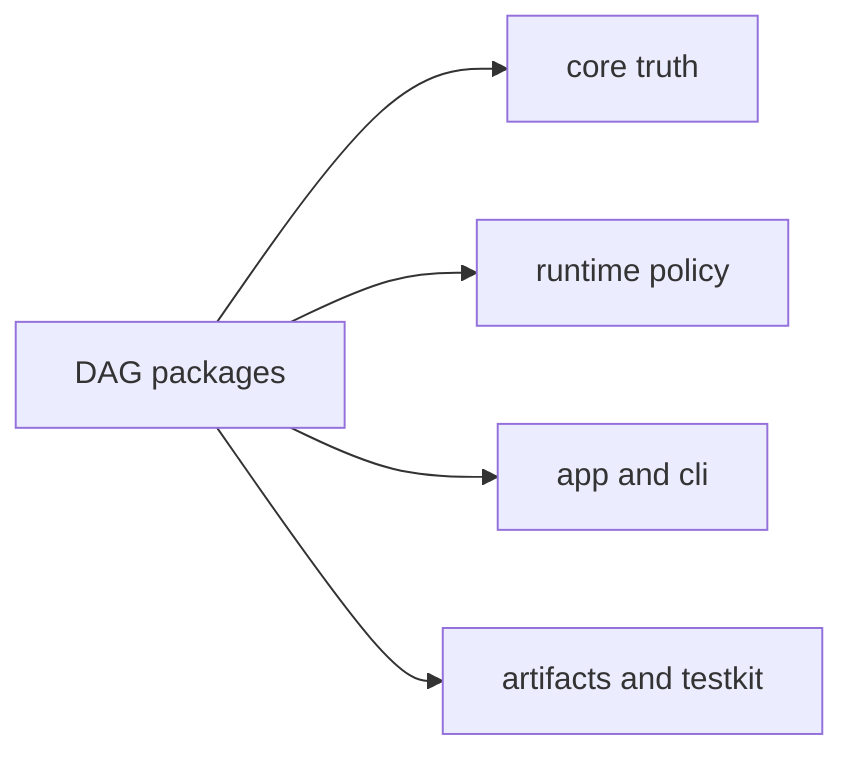

# DAG Packages

Use this page when the DAG command or behavior is already known but the owning
crate is not.

`bijux-dag` v0.4.0 is a local-first DAG runtime for reproducible workflows
with explicit graph contracts, deterministic execution records, verified
artifacts, cache explanation, and replayable run bundles.

The package split below shows which crate owns each clause of that promise.

The package split is deliberate:

- `bijux-dag-core` keeps graph truth deterministic and side-effect free
- `bijux-dag-runtime` owns execution-time policy and replay behavior
- `bijux-dag-app` and `bijux-dag-cli` turn that lower stack into the
  operator-facing command product
- `bijux-dag-artifacts` owns durable evidence material
- `bijux-dag-testkit` keeps shared fixtures and assertions out of production
  crates

Five DAG crates are public release targets in the current workspace:
`bijux-dag-core`, `bijux-dag-artifacts`, `bijux-dag-runtime`,
`bijux-dag-app`, and `bijux-dag-cli`. `bijux-dag-testkit` remains
repository-internal test support.

The canonical publication boundary lives in
[Package Boundary](../../bijux-core/foundation/package-boundary.md) and
`contracts/foundation/workspace_package_boundary.v1.json`.

## Section Map

## Package Map

| Package | Release status | Owns | Enter Here When |
| --- | --- | --- | --- |
| [`bijux-dag-core`](bijux-dag-core.md) | public | Graph truth, semantic identity, planner lowering, deterministic compilation | the issue is graph rules, fingerprints, topology, or planning inputs |
| [`bijux-dag-runtime`](bijux-dag-runtime.md) | public | Execution policy, replay behavior, cache behavior, diagnostics boundaries | the issue is run behavior, scheduler policy, replay reuse, or runtime guarantees |
| [`bijux-dag-app`](bijux-dag-app.md) | public | Command orchestration, request validation, response shaping, inspect and replay UX | the issue is command composition, operator output, or app-layer workflow wiring |
| [`bijux-dag-cli`](bijux-dag-cli.md) | public | Thin executable boundary for `bijux-dag` | the issue is binary startup, argv handoff, or exit behavior |
| [`bijux-dag-artifacts`](bijux-dag-artifacts.md) | public | Artifact identity, storage layout, integrity, retention, and lineage helpers | the issue is run evidence shape, hashing, proofs, or artifact lifecycle rules |
| [`bijux-dag-testkit`](bijux-dag-testkit.md) | private | Shared deterministic fixtures and test support surfaces | the issue is shared fixtures, reusable assertions, or test-only DAG helpers |

## Reading Rule

Choose the package page by the first durable owner, not by the command you saw
first. For example:

- `bijux-dag replay` may still require `bijux-dag-runtime` when the real
  question is reuse policy or artifact verification
- `bijux-dag cache verify` may still require `bijux-dag-runtime` when the real
  question is cache proof eligibility and corruption refusal
- `bijux-dag run` may still require `bijux-dag-artifacts` when the real
  question is persisted evidence shape
- `bijux-dag explain` may still require `bijux-dag-app` when the real question
  is response shaping and inspection UX
- `bijux-dag why-cache-missed` may still require `bijux-dag-app` when the real
  question is explanation taxonomy and diagnostic output shape

If a change crosses two rows in the table, treat it as an explicit
cross-package boundary change and validate both sides.

When the issue is not crate ownership but identity semantics, use
[Reproducibility Model](../interfaces/reference/reproducibility-model.md)
before choosing an implementation owner.
