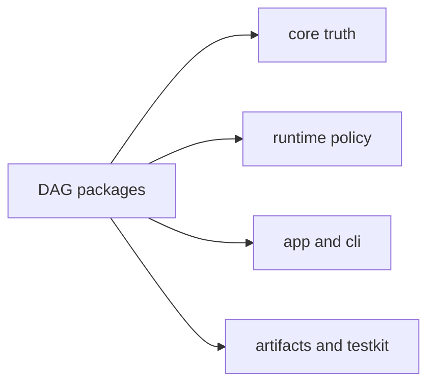

# DAG Packages

Use this page when the DAG surface is clear but the owning package is not.

The split is practical: `bijux-dag-core` holds graph truth,
`bijux-dag-runtime` holds execution policy, the app and CLI packages shape the
user-facing command surface, and the artifact and testkit packages support the
runtime around that center.

## Section Map

## Package Map

| Package | Owns | Enter Here When |
| --- | --- | --- |
| [`bijux-dag-core`](bijux-dag-core.md) | Graph truth, planner lowering, deterministic core semantics | the issue is graph model rules, planning invariants, or semantic correctness |
| [`bijux-dag-runtime`](bijux-dag-runtime.md) | Runtime policy, execution flow, replay behavior, diagnostics boundaries | the issue is run behavior, replay parity, lifecycle orchestration, or runtime guarantees |
| [`bijux-dag-app`](bijux-dag-app.md) | Command orchestration, user-facing shaping, app-layer wiring | the issue is orchestration flow, command composition, or top-level request handling |
| [`bijux-dag-cli`](bijux-dag-cli.md) | Thin CLI entrypoint wrapper for DAG command surfaces | the issue is DAG CLI entrypoint wiring or executable boundary behavior |
| [`bijux-dag-artifacts`](bijux-dag-artifacts.md) | Artifact identity, integrity semantics, and artifact lifecycle helpers | the issue is artifact schema, identity, storage contract, or integrity checks |
| [`bijux-dag-testkit`](bijux-dag-testkit.md) | Shared deterministic fixtures and test support surfaces | the issue is shared fixtures, deterministic test inputs, or common test helpers |

## Reading Rule

Choose the package page by ownership first. If a change touches two rows in
the table, treat it as an explicit cross-package boundary change and validate
both contracts.
