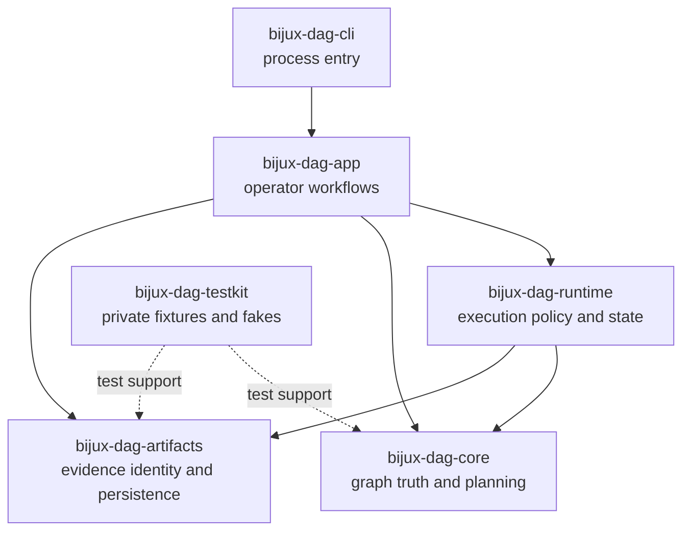
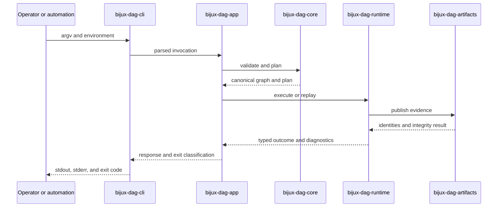

# DAG Packages

bijux-dag v0.4.1 is a local-first DAG runtime for reproducible workflows with
explicit graph contracts, deterministic execution records, verified artifacts,
cache explanation, and replayable run bundles.
Replay claims on this page are governed by the
[Replay Contract](../../spec/REPLAY_CONTRACT.md).

The DAG workspace is split by authority, not by command count. Graph truth,
execution policy, operator orchestration, process startup, and retained
evidence have different owners so that a command cannot silently redefine a
lower-level invariant.

Use this page to route a behavior change or failure to the first package that
has authority to decide it.

## Package Topology

Dependencies point toward the layer that owns the invariant. The command
surface may expose a result, but it cannot move ownership upward.

## Public And Private Packages

| Package | Publication | Durable authority | Does not own |
| --- | --- | --- | --- |
| [`bijux-dag-core`](bijux-dag-core.md) | public | graph parsing, validation, canonical identity, topology, and planner lowering | process execution, storage, or operator presentation |
| [`bijux-dag-artifacts`](bijux-dag-artifacts.md) | public | artifact identity, retained layout, integrity, lineage, and lifecycle primitives | scheduling or the meaning of a successful run |
| [`bijux-dag-runtime`](bijux-dag-runtime.md) | public | execution state, scheduler policy, adapters, replay, cache decisions, and runtime diagnostics | CLI parsing or graph semantics |
| [`bijux-dag-app`](bijux-dag-app.md) | public | command orchestration, request validation, response shaping, inspection, and replay workflows | low-level execution or evidence-format invention |
| [`bijux-dag-cli`](bijux-dag-cli.md) | public | binary startup, argument handoff, completion wiring, streams, and exit handoff | domain behavior |
| [`bijux-dag-testkit`](bijux-dag-testkit.md) | private | deterministic fixtures, fake adapters, reusable assertions, and repository test support | public runtime or operator compatibility |

The canonical publication status is recorded in
`contracts/foundation/workspace_package_boundary.v1.json` and explained in the
[Package Boundary](../../bijux-core/foundation/package-boundary.md). Public
crates are published in dependency order:

1. `bijux-dag-core`
2. `bijux-dag-artifacts`
3. `bijux-dag-runtime`
4. `bijux-dag-app`
5. `bijux-dag-cli`

`bijux-dag-testkit` is intentionally absent from that chain.

## Runtime And Evidence Flow

This flow also identifies the evidence boundary: the runtime decides when
evidence is produced, while the artifacts package defines how that evidence is
identified, stored, and verified.

## Route A Failure

| Observed failure | First owner | Why |
| --- | --- | --- |
| an invalid graph was accepted, or equivalent graphs received different identities | `bijux-dag-core` | validity and semantic identity precede execution |
| node readiness, retry, cancellation, backend mapping, replay, or cache reuse is wrong | `bijux-dag-runtime` | these are execution-policy and state-transition decisions |
| evidence was written non-atomically, cannot be verified, or has the wrong retained shape | `bijux-dag-artifacts` | persistence and integrity are artifact contracts |
| a command composes the wrong operations or returns the wrong typed response | `bijux-dag-app` | the app layer owns operator workflows |
| startup, completion, streams, or final exit handoff is wrong | `bijux-dag-cli` | the executable boundary owns process integration |
| a shared fake or fixture no longer represents its declared contract | `bijux-dag-testkit` | repository test support owns modeled test behavior |

Route by the first incorrect decision, not the first command name in the bug
report. For example, a failure seen through `bijux-dag replay` belongs to the
runtime when reuse policy is wrong, to artifacts when source evidence is
misread, and to app when the result is described incorrectly.

## Cross-Package Changes

A change crosses a package boundary when it alters data or meaning consumed by
another layer. Treat these as contract changes:

- graph or plan representations consumed by runtime;
- artifact identities, manifests, or verification results consumed by runtime
  and app;
- runtime outcomes or diagnostics shaped by app;
- app response and exit classifications emitted by CLI.

For a cross-package change, verify both the owning package and every direct
consumer. A passing command-level test is not enough if the lower-level public
contract changed.

## Choose The Next Page

- Start with [Core](bijux-dag-core.md) for graph truth and deterministic
  planning.
- Start with [Artifacts](bijux-dag-artifacts.md) for retained evidence and
  integrity.
- Start with [Runtime](bijux-dag-runtime.md) for execution, backends, replay,
  and cache decisions.
- Start with [App](bijux-dag-app.md) for operator workflows and response
  contracts.
- Start with [CLI](bijux-dag-cli.md) for the executable boundary.
- Start with [Testkit](bijux-dag-testkit.md) only for repository test support.
- Use the [Reproducibility Model](../interfaces/reproducibility-model.md) when
  the question crosses graph, plan, execution, environment, output, cache, or
  replay identity.

For command support rather than code ownership, use the
[Release Boundary](../foundation/release-boundary.md).
